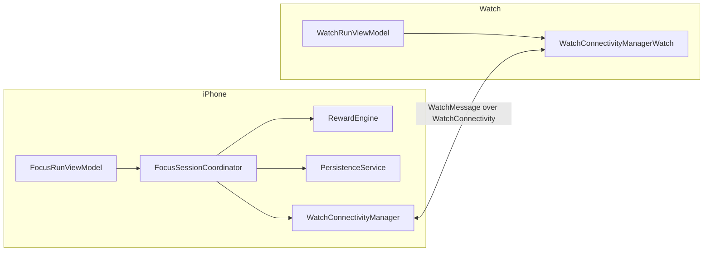

# AGENTS.md — Canonical Guide for AI Agents and Collaborators

This is the **single source of truth** for anyone (human or AI) working on this repository.
If any other document contradicts this file, this file wins. Read it fully before editing code.

- Product name: **Counting Sheep**
- Repo / code name: **Phone in the Other Room** (folder names, target names, and some docs still use this)
- Mascot: **Ollie**, a border collie who guards your focus while your phone is in the other room
- UserDefaults key prefix: `ollie.*` — this is intentional, do not "fix" it

Document precedence (highest first):

1. `AGENTS.md` (this file)
2. `docs/PROJECT_BRIEF.md`, `docs/PRODUCT_PRINCIPLES.md`, `docs/ARCHITECTURE.md`, `docs/DECISIONS/`
3. `docs/PLAYBOOKS/` and `skills/`
4. `PROJECT_AUDIT.md`, `IMPLEMENTATION_PLAN.md` (accurate July 2026 audits, treat as historical reference)
5. `README.md`, `docs/PRD.md`, `docs/IMPLEMENTATION_NOTES.md`, `docs/CHARLIE_AUDIT_ROADMAP.md` — drift-prone; verify against code when in doubt (see "Known documentation drift" below)

This guide records the founder's current product direction; it is not an immutable moral
constitution. Previous agent-authored wording does not become founder intent merely because it
appears in a canonical file. When the founder explicitly changes a product decision, update this
guide and the affected decision records instead of defending the old wording. Distinguish actual
technical, legal, privacy, and platform constraints from product hypotheses or agent preferences.
Explain tradeoffs plainly, but do not turn an inferred preference into a permanent prohibition.

---

## 1. Mission

Help people stop doomscrolling around sleep by making it easy, warm, and even a little
delightful to physically put the phone in another room before bed and let it wake after
they do. The user-facing nightly ritual is **Wind Down** (represented internally by the
established `NightWatch*` types): one phone-away session spans wind down before bed, the
overnight period, and quiet time after waking. **Phone Away** is the secondary, one-time or
scheduled phone-away mode outside that ritual. The optional Apple Watch companion mirrors the
phone-authoritative timer. UWB placement checking is deferred from the current release.

The differentiator is **screen time at the edges of sleep** and **physical separation**.
Gamification and collection serve that ritual; they do not turn the app into a generic
productivity timer or medical sleep tracker.

## 2. What the product IS / IS NOT

**IS:**

- A Wind Down ritual app: put the phone away, wind down, and wake before it does
- Warm, playful, cozy, emotionally safe — pixel-art farm aesthetic, gentle copy
- Low friction: configure once, then one tap to start Wind Down; Phone Away stays optional
- Honest about what it measures (quiet minutes around sleep, and
  "nights your phone slept in the other room")
- Purposeful gamification: sheep search, rarity, farm management, collection, trading,
  customization, and anticipation give Wind Down a meaningful narrative payoff
- Flexible in how people enjoy the Farm: collecting a large flock, optimizing wool,
  trading sheep, completing the catalogue, or decorating Ollie, a human avatar, and the farm

**IS NOT:**

- A generic productivity / pomodoro app
- A medical or clinical sleep-tracking app (no sleep-quality claims, no diagnoses)
- A single prescribed play style in which every player must value or manage sheep identically
- A social network. The narrow invite-only seven-night Slumber Party companion ritual is the
  sole approved social exception (ADR-0016); Friends, feeds, chat, discovery, and comparison
  remain gated.

See `docs/DECISIONS/ADR-0006-sleep-bookends-positioning.md` for the current rationale.

## 3. Current architecture summary

Stack: Swift 5.9, SwiftUI, iOS 17.0+, watchOS 10.0+, **XcodeGen** (`project.yml` generates `PhoneInTheOtherRoom.xcodeproj`). The official `supabase-swift` package is the one approved SPM dependency, used only by the separately gated backend paths authorized by ADR-0005 and ADR-0016; there are no CocoaPods dependencies. Pattern: MVVM + a session coordinator.

Eight targets (defined in `project.yml`):

| Target | Type | Notes |
|---|---|---|
| `PhoneInTheOtherRoom` | iOS app | Sources: `Shared/` + `PhoneInTheOtherRoomApp/`. Embeds the Watch app. iPhone-only. |
| `PhoneInTheOtherRoomWatchApp` | watchOS app | Sources: `Shared/` + `PhoneInTheOtherRoomWatchApp/`. Optional companion that mirrors the phone-authoritative Wind Down or Phone Away timer. |
| `PhoneInTheOtherRoomLiveActivity` | iOS Widget extension | Lock Screen, Dynamic Island, and paired-Watch Smart Stack run status. Embedded in the iOS app. |
| `PhoneInTheOtherRoomScreenTimeReport` | iOS app extension | Embedded DeviceActivity report extension. Main app + extension compile with `SCREEN_TIME_REPORTS`, share scoped selections through the approved App Group, and carry Family Controls entitlements. |
| `PhoneInTheOtherRoomDeviceActivityMonitor` | iOS app extension | Enforces the consented selected-app barrier through the protected session while the app is suspended. |
| `PhoneInTheOtherRoomShieldConfiguration` | iOS app extension | Supplies the gentle, bedtime-specific shield appearance. |
| `PhoneInTheOtherRoomShieldAction` | iOS app extension | Closes the shielded app when the shield button is pressed; Counting Sheep remains available as the emergency exit. |
| `PhoneInTheOtherRoomTests` | unit tests | Compiles `Shared/` + `Tests/`, including Night Watch schedule and legacy-decode coverage. |

Data flow for a Night Watch (represented internally by `FocusRun` for persisted-data compatibility):



1. The user configures bedtime, wake time, two quiet bookends, an ordered private sequence of
   up to three evening suggestions and two morning suggestions, and a session guard in
   `FocusRunSetupView`. Putting the phone away is always the first evening suggestion. Before
   the wind-down window the plan is
   saved; during it, one tap calls `FocusRunViewModel.requestStartNightWatch()`.
2. `NightWatchPreferences` creates an anchored `NightWatchPlan`; the iPhone persists and
   keeps its wall-clock transitions even while either app is backgrounded. Local reminders
   support the next requested wind-down and morning completion.
3. New plans offer `.honorTimer` App Shielding or `.nfcTag` NFC + App Shielding, using a locally registered NDEF phone-bed tag for the latter. Legacy `.watchPlacement` and `.qrCode` values remain decodable but normalize to the timer for new release flows. An opted-in automatic Wind Down can schedule shielding while the app is closed, with the app reconciling the run on next activation. A primary tag and optional backup keep only local digests and metadata. Retired physical tags can be resynced only from Settings by writing a fresh credential after a successful NFC write; the retired digest is never reactivated.
4. The plan moves through `.windDown`, `.overnight`, and `.morningQuiet`. The Watch mirrors
   that run but does not authorize, advance, or end the current release's protection flow.
5. New Wind Down, Screen-Free Morning, and Phone Away starts require Family Controls authorization
   and a non-empty opaque Screen Time app/category selection. The same consented selection is shielded
   from the eligible Wind Down start through the end of Screen-Free Morning, including overnight
   separation. Counting Sheep and its fail-open emergency exit remain available. The monitor
   extension records observed apply/clear evidence in the App Group. This barrier is not
   progression: the Wind Down benefit and Sunrise Trail settle independently. Runtime
   apply/restore failures fail open, record no false observed evidence, and route to repair before
   another start (ADR-0012, ADR-0019).
6. On finish, `Shared/RewardEngine.swift` credits Wind Down reward/progress and the shared
   Wind Down metric from the factual wind-down bookend only—not overnight or Screen-Free
   Morning minutes. Actual Screen-Free Morning minutes settle independently through Sunrise
   Trail and remain separately presented/private. `PersistenceService` saves JSON in
   `UserDefaults` under `ollie.*`, including a 90-day session-and-event history. Detailed
   ritual, reflection, and HealthKit history remains local. Separately consented impact
   records omit exact dates/times, source names, selected apps, and raw Health samples.
7. ADR-0016's v4 Slumber Party source implementation is complete locally. It presents a list of up to
   five concurrent, long-lived invite-only groups, each with fixed seven-night rounds rather than
   goals or readiness ceremonies. A completed local Wind Down or Phone Away may fan out to every
   eligible current party, with an independently idempotent reward ledger per party. The iPhone
   remains authoritative: local activity never waits for social transport, and active Wind Down
   has no in-app social UI. Current members may see factual round records, revisioned expiring
   statuses, curated profile snapshots, and fixed cheers. Best-effort silent Live Activity/Watch
   feedback reconciles from a durable cheer ledger. Exact schedules, app tokens, full Farm state,
   inventory, wool, impact data, and raw Health data remain outside the contract. Recovery never
   creates an anonymous account: 401 reconnects only the locally bound Apple-linked Supabase UUID,
   while `linked_account_required` links only the current anonymous account in place.

The iPhone is the **authoritative** side of a run. The Watch displays state and reports a brief optional placement distance only.
Persistence is UserDefaults + Codable JSON only — no CoreData or SwiftData. Core app
state remains in standard defaults; scoped Screen Time selections and the explicit Quiet
Note widget value use the `group.com.ngawangchime.countingsheep` App Group. First-run setup uses
two varied story pages, one skippable six-question local behavioral chapter, its separately
presented starting pattern, a universal Shepherd/welcome-gift stage, explicit schedule and
optional reminder choices, private routine ideas, required app protection, and a truthful
saved-plan summary. Chapter and question progress stay separate. Skipping the check-in removes
only its result: everyone remains eligible for one welcome cosmetic. A schedule and optional
reminder never begin Wind Down automatically. After first-run setup, Home presents a versioned resumable guide
(`ollie.orientation.state`, schema 6) as short
Home Basics and Around the Farm chapters. Practice, Slumber Party, Settings, and Nights guidance
is contextual. Choosing a welcome wearable claims it immediately: **Wear now** equips it in the
correct accessory/outfit slot, while **Keep for later** preserves the current appearance. Generic
guide navigation never grants or equips it.

Full detail: `docs/ARCHITECTURE.md`.

## 4. Repository map

```
AGENTS.md                      ← you are here (canonical)
project.yml                    ← XcodeGen source of truth for the Xcode project
PhoneInTheOtherRoom.xcodeproj/ ← GENERATED. Never hand-edit project.pbxproj.
Shared/                        ← Pure domain logic compiled into all targets
  Models/OllieModels.swift       (FocusRun, UserProgress, rewards, stars, economy)
  ProximityClassifier.swift      (distance → proximity buckets)
  FocusRunRules.swift            (timing thresholds, completion rules)
  NightWatch.swift               (sleep-bookend preferences, phases, offline cues)
  SessionGuard.swift              (phone-away timer / Watch placement / QR / NFC metadata)
  RewardEngine.swift             (protected-night progress + legacy reward/economy compatibility)
  FocusAnalytics.swift           (day records, correlations, CSV/JSON export)
  ImpactMeasurement.swift        (local sleep-outcome comparison + minimised upload contract)
  NightFlockModels.swift          (seven-day social domain and persisted compatibility models)
  NightFlockCommitment.swift      (legacy v2 shared-goal/setup compatibility)
  NightFlockV2API.swift           (legacy schema-version-2 lobby compatibility)
  NightFlockV3API.swift           (legacy schema-version-3 metrics/grant compatibility)
  NightFlockSharing.swift         (legacy sharing defaults and projections)
  NightFlockRewards.swift         (bounded Slumber Party Farm grant rules and local ledger)
  NightFlockOrientation.swift     (legacy Slumber Party orientation/tip persistence)
  NightFlockPresentation.swift    (aggregate and privacy-safe presentation derivations)
  NightFlockAPI.swift             (versioned command/state and local outbox contracts)
  NightWatchHistory.swift        (90-day session records + idempotent ritual events)
  PhoneBedTag.swift              (local NFC tag registration digest)
  QuietTimeShieldSchedule.swift  (shared schedule/status/evidence contract)
  WatchMessage.swift             (typed phone↔watch message protocol)
  ScreenTimeIntegration.swift    (Screen Time scopes + report context IDs)
  SleepIntervalMath.swift        (sleep interval merging)
  MorningCheckIn.swift           (private optional morning reflections; no score/reward)
  Onboarding.swift               (first-run setup draft, questionnaire skip/grant rules)
  FirstRunJourney.swift          (resumable Home/practice/Farm/Settings/Nights guide)
  Orientation.swift              (schema-5 first-run guide persistence + contextual tips)
  WelcomeReward.swift            (starter sheep, claimed welcome wearable, legacy pending migration, practice ledger)
PhoneInTheOtherRoomApp/        ← iOS app
  App/                           (@main, App Intents / Shortcuts)
  Design/                        (Theme.swift, PixelComponents.swift — the design system)
  Proximity/                     (FocusSessionCoordinator + optional Nearby Interaction provider)
  Services/                      (persistence, watch connectivity, notifications,
                                  HealthKit sleep, Screen Time auth/selection, feedback, exports,
                                  optional Supabase ActivityKit delivery and Slumber Party)
  ViewModels/                    (FocusRunViewModel and friends)
  Views/                         (screens; Components/ = shared UI; MVP/ = GATED mock screens)
  MockData/                      (MVPMockData.swift — feeds gated MVP screens ONLY)
PhoneInTheOtherRoomWatchApp/   ← watchOS app (App/, Services/, ViewModels/, Views/)
PhoneInTheOtherRoomLiveActivity/ ← WidgetKit / ActivityKit extension
PhoneInTheOtherRoomScreenTimeReport/ ← embedded DeviceActivity report extension
PhoneInTheOtherRoomDeviceActivityMonitor/ ← quiet-window scheduling callbacks
PhoneInTheOtherRoomShieldConfiguration/ ← custom shield appearance
PhoneInTheOtherRoomShieldAction/ ← shield-button response
Config/                         ← local Supabase xcconfig inputs (secrets stay untracked)
supabase/                       ← versioned gated backend schema/functions (ADR-0005/ADR-0016)
Assets.xcassets/               ← pixel art groups (dog/, farm/, home/, sheep/, ...) + rewards
Tests/                         ← unit tests (Shared logic only; no UI tests)
docs/                          ← durable docs, decisions, playbooks
skills/                        ← portable agent skills (see skills/README.md)
.cursor/rules/                 ← Cursor-specific adapter (thin; points back here)
```

## 5. Coding standards

- Swift 5.9, SwiftUI-first. No UIKit unless a system API demands it.
- `supabase-swift` is the only approved third-party dependency (ADR-0005). Do not add or
  replace packages without explicit human approval.
- Pure logic goes in `Shared/` and must be unit-testable without UIKit/SwiftUI imports.
- Side effects (network, notifications, HealthKit, WatchConnectivity, persistence) live in `Services/` classes.
- Views stay thin: read state from `@EnvironmentObject` view models, send intents, no business logic.
- Naming: `*ViewModel` for view models, `*Service` for services, `*Manager` only for the existing connectivity managers, `Watch*` prefix for watch-side types.
- UserDefaults keys use the `ollie.*` prefix. Screen Time report contexts use `phone-other.*`.
- Formatting helpers go through `OllieFormat` in `Shared/Formatting.swift`.
- Screen Time code compiles only under `#if SCREEN_TIME_REPORTS && canImport(...)`. Retained legacy Nearby Interaction paths require UWB hardware and must remain unreachable from current release setup; old placement data must degrade to the phone-away timer.
- Comments explain *why*, not *what*. No TODO comments — file a task in `docs/FUTURE_AGENT_TASKS.md` instead.

## 6. SwiftUI and state management conventions

- One `@StateObject` view model per app root: `FocusRunViewModel` (iOS, injected in `PhoneInTheOtherRoomApp.swift`) and `WatchRunViewModel` (Watch). Child views use `@EnvironmentObject`.
- The run state machine lives in `FocusSessionCoordinator` (an `ObservableObject` owned by
  `FocusRunViewModel`, which forwards `objectWillChange`). `NightWatchPlan` adds phase data
  to the same persisted run; do not create a parallel morning or bedtime state machine.
- Services are singletons (`PersistenceService.shared`, `WatchConnectivityManager.shared`, ...). Do not add new singletons without a strong reason — prefer passing dependencies into the coordinator/view model.
- Prefer `async/await` over Combine. Combine exists only for the `objectWillChange` forwarding.
- UI mutations must happen on the main actor (`Task { @MainActor in ... }` is the existing pattern in connectivity/proximity callbacks).
- `HomeView` is the navigation shell: during an active Night Watch Home becomes the live journey while Nights, Farm, and Settings remain reachable; terminal receipts temporarily override the shell. New screens hook into that routing, not parallel navigation stacks.
- Every new view gets a `#Preview` with representative state (including at least one non-happy-path state where relevant).

## 7. File organisation rules

- New shared logic → `Shared/` + a test in `Tests/`.
- New iOS screen → `PhoneInTheOtherRoomApp/Views/`. Shared UI pieces → `Views/Components/`.
- Do NOT add files to `Views/MVP/` or `MockData/` — that layer is gated (see §11).
- New files are picked up automatically by XcodeGen path globs; after adding files run `xcodegen generate`.
- Keep files under ~400 lines. `FocusStatsView.swift` and `AssetReadyScreens.swift` are
  known offenders slated for splitting — do not grow them.

## 8. Design system

- Canonical design system: `PhoneInTheOtherRoomApp/Design/Theme.swift` + `PixelComponents.swift` (pixel/paper farm aesthetic, `AppColors`, `pixelFont()`). Use these tokens; do not invent new colors, fonts, or spacing constants inline.
- Legacy layer: `Views/Components/GameComponents.swift` (dark game panels used by the active-run screens). Direction: converge on the pixel Theme over time. Do not build *new* features on `GameComponents`.
- Assets follow `docs/ASSET_NAMING.md` (`category_subject_variant_state`) and are organized in namespaced catalog groups (`dog/`, `farm/`, `home/`, `sheep/`, ...). Missing assets fall back to placeholder shapes via `AssetPlaceholderComponents.swift` — that fallback must keep working.
- Visual tone: warm, soft, nighttime-friendly. Nothing flashing, urgent, or red-alarm styled. Bedtime screens must be comfortable to look at in a dark room.

## 9. Product direction and game systems

- Copy is warm, clear, and Ollie-voiced. Pressure, urgency, stakes, and anticipation should be
  evaluated for clarity and fit with the bedtime ritual, not accepted or rejected through a
  generic checklist. See `skills/product-copy-review/SKILL.md`.
- No medical claims ("improves sleep", "fixes insomnia"). Say "helps you wind down", "phone-away habit".
- Habit formation is intentional: a new Farm starts with one starter sheep. An optional six-question
  local behavioral check-in derives one deterministic, non-clinical starting pattern and, only
  when independently supported, one secondary pattern; missing/default answers never become
  behavioral claims, and the result never silently changes the schedule or routine. Every person
  may independently choose and immediately claim one of three finished Shepherd welcome wearables,
  then explicitly wear it now or keep their existing appearance. The first
  successful five-minute onboarding practice grants one additional sheep without consuming a
  protected-night or Phone Away guarantee. The first three qualifying protected Wind Down
  searches, and independently the first three completed 100-minute Phone Away meter searches,
  guarantee a sheep; later searches on each track use that track's chance and bad-luck
  protection. A qualifying protected-night search requires a successfully completed primary
  Wind Down whose protected span from eligible start through morning quiet is at least 420
  minutes. That span is a progression rule, not a claim about hours asleep. The configured
  bookends remain factual receipt rows; Wind Down progression uses its factual wind-down
  bookend, while Screen-Free Morning settles independently through Sunrise Trail.
- Search outcomes are deterministic after resolution, persisted once, and protected against
  unreasonable bad luck. Missing data never lowers the search chance.
- The Farm progression direction separates a permanent discovery/history record from the
  currently owned flock. A found sheep can remain recorded in the catalogue and Ollie's Trail
  Notes even if its owned instance is later sheared, traded, released, or otherwise cycled.
- The active flock has finite capacity. Players may prioritize collecting and capacity expansion,
  wool production, trading sheep to other farms, catalogue completion, or cosmetic customization.
  Do not assume that every collected sheep must occupy the Farm forever.
- Wool is the single Farm currency. Shearing and trading sheep to other farms produce it, and the
  Farm Shop exchanges it for capacity upgrades, collectibles, farm decoration, Ollie cosmetics,
  and a future customizable human avatar. Economy values and lifecycle timing must be explicit,
  testable balance rules rather than incidental constants embedded in views.
- Shearing is a deliberate flock-management action, not merely a loss state: it retains a
  sheep while its wool regrows. Trading or releasing may remove the owned instance while keeping
  its discovery and history. ADR-0015 records the current returns and timing.
- An early-ended run advances no sheep search but keeps its factual trail receipt. The product
  does not need automatic sheep deletion after a missed night; future lifecycle mechanics remain
  open product decisions rather than assumed permanent restrictions.
- Successfully completed additional-quiet periods map up to the centrally configured 100-minute
  Phone Away search meter. After three protected Wind Downs, each completed meter opens one
  Phone Away search. The first three of those meter searches guarantee a sheep; later ones use
  the isolated 20/30/40/50 ladder and a four-clue bad-luck guarantee. They never change Wind
  Down odds. Practice and early-ended runs consume no mapped minutes.
- The user-facing action labels are **“Put phone away,” “Start now,”** and **“Plan.”** Copy does
  not force the mode name into awkward verbs.
- Wind Down setup may hold up to three ordered evening suggestions and two morning suggestions.
  These are private, optional ideas with no checkmarks, verification, reward, score, streak, or
  claim that a suggestion was completed. Guidance appears beside those choices, on Home, and at
  phase-appropriate moments. The source library is bundled locally and reached from the secondary
  **“About these ideas and sources”** link; “finite guide” is an internal description only.
- Settings is organized as **Your Wind Down**, **Connections**, **Privacy & data**, and **Help &
  app guide**. The compact root leads to focused detail screens with contextual help and progressive
  disclosure; there is one Wind Down configuration route, not a duplicate Review Wind Down route.
- Farm's user-facing task labels are **Ollie's Search** (the missing-sheep board) and
  **Search Journal** (history). Do not call a completed Wind Down or Phone Away note a
  “search” or a “protected night.” First-run sheep and the independently chosen Shepherd wearable are
  **welcome gifts**. After a completed Wind Down or Phone Away, a found sheep is “Ollie
  found a missing sheep.” Existing internal search/history type names may remain stable
  while copy migrates.
- Use the belonging test in `docs/PRODUCT_PRINCIPLES.md` to clarify how a feature supports the
  product. It is a decision aid, not a veto over explicit founder direction.

## 10. Validation — commands to run

Before starting work (once per session):

```bash
xcodegen generate          # regenerate the Xcode project from project.yml
```

After any code change, before declaring work done:

```bash
xcodegen generate          # if you added/removed/moved files or touched project.yml
xcodebuild build \
  -project PhoneInTheOtherRoom.xcodeproj \
  -scheme PhoneInTheOtherRoom \
  -destination 'generic/platform=iOS Simulator' | tail -20
xcodebuild test \
  -project PhoneInTheOtherRoom.xcodeproj \
  -scheme PhoneInTheOtherRoom \
  -destination 'platform=iOS Simulator,name=iPhone 15' | tail -30
```

(Substitute an available simulator name if iPhone 15 is missing: `xcrun simctl list devices available`.)

There is no CI. A green local build + test run is the merge gate. If you changed `Shared/` logic, add or update tests in `Tests/` — untested shared logic is not done.

## 11. Before editing code — agent checklist

1. Read this file, `docs/PROJECT_BRIEF.md`, and `docs/PRODUCT_PRINCIPLES.md`.
2. Read `docs/ARCHITECTURE.md` if touching structure; the relevant playbook in `docs/PLAYBOOKS/` if doing a release or review task.
3. Check `docs/FUTURE_AGENT_TASKS.md` — your task may already be scoped there with acceptance criteria.
4. Confirm which layer your change belongs in (Shared / Services / ViewModels / Views).
5. If your change touches `project.yml`, targets, entitlements, signing, or the tab structure: **stop and confirm with the human first**. Never run more than one agent at a time on these.
6. General Friends and release-facing Screen Time UI remain gated by their relevant decision
   records. ADR-0016 authorizes only the feature-flagged invite-only Slumber Party slice.
   Farm, The Barn, Ollie's Search, sheep lifecycle, wool, Shop, and customization work is an
   approved direction when explicitly requested. Implement it with new production models and
   real persisted data; never wire `MVPMockData` or `Views/MVP/` into release flows.

## 12. After editing code — agent checklist

1. Run the validation commands in §10; paste real results, do not claim success without them.
2. Run through `docs/PLAYBOOKS/pre-merge-review.md` for anything non-trivial.
3. Update docs if behavior changed (this file, ARCHITECTURE.md, or the backlog).
4. Commit in small logical commits with clear messages (see `docs/PLAYBOOKS/git-workflow.md`). **Never push, force-push, or amend without explicit human instruction.**
5. Note any new risks or follow-ups in `docs/FUTURE_AGENT_TASKS.md`.

## 13. Common mistakes to avoid

- **Editing `project.pbxproj` by hand.** It is generated. Edit `project.yml`, then `xcodegen generate`.
- **Trusting stale docs.** See "Known documentation drift" below.
- **Promoting mock screens into production.** `Views/MVP/AssetReadyScreens.swift` + `MockData/`
  may inform visual exploration, but they must not feed release flows. Build real Farm and Shop
  models and views outside the gated preview layer.
- **Adding entitlement keys without portal setup.** HealthKit and Family Controls require capabilities in the Apple Developer portal and (for Family Controls distribution) Apple's approval. Adding plist/entitlement text alone breaks signing.
- **Expanding shielding beyond its consented boundary.** Reporting/pickers and optional
  shielding are enabled; shielding must use the consented selection, run only from an
  eligible Wind Down start through morning quiet, preserve the early exit, and fail open.
  Overnight shielding is the accepted ADR-0012 barrier; it still never earns quiet credit.
- **Re-exposing deferred guard choices.** New release flows expose only App Shielding (timer) and NFC + App Shielding. Keep legacy Watch-placement/QR data decodable without returning either choice to setup.
- **Breaking persisted-data decoding.** `UserProgress` etc. are stored as JSON. Changing Codable models needs backwards-compatible decoding (there is a legacy-decode test — keep it passing).
- **Inventing product prohibitions.** Do not present an agent-authored taste judgment as the
  founder's ethos or as an immutable boundary. Record the requested direction, explain concrete
  product tradeoffs, and escalate only decisions that are genuinely unresolved.
- **Unsequenced scope.** Farm, economy, Shop, and avatar work is substantial. Implement coherent,
  testable vertical slices and keep later slices data-compatible instead of scattering partial
  behavior across the app.

## 14. Feature gates and approved directions

| Feature | Status | Gate |
|---|---|---|
| Farm / The Barn / Ollie's Search | Implemented with real persisted data | Do not wire `MVPMockData`; follow ADR-0015 |
| Sheep lifecycle + wool | Implemented | Persist backwards-compatibly; centralize and test balance rules |
| Farm Shop + Ollie/farm cosmetics | Implemented, nested in Farm | Fixed local catalogue; follow ADR-0015 |
| Human avatar + cosmetics | Implemented local foundation | Keep inclusive and data-compatible; expand with finished assets |
| Friends screens | Debug internal-preview launch flag only | ADR-0003; Slumber Party does not ungate them |
| Invite-only Slumber Party | v4 source implemented; production schema/functions deployed 2026-08-25 | ADR-0016; ordinary Debug stays off; moderation/retention operations, privacy publication, updated app distribution, and physical two-account QA remain human-owned |
| Screen Time reports & pickers | Foundation enabled; physical-device QA pending | Family Controls distribution assigned to app + report extension |
| HealthKit sleep duration/stages | Included for 1.0, optional and read-only | Physical-device reads + privacy disclosure |
| NFC + app shielding for Night Watch | Included for 1.0, optional | New extension App IDs, Family Controls distribution, and physical overnight QA |
| Apple Watch companion | Included for 1.0, optional | Mirrors timer/NFC run state; UWB placement checking is deferred |
| Broader social features | Not planned | Own decision record required; ADR-0016 authorizes Slumber Party only |
| Supabase ActivityKit delivery | Approved, disabled by default | ADR-0005 deployment and privacy gates |

## 15. TestFlight-readiness priorities (ordered)

1. Physical overnight QA: background/termination restore, notifications, Live Activity,
   Watch reachable/unreachable timer mirroring, NFC fallback/recovery, and timezone/DST behavior.
2. Privacy strings consistent with Night Watch; App Store privacy labels cover the optional
   Supabase dependency, Apple-linked Slumber Party identity, and enabled/disabled configuration.
3. Re-run a signed archive with the configured bundle IDs, Team ID, and version numbers.
4. App Store 1.0 stays four tabs (Home + Nights + Farm + Settings). Farm may contain The Barn,
   Ollie's Search, Farm Shop, and customization; the legacy mock UI remains behind the explicit
   Debug preview flag. NFC, read-only HealthKit sleep, Screen Time reports, and optional
   continuous selected-app shielding serve the bedtime ritual.
5. Manual QA per `docs/PLAYBOOKS/testflight-readiness.md`.
6. Confirm the embedded Screen Time report extension signs and renders on a physical device.
7. Confirm the monitor, shield configuration, and shield action App IDs have Family Controls
   distribution profiles and survive an overnight terminated-app test.

## 16. Known documentation drift (do not propagate)

The invite-only seven-night Slumber Party exception was reconciled on 2026-08-12 across the
project brief, principles, architecture, privacy/release docs, backlog, ADR-0003/0005, and
ADR-0016. The Phone Away rename, 100-minute balance, private suggestion sequence, guidance
placement/source link, Settings grouping, and concrete Farm labels were reconciled on
2026-08-13. The now-legacy 2026-08-16 Slumber Party v2 revision added one bounded shared Wind
Down goal, a 2–8 person lobby, named member progress, reusable invite codes, optional
source-linked routine ideas, separate sharing controls, and coarse Screen Time shielding
evidence. The now-legacy schema-three slice added independently controlled Wind Down and Phone
Away minutes, optional sleep duration and restfulness, and bounded server-authoritative Farm
rewards. On 2026-08-16 the founder authorized TestFlight/Release archives to compile with
`SUPABASE_NIGHT_FLOCK_ENABLED=YES`; ordinary Debug remains disabled. The same day’s first-run
revision added a universal Wind Down starting point, one starter sheep, a pending shepherd
wearable gift, a one-time onboarding-practice sheep, independent protected-night and Phone Away
guarantee counters, and a 420-minute protected-span rule for qualifying Wind Down searches.
Existing settled outcomes remain intact. General Friends and social-network restrictions still
apply. Internal `additionalQuiet`, `PhoneBreak`, `QuietTime`, `NightWatch*`, persisted enum
values, and `ollie.*` keys remain backward-compatible; none of those identifiers are user-facing
copy.

On 2026-08-25 the founder replaced the v1–v3 Slumber Party goal/readiness, one-membership,
per-party-alias, per-field-sharing, and globally-once reward contract with v4: a person may hold
up to five concurrent long-lived parties; each has fixed seven-night rounds, active invites that
every current member can retrieve/share, late self-reported factual backfill, member-visible
records/statuses/curated snapshots, host-only invite management, and per-party reward fan-out. The
canonical profile has a rolling name-change limit and curated Farm look only; it is not a social
directory. V4 is additive behind a strict schema fence. On 2026-08-25 the founder explicitly
approved production deployment: all five Slumber Party migrations, both authenticated Edge
Functions, and versioned invitation-encryption secrets were installed in the production project.
Updated app distribution, moderation, retention, privacy publication, and physical two-account QA
remain human-owned. General Friends and social-network restrictions still apply.

On 2026-08-26 the founder superseded the previous two-question, combined-reveal, profile-matched
gift contract. Six categorical questions now form one skippable chapter; only explicit answers
support the behavioral result, and everyone independently selects one immediately claimed welcome
gift. Reminder permission is explained and optional, while automatic Wind Down defaults to off.
Phase-2 notification/Live-Activity anchor projection and remote privacy cleanup remain unfinished.

Continue to verify documentation claims against code and `project.yml` as the implementation moves.
