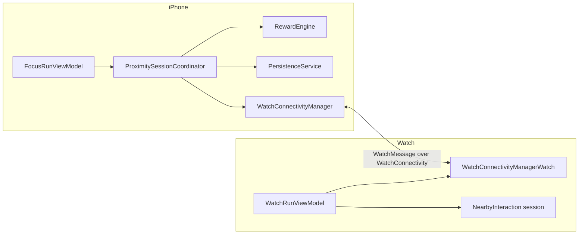

# AGENTS.md — Canonical Guide for AI Agents and Collaborators

This is the **single source of truth** for anyone (human or AI) working on this repository.
If any other document contradicts this file, this file wins. Read it fully before editing code.

- Product name: **Counting Sheep**
- Repo / code name: **Phone in the Other Room** (folder names, target names, and some docs still use this)
- Mascot: **Ollie**, a border collie who guards your focus while your phone is in the other room
- UserDefaults key prefix: `ollie.*` — this is intentional, do not "fix" it

Document precedence (highest first):

1. `AGENTS.md` (this file)
2. `docs/PROJECT_BRIEF.md`, `docs/PRODUCT_PRINCIPLES.md`, `docs/ARCHITECTURE.md`, `docs/DECISIONS/`
3. `docs/PLAYBOOKS/` and `skills/`
4. `PROJECT_AUDIT.md`, `IMPLEMENTATION_PLAN.md` (accurate July 2026 audits, treat as historical reference)
5. `README.md`, `docs/PRD.md`, `docs/IMPLEMENTATION_NOTES.md`, `docs/CHARLIE_AUDIT_ROADMAP.md` — **known to contain drift** (see "Known documentation drift" below)

---

## 1. Mission

Help people stop doomscrolling in bed by making it easy, warm, and even a little delightful
to physically put the phone in another room before sleep. The core mechanic is a
**Focus Run**: the phone goes to another room, the Apple Watch verifies the distance via
Nearby Interaction (UWB), and Ollie celebrates when the phone "stays in bed" elsewhere.

The differentiator is **bedtime screen time** and **physical separation**. Not generic
productivity. Not medical sleep tracking. Not another gamified habit tracker.

## 2. What the product IS / IS NOT

**IS:**

- A bedtime ritual app: put the phone away, wind down, sleep better
- Warm, playful, cozy, emotionally safe — pixel-art farm aesthetic, gentle copy
- Low friction: one tap to start a Focus Run
- Honest about what it measures (focus minutes, streaks, "nights your phone slept in the other room")
- Restrained in gamification: rewards celebrate rest, never punish failure

**IS NOT:**

- A generic productivity / pomodoro app
- A medical or clinical sleep-tracking app (no sleep-quality claims, no diagnoses)
- A manipulative engagement machine (no infinite feeds, no loss-aversion streaks, no variable-ratio reward manipulation, no shame)
- A social network (Friends features are explicitly gated — see ADR-0003)

See `docs/DECISIONS/ADR-0001-product-positioning.md` for the full rationale.

## 3. Current architecture summary

Stack: Swift 5.9, SwiftUI, iOS 17.0+, watchOS 10.0+, **XcodeGen** (`project.yml` generates `PhoneInTheOtherRoom.xcodeproj`). No SPM/CocoaPods dependencies. Pattern: MVVM + a session coordinator.

Four targets (defined in `project.yml`):

| Target | Type | Notes |
|---|---|---|
| `PhoneInTheOtherRoom` | iOS app | Sources: `Shared/` + `PhoneInTheOtherRoomApp/`. Embeds the Watch app. iPhone-only. |
| `PhoneInTheOtherRoomWatchApp` | watchOS app | Sources: `Shared/` + `PhoneInTheOtherRoomWatchApp/`. Companion of the iOS app. |
| `PhoneInTheOtherRoomScreenTimeReport` | iOS app extension | DeviceActivity report extension. **Not embedded** in the main app yet. Compile flag `SCREEN_TIME_REPORTS` is set only on this target. |
| `PhoneInTheOtherRoomTests` | unit tests | Compiles `Shared/` + `Tests/`. 19 tests in `Tests/ProximityClassifierTests.swift`. |

Data flow for a Focus Run:



1. User starts a run on iPhone (`FocusRunSetupView` → `FocusRunViewModel.requestStartRun()` → `ProximitySessionCoordinator.start`).
2. Coordinator sends `startFocusRun` to the Watch; Nearby Interaction discovery tokens are exchanged.
3. Watch measures distance and sends `watchDistanceReading` messages back.
4. `Shared/ProximityClassifier.swift` classifies readings; the coordinator drives the run state machine:
   `setup → placementGrace → waitingForPhoneAway → running ↔ warningPhoneTooClose → completed | endedEarly` (also `signalLost`, `unsupported`, `demo`).
5. On finish, `Shared/RewardEngine.swift` grants rewards/stars/sheep and `PersistenceService` saves `UserProgress` as JSON in `UserDefaults` (keys `ollie.progress`, `ollie.rewards`, `ollie.thresholds`, `ollie.lastRun`, `ollie.analytics.manualEntries`).

The iPhone is the **authoritative** side of a run. The Watch displays state and reports distance.
Persistence is UserDefaults + Codable JSON only — no CoreData, no SwiftData, no App Groups (yet; the Screen Time extension will need an App Group to share data).

Full detail: `docs/ARCHITECTURE.md`.

## 4. Repository map

```
AGENTS.md                      ← you are here (canonical)
project.yml                    ← XcodeGen source of truth for the Xcode project
PhoneInTheOtherRoom.xcodeproj/ ← GENERATED. Never hand-edit project.pbxproj.
Shared/                        ← Pure domain logic compiled into all targets
  Models/OllieModels.swift       (FocusRun, UserProgress, rewards, stars, economy)
  ProximityClassifier.swift      (distance → proximity buckets)
  FocusRunRules.swift            (timing thresholds, completion rules)
  RewardEngine.swift             (rewards, streaks, sheep/coin economy)
  FocusAnalytics.swift           (day records, correlations, CSV/JSON export)
  WatchMessage.swift             (typed phone↔watch message protocol)
  ScreenTimeIntegration.swift    (Screen Time scopes + report context IDs)
  SleepIntervalMath.swift        (sleep interval merging)
PhoneInTheOtherRoomApp/        ← iOS app
  App/                           (@main, App Intents / Shortcuts)
  Design/                        (Theme.swift, PixelComponents.swift — the design system)
  Proximity/                     (ProximitySessionCoordinator + distance providers)
  Services/                      (persistence, watch connectivity, notifications,
                                  HealthKit sleep, Screen Time auth/selection, exports)
  ViewModels/                    (FocusRunViewModel and friends)
  Views/                         (screens; Components/ = shared UI; MVP/ = GATED mock screens)
  MockData/                      (MVPMockData.swift — feeds gated MVP screens ONLY)
PhoneInTheOtherRoomWatchApp/   ← watchOS app (App/, Services/, ViewModels/, Views/)
PhoneInTheOtherRoomScreenTimeReport/ ← DeviceActivity report extension (not yet embedded)
Assets.xcassets/               ← pixel art groups (dog/, farm/, home/, sheep/, ...) + rewards
Tests/                         ← unit tests (Shared logic only; no UI tests)
docs/                          ← durable docs, decisions, playbooks
skills/                        ← portable agent skills (see skills/README.md)
.cursor/rules/                 ← Cursor-specific adapter (thin; points back here)
```

## 5. Coding standards

- Swift 5.9, SwiftUI-first. No UIKit unless a system API demands it.
- No third-party dependencies. Do not add SPM packages without explicit human approval.
- Pure logic goes in `Shared/` and must be unit-testable without UIKit/SwiftUI imports.
- Side effects (network, notifications, HealthKit, WatchConnectivity, persistence) live in `Services/` classes.
- Views stay thin: read state from `@EnvironmentObject` view models, send intents, no business logic.
- Naming: `*ViewModel` for view models, `*Service` for services, `*Manager` only for the existing connectivity managers, `Watch*` prefix for watch-side types.
- UserDefaults keys use the `ollie.*` prefix. Screen Time report contexts use `phone-other.*`.
- Formatting helpers go through `OllieFormat` in `Shared/Formatting.swift`.
- Guard platform-specific APIs: Nearby Interaction requires UWB hardware; Screen Time code compiles only under `#if SCREEN_TIME_REPORTS && canImport(...)`. Always keep the graceful-degradation paths working (`unsupported` state, `NoDistanceFallbackProvider`).
- Comments explain *why*, not *what*. No TODO comments — file a task in `docs/FUTURE_AGENT_TASKS.md` instead.

## 6. SwiftUI and state management conventions

- One `@StateObject` view model per app root: `FocusRunViewModel` (iOS, injected in `PhoneInTheOtherRoomApp.swift`) and `WatchRunViewModel` (Watch). Child views use `@EnvironmentObject`.
- The run state machine lives in `ProximitySessionCoordinator` (an `ObservableObject` owned by `FocusRunViewModel`, which forwards `objectWillChange`). Do not duplicate run state elsewhere; read it through the coordinator.
- Services are singletons (`PersistenceService.shared`, `WatchConnectivityManager.shared`, ...). Do not add new singletons without a strong reason — prefer passing dependencies into the coordinator/view model.
- Prefer `async/await` over Combine. Combine exists only for the `objectWillChange` forwarding.
- UI mutations must happen on the main actor (`Task { @MainActor in ... }` is the existing pattern in connectivity/proximity callbacks).
- `HomeView` is the navigation shell: it routes between the tab UI and the run-state views based on `activeRun.state`. New screens hook into that routing, not parallel navigation stacks.
- Every new view gets a `#Preview` with representative state (including at least one non-happy-path state where relevant).

## 7. File organisation rules

- New shared logic → `Shared/` + a test in `Tests/`.
- New iOS screen → `PhoneInTheOtherRoomApp/Views/`. Shared UI pieces → `Views/Components/`.
- Do NOT add files to `Views/MVP/` or `MockData/` — that layer is gated (see §11).
- New files are picked up automatically by XcodeGen path globs; after adding files run `xcodegen generate`.
- Keep files under ~400 lines. `FocusStatsView.swift` (1,232) and `AssetReadyScreens.swift` (1,413) are known offenders slated for splitting — do not grow them.

## 8. Design system

- Canonical design system: `PhoneInTheOtherRoomApp/Design/Theme.swift` + `PixelComponents.swift` (pixel/paper farm aesthetic, `AppColors`, `pixelFont()`). Use these tokens; do not invent new colors, fonts, or spacing constants inline.
- Legacy layer: `Views/Components/GameComponents.swift` (dark game panels used by the active-run screens). Direction: converge on the pixel Theme over time. Do not build *new* features on `GameComponents`.
- Assets follow `docs/ASSET_NAMING.md` (`category_subject_variant_state`) and are organized in namespaced catalog groups (`dog/`, `farm/`, `home/`, `sheep/`, ...). Missing assets fall back to placeholder shapes via `AssetPlaceholderComponents.swift` — that fallback must keep working.
- Visual tone: warm, soft, nighttime-friendly. Nothing flashing, urgent, or red-alarm styled. Bedtime screens must be comfortable to look at in a dark room.

## 9. Product taste rules

- Copy is gentle, warm, and Ollie-voiced. Never guilt, shame, urgency, or FOMO. See `skills/product-copy-review/SKILL.md`.
- No medical claims ("improves sleep", "fixes insomnia"). Say "helps you wind down", "phone-away habit".
- Rewards celebrate; they never punish. An early-ended run gets a consolation (muddy paw), not a loss.
- Streak copy must never threaten ("don't break your streak!"). A missed night is a fresh start.
- Every feature must pass the belonging test in `docs/PRODUCT_PRINCIPLES.md` §"Does this feature belong?".

## 10. Validation — commands to run

Before starting work (once per session):

```bash
xcodegen generate          # regenerate the Xcode project from project.yml
```

After any code change, before declaring work done:

```bash
xcodegen generate          # if you added/removed/moved files or touched project.yml
xcodebuild build \
  -project PhoneInTheOtherRoom.xcodeproj \
  -scheme PhoneInTheOtherRoom \
  -destination 'generic/platform=iOS Simulator' | tail -20
xcodebuild test \
  -project PhoneInTheOtherRoom.xcodeproj \
  -scheme PhoneInTheOtherRoom \
  -destination 'platform=iOS Simulator,name=iPhone 15' | tail -30
```

(Substitute an available simulator name if iPhone 15 is missing: `xcrun simctl list devices available`.)

There is no CI. A green local build + test run is the merge gate. If you changed `Shared/` logic, add or update tests in `Tests/` — untested shared logic is not done.

## 11. Before editing code — agent checklist

1. Read this file, `docs/PROJECT_BRIEF.md`, and `docs/PRODUCT_PRINCIPLES.md`.
2. Read `docs/ARCHITECTURE.md` if touching structure; the relevant playbook in `docs/PLAYBOOKS/` if doing a release or review task.
3. Check `docs/FUTURE_AGENT_TASKS.md` — your task may already be scoped there with acceptance criteria.
4. Confirm which layer your change belongs in (Shared / Services / ViewModels / Views).
5. If your change touches `project.yml`, targets, entitlements, signing, or the tab structure: **stop and confirm with the human first**. Never run more than one agent at a time on these.
6. If your plan includes "finishing" the Farm, Friends, or Shop screens, wiring `MVPMockData` into real flows, or adding Screen Time UI to release builds: **stop**. Those are gated behind explicit milestones (`docs/DECISIONS/ADR-0003-gated-features.md`, `ADR-0004`).

## 12. After editing code — agent checklist

1. Run the validation commands in §10; paste real results, do not claim success without them.
2. Run through `docs/PLAYBOOKS/pre-merge-review.md` for anything non-trivial.
3. Update docs if behavior changed (this file, ARCHITECTURE.md, or the backlog).
4. Commit in small logical commits with clear messages (see `docs/PLAYBOOKS/git-workflow.md`). **Never push, force-push, or amend without explicit human instruction.**
5. Note any new risks or follow-ups in `docs/FUTURE_AGENT_TASKS.md`.

## 13. Common mistakes to avoid

- **Editing `project.pbxproj` by hand.** It is generated. Edit `project.yml`, then `xcodegen generate`.
- **Trusting stale docs.** See "Known documentation drift" below.
- **"Finishing" the mock screens.** `Views/MVP/AssetReadyScreens.swift` + `MockData/` look like unfinished features begging to be wired up. They are deliberately gated. Don't.
- **Adding entitlement keys without portal setup.** HealthKit and Family Controls require capabilities in the Apple Developer portal and (for Family Controls distribution) Apple's approval. Adding plist/entitlement text alone breaks signing.
- **Assuming Screen Time code runs in the main app.** `SCREEN_TIME_REPORTS` is only defined on the extension target; in the main app those code paths compile to unavailable stubs.
- **Breaking the unsupported-device path.** Not all devices have UWB. `unsupported` state and fallback providers must keep working.
- **Breaking persisted-data decoding.** `UserProgress` etc. are stored as JSON. Changing Codable models needs backwards-compatible decoding (there is a legacy-decode test — keep it passing).
- **Adding dark-pattern gamification.** See §9 and `docs/PRODUCT_PRINCIPLES.md`. This is a hard product boundary, not a style preference.
- **Scope creep.** The #1 project risk is that the app tries to do too much. When in doubt, do less.

## 14. Feature creep warnings (explicitly gated work)

| Feature | Status | Gate |
|---|---|---|
| Farm / Friends / Shop tabs | Hidden from release builds, DEBUG-gated | ADR-0003 milestones |
| Screen Time reports & pickers | Deferred post-TestFlight | Family Controls distribution approval + ADR gates |
| HealthKit sleep card | Deferred to TestFlight build 2 | Signing + entitlements settled |
| NFC/QR bedtime sessions (Foqos-style) | Approved direction, post-build-1 | ADR-0004 gates |
| Social features / backend | Not planned | Own decision record required |

## 15. TestFlight-readiness priorities (ordered)

1. Signing: real bundle IDs (replace `com.example.*`), `DEVELOPMENT_TEAM`, enable code signing in `project.yml`.
2. First-build scope: two tabs (Home + Stats), mock screens gated, Screen Time UI hidden (see `docs/PROJECT_BRIEF.md` MVP scope).
3. Version numbers (`MARKETING_VERSION` / `CURRENT_PROJECT_VERSION`).
4. Crash-risk hardening: backgrounding mid-run, Watch unreachable, no-UWB devices.
5. Privacy strings consistent, App Store privacy labels prepared.
6. Manual QA per `docs/PLAYBOOKS/testflight-readiness.md`.
7. Submit the Family Controls distribution request to Apple early (long lead time) even though the feature ships later.

## 16. Known documentation drift (do not propagate)

- `README.md` claims entitlement files are populated — **all three `.entitlements` files are empty**.
- `docs/IMPLEMENTATION_NOTES.md` describes a Missions tab and claims Watch/Screen Time targets are omitted from `project.yml` — both wrong.
- `docs/PRD.md` uses "Phone in the Other Room" as the in-app identity — the shipping display name is "Counting Sheep" — and describes Screen Time/HealthKit as implemented; they are scaffolded but not entitlement-wired.
- `docs/CHARLIE_AUDIT_ROADMAP.md` says Screen Time integration is absent — scaffolding exists.

A doc-alignment task exists in `docs/FUTURE_AGENT_TASKS.md`. Until it is done, verify claims against code and `project.yml`.
