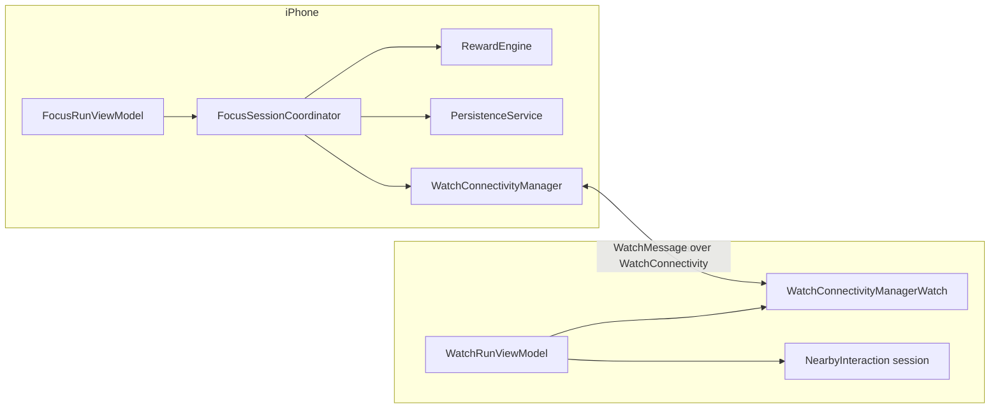

# AGENTS.md — Canonical Guide for AI Agents and Collaborators

This is the **single source of truth** for anyone (human or AI) working on this repository.
If any other document contradicts this file, this file wins. Read it fully before editing code.

- Product name: **Counting Sheep**
- Repo / code name: **Phone in the Other Room** (folder names, target names, and some docs still use this)
- Mascot: **Ollie**, a border collie who guards your focus while your phone is in the other room
- UserDefaults key prefix: `ollie.*` — this is intentional, do not "fix" it

Document precedence (highest first):

1. `AGENTS.md` (this file)
2. `docs/PROJECT_BRIEF.md`, `docs/PRODUCT_PRINCIPLES.md`, `docs/ARCHITECTURE.md`, `docs/DECISIONS/`
3. `docs/PLAYBOOKS/` and `skills/`
4. `PROJECT_AUDIT.md`, `IMPLEMENTATION_PLAN.md` (accurate July 2026 audits, treat as historical reference)
5. `README.md`, `docs/PRD.md`, `docs/IMPLEMENTATION_NOTES.md`, `docs/CHARLIE_AUDIT_ROADMAP.md` — drift-prone; verify against code when in doubt (see "Known documentation drift" below)

---

## 1. Mission

Help people stop doomscrolling around sleep by making it easy, warm, and even a little
delightful to physically put the phone in another room before bed and let it wake after
they do. The user-facing ritual is **Quiet Time** (represented internally by the established
`NightWatch*` types): one phone-away session spans quiet time before bed, the overnight
period, and quiet time after waking. An optional Apple Watch
placement check can confirm the initial walk via Nearby Interaction (UWB).

The differentiator is **screen time at the edges of sleep** and **physical separation**.
Not generic productivity. Not medical sleep tracking. Not another gamified habit tracker.

## 2. What the product IS / IS NOT

**IS:**

- A quiet-time ritual app: put the phone away, wind down, and wake before it does
- Warm, playful, cozy, emotionally safe — pixel-art farm aesthetic, gentle copy
- Low friction: configure once, then one tap to start Quiet Time
- Honest about what it measures (quiet minutes around sleep, protected nights, and
  "nights your phone slept in the other room")
- Purposeful gamification: search pressure, rarity, and anticipation help people return to
  Wind Down; outcomes remain transparent, cosmetic/story-led, and recoverable

**IS NOT:**

- A generic productivity / pomodoro app
- A medical or clinical sleep-tracking app (no sleep-quality claims, no diagnoses)
- A deceptive or coercive engagement machine (no infinite feeds, loss-aversion streaks,
  shame, paid randomness, or rewards for merely opening the app)
- A social network (Friends features are explicitly gated — see ADR-0003)

See `docs/DECISIONS/ADR-0006-sleep-bookends-positioning.md` for the current rationale.

## 3. Current architecture summary

Stack: Swift 5.9, SwiftUI, iOS 17.0+, watchOS 10.0+, **XcodeGen** (`project.yml` generates `PhoneInTheOtherRoom.xcodeproj`). The official `supabase-swift` package is the one approved SPM dependency, limited to optional ActivityKit delivery (ADR-0005); there are no CocoaPods dependencies. Pattern: MVVM + a session coordinator.

Eight targets (defined in `project.yml`):

| Target | Type | Notes |
|---|---|---|
| `PhoneInTheOtherRoom` | iOS app | Sources: `Shared/` + `PhoneInTheOtherRoomApp/`. Embeds the Watch app. iPhone-only. |
| `PhoneInTheOtherRoomWatchApp` | watchOS app | Sources: `Shared/` + `PhoneInTheOtherRoomWatchApp/`. Optional companion and one-time Watch placement assist. |
| `PhoneInTheOtherRoomLiveActivity` | iOS Widget extension | Lock Screen, Dynamic Island, and paired-Watch Smart Stack run status. Embedded in the iOS app. |
| `PhoneInTheOtherRoomScreenTimeReport` | iOS app extension | Embedded DeviceActivity report extension. Main app + extension compile with `SCREEN_TIME_REPORTS`, share scoped selections through the approved App Group, and carry Family Controls entitlements. |
| `PhoneInTheOtherRoomDeviceActivityMonitor` | iOS app extension | Enforces the consented selected-app barrier through the protected session while the app is suspended. |
| `PhoneInTheOtherRoomShieldConfiguration` | iOS app extension | Supplies the gentle, bedtime-specific shield appearance. |
| `PhoneInTheOtherRoomShieldAction` | iOS app extension | Closes the shielded app when the shield button is pressed; Counting Sheep remains available as the emergency exit. |
| `PhoneInTheOtherRoomTests` | unit tests | Compiles `Shared/` + `Tests/`, including Night Watch schedule and legacy-decode coverage. |

Data flow for a Night Watch (represented internally by `FocusRun` for persisted-data compatibility):



1. The user configures bedtime, wake time, two quiet bookends, two optional offline cues,
   and a session guard in `FocusRunSetupView`. Before the wind-down window the plan is
   saved; during it, one tap calls `FocusRunViewModel.requestStartNightWatch()`.
2. `NightWatchPreferences` creates an anchored `NightWatchPlan`; the iPhone persists and
   keeps its wall-clock transitions even while either app is backgrounded. Local reminders
   support the next requested wind-down and morning completion.
3. New plans default to `.nfcTag`, using a locally registered NDEF phone-bed tag; `.honorTimer` remains the simplest fallback. `.watchPlacement` makes one optional, time-boxed Nearby Interaction check at the start; `.qrCode` records a phone-bed scan. An opted-in automatic Wind Down can schedule shielding while the app is closed, with the app reconciling the run on next activation.
4. The plan moves through `.windDown`, `.overnight`, and `.morningQuiet`. Optional placement
   can always become a simple timer; no later Watch distance can warn or end Night Watch.
5. If the user opted into shielding, the same consented Screen Time selection is shielded
   from the eligible Wind Down start through the end of morning quiet, including overnight
   separation. Counting Sheep and its fail-open emergency exit remain available. The monitor
   extension records observed apply/clear evidence in the App Group. This barrier is not
   progression: only the two quiet bookends are credited (ADR-0012).
6. On finish, `Shared/RewardEngine.swift` credits only the two quiet bookends—not the
   overnight hours—then grants one completion reward. `PersistenceService` saves JSON in
   `UserDefaults` under `ollie.*`, including a 90-day session-and-event history. Detailed
   ritual, reflection, and HealthKit history remains local. Separately consented impact
   records omit exact dates/times, source names, selected apps, and raw Health samples.

The iPhone is the **authoritative** side of a run. The Watch displays state and reports a brief optional placement distance only.
Persistence is UserDefaults + Codable JSON only — no CoreData or SwiftData. Core app
state remains in standard defaults; scoped Screen Time selections and the explicit Quiet
Note widget value use the `group.com.ngawangchime.countingsheep` App Group.

Full detail: `docs/ARCHITECTURE.md`.

## 4. Repository map

```
AGENTS.md                      ← you are here (canonical)
project.yml                    ← XcodeGen source of truth for the Xcode project
PhoneInTheOtherRoom.xcodeproj/ ← GENERATED. Never hand-edit project.pbxproj.
Shared/                        ← Pure domain logic compiled into all targets
  Models/OllieModels.swift       (FocusRun, UserProgress, rewards, stars, economy)
  ProximityClassifier.swift      (distance → proximity buckets)
  FocusRunRules.swift            (timing thresholds, completion rules)
  NightWatch.swift               (sleep-bookend preferences, phases, offline cues)
  SessionGuard.swift              (phone-away timer / Watch placement / QR / NFC metadata)
  RewardEngine.swift             (protected-night progress + legacy reward/economy compatibility)
  FocusAnalytics.swift           (day records, correlations, CSV/JSON export)
  ImpactMeasurement.swift        (local sleep-outcome comparison + minimised upload contract)
  NightWatchHistory.swift        (90-day session records + idempotent ritual events)
  PhoneBedTag.swift              (local NFC tag registration digest)
  QuietTimeShieldSchedule.swift  (shared schedule/status/evidence contract)
  WatchMessage.swift             (typed phone↔watch message protocol)
  ScreenTimeIntegration.swift    (Screen Time scopes + report context IDs)
  SleepIntervalMath.swift        (sleep interval merging)
  MorningCheckIn.swift           (private optional morning reflections; no score/reward)
PhoneInTheOtherRoomApp/        ← iOS app
  App/                           (@main, App Intents / Shortcuts)
  Design/                        (Theme.swift, PixelComponents.swift — the design system)
  Proximity/                     (FocusSessionCoordinator + optional Nearby Interaction provider)
  Services/                      (persistence, watch connectivity, notifications,
                                  HealthKit sleep, Screen Time auth/selection, feedback, exports,
                                  optional Supabase ActivityKit delivery)
  ViewModels/                    (FocusRunViewModel and friends)
  Views/                         (screens; Components/ = shared UI; MVP/ = GATED mock screens)
  MockData/                      (MVPMockData.swift — feeds gated MVP screens ONLY)
PhoneInTheOtherRoomWatchApp/   ← watchOS app (App/, Services/, ViewModels/, Views/)
PhoneInTheOtherRoomLiveActivity/ ← WidgetKit / ActivityKit extension
PhoneInTheOtherRoomScreenTimeReport/ ← embedded DeviceActivity report extension
PhoneInTheOtherRoomDeviceActivityMonitor/ ← quiet-window scheduling callbacks
PhoneInTheOtherRoomShieldConfiguration/ ← custom shield appearance
PhoneInTheOtherRoomShieldAction/ ← shield-button response
Config/                         ← local Supabase xcconfig inputs (secrets stay untracked)
supabase/                       ← versioned ADR-0005 schema/functions for ActivityKit delivery
Assets.xcassets/               ← pixel art groups (dog/, farm/, home/, sheep/, ...) + rewards
Tests/                         ← unit tests (Shared logic only; no UI tests)
docs/                          ← durable docs, decisions, playbooks
skills/                        ← portable agent skills (see skills/README.md)
.cursor/rules/                 ← Cursor-specific adapter (thin; points back here)
```

## 5. Coding standards

- Swift 5.9, SwiftUI-first. No UIKit unless a system API demands it.
- `supabase-swift` is the only approved third-party dependency (ADR-0005). Do not add or
  replace packages without explicit human approval.
- Pure logic goes in `Shared/` and must be unit-testable without UIKit/SwiftUI imports.
- Side effects (network, notifications, HealthKit, WatchConnectivity, persistence) live in `Services/` classes.
- Views stay thin: read state from `@EnvironmentObject` view models, send intents, no business logic.
- Naming: `*ViewModel` for view models, `*Service` for services, `*Manager` only for the existing connectivity managers, `Watch*` prefix for watch-side types.
- UserDefaults keys use the `ollie.*` prefix. Screen Time report contexts use `phone-other.*`.
- Formatting helpers go through `OllieFormat` in `Shared/Formatting.swift`.
- Guard platform-specific APIs: Nearby Interaction requires UWB hardware; Screen Time code compiles only under `#if SCREEN_TIME_REPORTS && canImport(...)`. Placement must always degrade to the phone-away timer.
- Comments explain *why*, not *what*. No TODO comments — file a task in `docs/FUTURE_AGENT_TASKS.md` instead.

## 6. SwiftUI and state management conventions

- One `@StateObject` view model per app root: `FocusRunViewModel` (iOS, injected in `PhoneInTheOtherRoomApp.swift`) and `WatchRunViewModel` (Watch). Child views use `@EnvironmentObject`.
- The run state machine lives in `FocusSessionCoordinator` (an `ObservableObject` owned by
  `FocusRunViewModel`, which forwards `objectWillChange`). `NightWatchPlan` adds phase data
  to the same persisted run; do not create a parallel morning or bedtime state machine.
- Services are singletons (`PersistenceService.shared`, `WatchConnectivityManager.shared`, ...). Do not add new singletons without a strong reason — prefer passing dependencies into the coordinator/view model.
- Prefer `async/await` over Combine. Combine exists only for the `objectWillChange` forwarding.
- UI mutations must happen on the main actor (`Task { @MainActor in ... }` is the existing pattern in connectivity/proximity callbacks).
- `HomeView` is the navigation shell: during an active Night Watch Home becomes the live journey while Nights, Farm, and Settings remain reachable; terminal receipts temporarily override the shell. New screens hook into that routing, not parallel navigation stacks.
- Every new view gets a `#Preview` with representative state (including at least one non-happy-path state where relevant).

## 7. File organisation rules

- New shared logic → `Shared/` + a test in `Tests/`.
- New iOS screen → `PhoneInTheOtherRoomApp/Views/`. Shared UI pieces → `Views/Components/`.
- Do NOT add files to `Views/MVP/` or `MockData/` — that layer is gated (see §11).
- New files are picked up automatically by XcodeGen path globs; after adding files run `xcodegen generate`.
- Keep files under ~400 lines. `FocusStatsView.swift` and `AssetReadyScreens.swift` are
  known offenders slated for splitting — do not grow them.

## 8. Design system

- Canonical design system: `PhoneInTheOtherRoomApp/Design/Theme.swift` + `PixelComponents.swift` (pixel/paper farm aesthetic, `AppColors`, `pixelFont()`). Use these tokens; do not invent new colors, fonts, or spacing constants inline.
- Legacy layer: `Views/Components/GameComponents.swift` (dark game panels used by the active-run screens). Direction: converge on the pixel Theme over time. Do not build *new* features on `GameComponents`.
- Assets follow `docs/ASSET_NAMING.md` (`category_subject_variant_state`) and are organized in namespaced catalog groups (`dog/`, `farm/`, `home/`, `sheep/`, ...). Missing assets fall back to placeholder shapes via `AssetPlaceholderComponents.swift` — that fallback must keep working.
- Visual tone: warm, soft, nighttime-friendly. Nothing flashing, urgent, or red-alarm styled. Bedtime screens must be comfortable to look at in a dark room.

## 9. Product taste rules

- Copy is warm, clear, and Ollie-voiced. Constructive urgency and anticipation are allowed
  when the rule is understandable; never use humiliation, deception, or shame. See `skills/product-copy-review/SKILL.md`.
- No medical claims ("improves sleep", "fixes insomnia"). Say "helps you wind down", "phone-away habit".
- Habit formation is intentional: the first three completed protected nights settle a sheep;
  later nights advance Ollie's search and can discover common, uncommon, rare, or legendary
  cosmetic/story sheep. Search odds, streak momentum, and wanted posters may create anticipation.
- Search outcomes are deterministic after resolution, persisted once, and protected against
  unreasonable bad luck. Missing data never lowers the search chance.
- Rewards never affect essential access. An early-ended run advances no sheep search but keeps
  its factual trail receipt; a missed night is recoverable and never deletes found sheep.
- Successfully completed additional-quiet periods map up to 75 minutes toward a future
  non-guaranteed search. They never resolve sheep; guaranteed or early-ended primary runs
  consume no mapped minutes.
- Every feature must pass the belonging test in `docs/PRODUCT_PRINCIPLES.md` §"Does this feature belong?".

## 10. Validation — commands to run

Before starting work (once per session):

```bash
xcodegen generate          # regenerate the Xcode project from project.yml
```

After any code change, before declaring work done:

```bash
xcodegen generate          # if you added/removed/moved files or touched project.yml
xcodebuild build \
  -project PhoneInTheOtherRoom.xcodeproj \
  -scheme PhoneInTheOtherRoom \
  -destination 'generic/platform=iOS Simulator' | tail -20
xcodebuild test \
  -project PhoneInTheOtherRoom.xcodeproj \
  -scheme PhoneInTheOtherRoom \
  -destination 'platform=iOS Simulator,name=iPhone 15' | tail -30
```

(Substitute an available simulator name if iPhone 15 is missing: `xcrun simctl list devices available`.)

There is no CI. A green local build + test run is the merge gate. If you changed `Shared/` logic, add or update tests in `Tests/` — untested shared logic is not done.

## 11. Before editing code — agent checklist

1. Read this file, `docs/PROJECT_BRIEF.md`, and `docs/PRODUCT_PRINCIPLES.md`.
2. Read `docs/ARCHITECTURE.md` if touching structure; the relevant playbook in `docs/PLAYBOOKS/` if doing a release or review task.
3. Check `docs/FUTURE_AGENT_TASKS.md` — your task may already be scoped there with acceptance criteria.
4. Confirm which layer your change belongs in (Shared / Services / ViewModels / Views).
5. If your change touches `project.yml`, targets, entitlements, signing, or the tab structure: **stop and confirm with the human first**. Never run more than one agent at a time on these.
6. If your plan includes "finishing" the Farm, Friends, or Shop screens, wiring `MVPMockData` into real flows, or adding Screen Time UI to release builds: **stop**. Those are gated behind explicit milestones (`docs/DECISIONS/ADR-0003-gated-features.md`, `ADR-0004`).

## 12. After editing code — agent checklist

1. Run the validation commands in §10; paste real results, do not claim success without them.
2. Run through `docs/PLAYBOOKS/pre-merge-review.md` for anything non-trivial.
3. Update docs if behavior changed (this file, ARCHITECTURE.md, or the backlog).
4. Commit in small logical commits with clear messages (see `docs/PLAYBOOKS/git-workflow.md`). **Never push, force-push, or amend without explicit human instruction.**
5. Note any new risks or follow-ups in `docs/FUTURE_AGENT_TASKS.md`.

## 13. Common mistakes to avoid

- **Editing `project.pbxproj` by hand.** It is generated. Edit `project.yml`, then `xcodegen generate`.
- **Trusting stale docs.** See "Known documentation drift" below.
- **"Finishing" the mock screens.** `Views/MVP/AssetReadyScreens.swift` + `MockData/` look like unfinished features begging to be wired up. They are deliberately gated. Don't.
- **Adding entitlement keys without portal setup.** HealthKit and Family Controls require capabilities in the Apple Developer portal and (for Family Controls distribution) Apple's approval. Adding plist/entitlement text alone breaks signing.
- **Expanding shielding beyond its consented boundary.** Reporting/pickers and optional
  shielding are enabled; shielding must use the consented selection, run only from an
  eligible Wind Down start through morning quiet, preserve the early exit, and fail open.
  Overnight shielding is the accepted ADR-0012 barrier; it still never earns quiet credit.
- **Breaking the unsupported-device path.** Not all devices have UWB. `unsupported` state and fallback providers must keep working.
- **Breaking persisted-data decoding.** `UserProgress` etc. are stored as JSON. Changing Codable models needs backwards-compatible decoding (there is a legacy-decode test — keep it passing).
- **Adding dark-pattern gamification.** See §9 and `docs/PRODUCT_PRINCIPLES.md`. This is a hard product boundary, not a style preference.
- **Scope creep.** The #1 project risk is that the app tries to do too much. When in doubt, do less.

## 14. Feature creep warnings (explicitly gated work)

| Feature | Status | Gate |
|---|---|---|
| Friends / Shop screens | Debug internal-preview launch flag only | ADR-0003/0007 milestones |
| Screen Time reports & pickers | Foundation enabled; physical-device QA pending | Family Controls distribution assigned to app + report extension |
| HealthKit sleep duration/stages | Included for 1.0, optional and read-only | Physical-device reads + privacy disclosure |
| NFC + app shielding for Night Watch | Included for 1.0, optional | New extension App IDs, Family Controls distribution, and physical overnight QA |
| Social features | Not planned | Own decision record required; ADR-0005 does not authorize social UI |
| Supabase ActivityKit delivery | Approved, disabled by default | ADR-0005 deployment and privacy gates |

## 15. TestFlight-readiness priorities (ordered)

1. Physical overnight QA: background/termination restore, notifications, Live Activity,
   Watch unreachable, QR fallback, no-UWB devices, and timezone/DST behavior.
2. Privacy strings consistent with Night Watch; App Store privacy labels cover the optional
   Supabase dependency and its enabled/disabled configuration.
3. Re-run a signed archive with the configured bundle IDs, Team ID, and version numbers.
4. App Store 1.0 stays four tabs (Home + Nights + Farm + Settings), with mock UI gated behind the
   explicit Debug preview flag. NFC, read-only HealthKit sleep, Screen Time reports, and
   optional continuous selected-app shielding serve that ritual.
5. Manual QA per `docs/PLAYBOOKS/testflight-readiness.md`.
6. Confirm the embedded Screen Time report extension signs and renders on a physical device.
7. Confirm the monitor, shield configuration, and shield action App IDs have Family Controls
   distribution profiles and survive an overnight terminated-app test.

## 16. Known documentation drift (do not propagate)

The previously listed drift items were reconciled again on 2026-07-18 after the Night
Watch and ADR-0005 backend changes. README, PRD, implementation notes, architecture, and
TestFlight guidance now describe the current phase-aware product and approved dependency.
No documentation drift is currently known.

When in doubt, still verify doc claims against code and `project.yml` — docs can drift again as the code moves.
