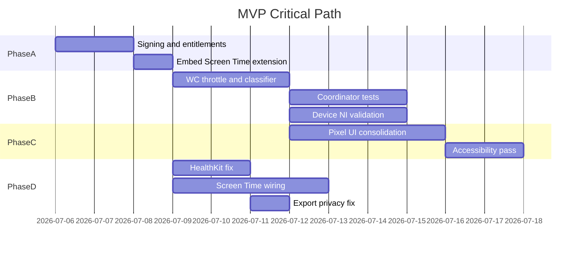

# Implementation Plan — Phone in the Other Room / Counting Sheep

**Date:** July 5, 2026  
**Source:** [`PROJECT_AUDIT.md`](PROJECT_AUDIT.md)  
**Scope:** Prioritized backlog with effort estimates and phased execution

---

## 1. Executive Summary

| Metric | Value |
|--------|-------|
| Total tracked issues | 68 |
| Critical | 8 |
| High | 18 |
| Medium | 24 |
| Low | 18 |
| MVP estimate (solo) | 15–21 engineer-days (~3–4 weeks) |
| MVP estimate (3 parallel tracks) | ~2 weeks |
| V2 estimate | 30–45 engineer-days (~6–8 weeks) |

**MVP goal:** PRD 3-minute demo acceptance on real iPhone + Watch with kind failure paths.

**V2 goal:** Reliable multitasking, real economy wiring, shared abstractions, CI, full accessibility.

---

## 2. Priority Definitions

| Level | Meaning | Ship blocker? |
|-------|---------|---------------|
| **Critical** | Blocks real-device validation, security/compliance, or core run correctness | Yes |
| **High** | Significant reliability, battery, UX, or maintainability risk | MVP yes / V2 maybe |
| **Medium** | Quality, completeness, or tech-debt items | No |
| **Low** | Polish, nice-to-have, minor cleanup | No |

### Effort scale

| Size | Duration | Notes |
|------|----------|-------|
| **S** | 0.5–1 day | Single file, localized change |
| **M** | 1–3 days | Multi-file, includes basic tests |
| **L** | 3–5 days | Cross-cutting, substantial tests or device QA |
| **XL** | 5+ days | New subsystem or major feature |

Estimates assume one engineer including test and review.

---

## 3. Full Prioritized Issue Backlog

### Infrastructure & Signing

| ID | Issue | Priority | Effort | Phase | Files |
|----|-------|----------|--------|-------|-------|
| INF-01 | `CODE_SIGNING_ALLOWED: NO` on all targets | **Critical** | S | MVP-A | [`project.yml`](project.yml) |
| INF-02 | Empty entitlement plists; `CODE_SIGN_ENTITLEMENTS` not wired | **Critical** | M | MVP-A | `*.entitlements`, pbxproj |
| INF-03 | Placeholder bundle IDs (`com.example.*`) | **Critical** | S | MVP-A | [`project.yml`](project.yml) |
| INF-04 | Screen Time extension not embedded in main iOS target | **Critical** | M | MVP-A | [`project.yml`](project.yml), pbxproj |
| INF-05 | `SCREEN_TIME_REPORTS` flag only on extension, not main app | **Critical** | S | MVP-A | [`project.yml`](project.yml) |
| INF-06 | README claims entitlements configured; files empty | Medium | S | MVP-A | [`README.md`](README.md) |
| INF-07 | Watch scheme removed from shared scheme | Low | S | V2 | xcscheme files |
| INF-08 | No CI (XcodeGen + unit tests on PR) | Medium | M | V2 | `.github/workflows/` |
| INF-09 | No App Group for extension data sharing | Medium | M | V2 | entitlements, services |

### Core Run — Correctness & Reliability

| ID | Issue | Priority | Effort | Phase | Files |
|----|-------|----------|--------|-------|-------|
| RUN-01 | No real-device NI validation matrix documented/tested | **Critical** | L | MVP-B | manual test plan + fixes |
| RUN-02 | Watch proximity bucketing bypasses `ProximityClassifier` | **High** | M | MVP-B | [`WatchRunViewModel.swift`](PhoneInTheOtherRoomWatchApp/ViewModels/WatchRunViewModel.swift) |
| RUN-03 | Watch early-end mutates run locally before phone authority | **High** | M | MVP-B | WatchRunViewModel, coordinator |
| RUN-04 | No `scenePhase` / background lifecycle handling | **High** | M | MVP-B | app entry, coordinator |
| RUN-05 | Foreground requirement not communicated in UI | **High** | S | MVP-B | setup + active-run views |
| RUN-06 | `shouldWarnPhoneTooClose` dead code in classifier | Medium | S | V2 | [`ProximityClassifier.swift`](Shared/ProximityClassifier.swift) |
| RUN-07 | God coordinator (~560 lines, too many responsibilities) | Medium | L | V2 | refactor coordinator |
| RUN-08 | `AsyncStream` never finished on NI `stop()` | Low | S | V2 | [`NearbyInteractionDistanceProvider.swift`](PhoneInTheOtherRoomApp/Proximity/NearbyInteractionDistanceProvider.swift) |

### WatchConnectivity & Sync

| ID | Issue | Priority | Effort | Phase | Files |
|----|-------|----------|--------|-------|-------|
| WC-01 | 1 Hz full `FocusRun` sync (up to 3 WC paths/tick) | **High** | M | MVP-B | coordinator, WC managers |
| WC-02 | Unthrottled `watchDistanceReading` on every NI update | **High** | S | MVP-B | WatchRunViewModel |
| WC-03 | Large JSON payloads; no delta protocol | Medium | L | V2 | WatchMessage, codec |
| WC-04 | Duplicate WC managers (~80% copy-paste) | Medium | L | V2 | extract Shared core |
| WC-05 | Duplicate NI token retry (2s × 6) phone + watch | Medium | M | V2 | extract Shared exchange |
| WC-06 | Duplicate NI session wrappers | Medium | M | V2 | Shared abstraction |
| WC-07 | `WatchMessageCodec` no round-trip tests | **High** | S | MVP-B | Tests/ |
| WC-08 | No integration tests for reachability loss | Medium | L | V2 | Tests/ |

### Performance & Battery

| ID | Issue | Priority | Effort | Phase | Files |
|----|-------|----------|--------|-------|-------|
| BAT-01 | 1 Hz timer + WC for entire run | **High** | M | MVP-B | coordinator (same as WC-01) |
| BAT-02 | `isIdleTimerDisabled` for full run | Medium | S | MVP-C | coordinator + user guidance to lock phone |
| BAT-03 | Redundant Watch UI 1 Hz timers | Medium | S | MVP-B | WatchRunView, WatchWarningView |
| BAT-04 | Token retry loops (6 × 2s) both devices | Low | S | V2 | shared exchange |
| BAT-05 | `PingService` activates audio session per ping | Low | S | V2 | PingService |
| BAT-06 | No payload compression | Low | M | V2 | WC codec |

### Security & Privacy

| ID | Issue | Priority | Effort | Phase | Files |
|----|-------|----------|--------|-------|-------|
| SEC-01 | Empty entitlements (Family Controls, HealthKit) | **Critical** | M | MVP-A | entitlements (same as INF-02) |
| SEC-02 | HealthKit auth treats no-throw as authorized | **High** | S | MVP-D | [`HealthSleepService.swift`](PhoneInTheOtherRoomApp/Services/HealthSleepService.swift) |
| SEC-03 | JSON export `relativeDays` doesn't redact dates | **High** | S | MVP-D | [`FocusAnalytics.swift`](Shared/FocusAnalytics.swift) |
| SEC-04 | Screen Time selections in plain UserDefaults | Medium | M | V2 | ScreenTimeSelectionService |
| SEC-05 | Analytics manual entries in plain UserDefaults | Medium | S | V2 | PersistenceService |
| SEC-06 | Default export privacy = exact dates | Medium | S | MVP-D | FocusRunViewModel |
| SEC-07 | Placeholder rows exportable by default | Low | S | MVP-D | FocusStatsView |
| SEC-08 | Export files in temp directory | Low | S | V2 | AnalyticsExportService |

### Accessibility

| ID | Issue | Priority | Effort | Phase | Files |
|----|-------|----------|--------|-------|-------|
| A11Y-01 | Active run: timer, proximity meter, warnings unlabeled | **High** | M | MVP-C | ActiveRunView |
| A11Y-02 | Focus setup pickers and CTA unlabeled | **High** | M | MVP-C | FocusRunSetupView |
| A11Y-03 | Watch exposes raw `"NINearbyObject.distance"` | **High** | S | MVP-C | WatchRunView |
| A11Y-04 | Stats charts, export, manual entry unlabeled | Medium | M | V2 | FocusStatsView |
| A11Y-05 | Color-only proximity meter (no text alternative) | Medium | S | MVP-C | ActiveRunView |
| A11Y-06 | No Dynamic Type on hero text (64pt timer) | Medium | M | V2 | active-run views |
| A11Y-07 | Forced light mode | Medium | M | V2 | PhoneInTheOtherRoomApp.swift |
| A11Y-08 | No `accessibilityReduceMotion` guards | Low | S | V2 | GameComponents, PixelComponents |
| A11Y-09 | Watch warning view unlabeled | Medium | S | MVP-C | WatchWarningView |

### Testing

| ID | Issue | Priority | Effort | Phase | Files |
|----|-------|----------|--------|-------|-------|
| TST-01 | `ProximitySessionCoordinator` untested | **Critical** | L | MVP-B | Tests/ |
| TST-02 | `RewardEngine.generateReward` untested | **High** | M | MVP-B | Tests/ |
| TST-03 | No watch test target | Medium | M | V2 | project.yml, Tests/ |
| TST-04 | `PersistenceService` untested | Medium | M | V2 | Tests/ |
| TST-05 | `WatchRunViewModel` untested | **High** | M | MVP-B | Tests/ |
| TST-06 | Misleading test file name (tests 6+ modules) | Low | S | V2 | rename + split |
| TST-07 | PRD failure paths not automated | Medium | L | V2 | integration tests |
| TST-08 | JSON privacy redaction untested | **High** | S | MVP-D | Tests/ |

### UI / Architecture / Tech Debt

| ID | Issue | Priority | Effort | Phase | Files |
|----|-------|----------|--------|-------|-------|
| UI-01 | Dual visual systems (legacy + pixel) | **High** | L | MVP-C | ActiveRunView, GameComponents |
| UI-02 | `AssetReadyScreens.swift` ~1,400 lines, mock-heavy | **High** | L | MVP-C | split + gate DEBUG |
| UI-03 | Farm/Friends/Shop on `MVPMockData` not `UserProgress` | **High** | L | V2 | AssetReadyScreens, MVPMockData |
| UI-04 | Home dashboard hardcoded values (sheep reward, watch status) | **High** | M | MVP-C | PixelHomeDashboard |
| UI-05 | Asset naming drift (mock vs catalog) | Medium | M | MVP-C | MVPMockData, AssetSlot |
| UI-06 | Orphaned screens (Missions, Doghouse, StatsOverview) | Medium | S | MVP-C | gate `#if DEBUG` or wire |
| UI-07 | `FocusRunViewModel` god-object | Medium | L | V2 | split integrations |
| UI-08 | Singleton coupling everywhere | Medium | L | V2 | protocol DI |
| UI-09 | Doc drift (PRD, IMPLEMENTATION_NOTES, CHARLIE) | Low | S | MVP-A | docs/ |
| UI-10 | Monolithic view files (Stats, PixelComponents) | Low | M | V2 | split files |
| UI-11 | DEBUG mock fallbacks mask integration gaps | Medium | S | MVP-D | FocusStatsView |

### Incomplete Features

| ID | Issue | Priority | Effort | Phase | Files |
|----|-------|----------|--------|-------|-------|
| FEAT-01 | Screen Time stats scaffolded but non-functional | **Critical** | L | MVP-D | extension + FocusStatsView |
| FEAT-02 | Health sleep scaffolded; shows "Not connected" | **High** | M | MVP-D | HealthSleepService, FocusStatsView |
| FEAT-03 | Core Focus Run needs real-device validation | **Critical** | L | MVP-B | device QA |
| FEAT-04 | Bedtime phone-away not implemented | Medium | L | V2 | new service + stats |
| FEAT-05 | Missions built but unwired | Medium | M | V2 | HomeView tab or remove |
| FEAT-06 | Shop placeholder — no economy | Low | L | V2 | shop + RewardEngine |
| FEAT-07 | Friends mock only | Low | XL | V2 | backend or local-only |
| FEAT-08 | Reward shelf collect-only (no equip) | Low | L | V2 | RewardShelfView |
| FEAT-09 | Onboarding preview only | Low | M | V2 | new flow |
| FEAT-10 | Watch complications/widgets | Low | L | V2 | watch targets |
| FEAT-11 | Live Activities | Low | L | V2 | new target |
| FEAT-12 | Multitasking (scenePhase → ERS → Live Activity) | Medium | XL | V2 | tiered rollout |

### Duplicate Logic

| ID | Issue | Priority | Effort | Phase | Notes |
|----|-------|----------|--------|-------|-------|
| DUP-01 | Notification auth boilerplate duplicated | Low | S | V2 | See WC-04 family |
| DUP-02 | `remainingSeconds` duplicated | Low | S | V2 | Shared helper |
| DUP-03 | Warnings-left display duplicated | Low | S | V2 | Shared view component |
| DUP-04 | Completion/early-end copy not shared | Low | M | V2 | Shared copy strings |

---

## 4. Priority Summary by Level

### Critical (8 unique — SEC-01 duplicates INF-02)

| ID | Issue | Effort | Phase |
|----|-------|--------|-------|
| INF-01 | Signing disabled | S | MVP-A |
| INF-02 / SEC-01 | Empty entitlements | M | MVP-A |
| INF-03 | Placeholder bundle IDs | S | MVP-A |
| INF-04 | Screen Time extension not embedded | M | MVP-A |
| INF-05 | `SCREEN_TIME_REPORTS` missing on main app | S | MVP-A |
| RUN-01 | No NI validation matrix | L | MVP-B |
| TST-01 | Coordinator untested | L | MVP-B |
| FEAT-01 | Screen Time non-functional | L | MVP-D |
| FEAT-03 | Core run needs device validation | L | MVP-B |

### High (18)

RUN-02, RUN-03, RUN-04, RUN-05, WC-01, WC-02, WC-07, BAT-01, SEC-02, SEC-03, A11Y-01, A11Y-02, A11Y-03, TST-02, TST-05, TST-08, UI-01, UI-02, UI-04, FEAT-02

### Medium (24)

INF-06, INF-08, INF-09, RUN-06, RUN-07, WC-03, WC-04, WC-05, WC-06, WC-08, BAT-02, BAT-03, SEC-04, SEC-05, SEC-06, A11Y-04, A11Y-05, A11Y-06, A11Y-07, A11Y-09, TST-03, TST-04, TST-07, UI-03, UI-05, UI-06, UI-07, UI-08, UI-11, FEAT-04, FEAT-05, FEAT-12

### Low (18)

INF-07, RUN-08, BAT-04, BAT-05, BAT-06, SEC-07, SEC-08, A11Y-08, TST-06, UI-09, UI-10, FEAT-06, FEAT-07, FEAT-08, FEAT-09, FEAT-10, FEAT-11, DUP-01 through DUP-04

---

## 5. Phased Execution Order



### Phase MVP-A — Infrastructure (2–3 days, blocking)

**Issues:** INF-01, INF-02, INF-03, INF-04, INF-05, SEC-01, UI-09  
**Effort:** ~3–4 engineer-days

| Step | Action | Effort |
|------|--------|--------|
| 1 | Set real bundle IDs and development team in `project.yml` | S |
| 2 | Enable `CODE_SIGNING_ALLOWED`; wire `CODE_SIGN_ENTITLEMENTS` | S |
| 3 | Populate entitlements: HealthKit, Family Controls, Nearby Interaction | M |
| 4 | Add Screen Time extension as embedded dependency in `project.yml` | M |
| 5 | Add `SCREEN_TIME_REPORTS` to main iOS target compile flags | S |
| 6 | Run `xcodegen generate`; verify build on device | S |
| 7 | Update README + IMPLEMENTATION_NOTES to match reality | S |

**Exit criteria:** App installs on physical iPhone + Watch; extension appears in host bundle.

---

### Phase MVP-B — Core Loop (5–7 days, critical path)

**Issues:** RUN-01, RUN-02, RUN-03, RUN-04, RUN-05, WC-01, WC-02, WC-07, BAT-01, BAT-03, TST-01, TST-02, TST-05, FEAT-03  
**Effort:** ~8–12 engineer-days

| Step | Action | Effort |
|------|--------|--------|
| 1 | Throttle WC: send on state change + 15–30s heartbeat; omit `proximityHistory` on tick | M |
| 2 | Debounce `watchDistanceReading` to max 1 Hz | S |
| 3 | Route Watch bucketing through `ProximityClassifier` | M |
| 4 | Fix Watch early-end to request phone authority instead of local mutation | M |
| 5 | Add `scenePhase` observer; show banner when backgrounded (pause optional for MVP) | M |
| 6 | Add foreground requirement copy to setup + active-run screens | S |
| 7 | Remove redundant Watch UI timers; bind to coordinator state | S |
| 8 | Write `WatchMessageCodec` round-trip tests | S |
| 9 | Write `RewardEngine.generateReward` tests | M |
| 10 | Write `ProximitySessionCoordinator` tests with mock distance provider | L |
| 11 | Write `WatchRunViewModel` message handling tests | M |
| 12 | Execute NI hardware validation matrix on 2+ device pairs | L |

**Exit criteria:** 3-minute demo loop passes on real hardware; coordinator + codec + reward tests green.

---

### Phase MVP-C — UX Polish (4–6 days, parallel with B after signing)

**Issues:** UI-01, UI-02, UI-04, UI-05, UI-06, A11Y-01, A11Y-02, A11Y-03, A11Y-05, A11Y-09, BAT-02  
**Effort:** ~6–9 engineer-days

| Step | Action | Effort |
|------|--------|--------|
| 1 | Restyle `ActiveRunView` to pixel theme (or wrap in pixel shell) | L |
| 2 | Wire `PixelHomeDashboard` to real `UserProgress` (sheep reward, watch reachability) | M |
| 3 | Align `MVPMockData` asset names with `AssetSlot` / catalog | M |
| 4 | Gate orphaned screens (`MissionsOverviewScreen`, etc.) behind `#if DEBUG` | S |
| 5 | Split `AssetReadyScreens.swift` into per-screen files | L |
| 6 | Accessibility: label timer, proximity, warnings, CTAs on phone + watch | M |
| 7 | Add "lock your phone to save battery" guidance during run | S |

**Exit criteria:** Consistent pixel visual language on demo path; VoiceOver navigable on active-run flow.

---

### Phase MVP-D — Stats Integrations (4–5 days, parallel after MVP-A)

**Issues:** FEAT-01, FEAT-02, SEC-02, SEC-03, SEC-06, TST-08, UI-11  
**Effort:** ~5–7 engineer-days

| Step | Action | Effort |
|------|--------|--------|
| 1 | Fix `HealthSleepService` to check `authorizationStatus` after request | S |
| 2 | Wire sleep tab to show last-night data when authorized | M |
| 3 | Verify `FamilyActivityPicker` + `DeviceActivityReport` on signed device | L |
| 4 | Fix JSON export to redact dates in `relativeDays` mode | S |
| 5 | Default export privacy to relative days | S |
| 6 | Remove or clearly label DEBUG mock fallbacks in `FocusStatsView` | S |
| 7 | Add test for JSON privacy redaction | S |

**Exit criteria:** Stats tabs show real data when permissions granted; export respects privacy mode.

---

## 6. V2 Backlog

### V2 Tier 1 — Reliability (2–3 weeks, ~10–15 days)

| Issues | Theme |
|--------|-------|
| FEAT-12 tier 1+2 | `scenePhase` pause/resume on background |
| WC-04, WC-05, WC-06 | Shared WC + NI abstractions |
| RUN-07 | Coordinator refactor |
| TST-03, TST-04, TST-07 | Watch tests, persistence tests, integration tests |
| INF-08 | CI pipeline (XcodeGen + unit tests on PR) |

### V2 Tier 2 — Product completeness (3–4 weeks, ~12–18 days)

| Issues | Theme |
|--------|-------|
| UI-03 | Wire Farm to real `UserProgress` economy |
| FEAT-04 | Bedtime phone-away tracking |
| FEAT-05 | Missions tab wiring or removal |
| A11Y-04, A11Y-06, A11Y-07, A11Y-08 | Full accessibility pass |
| UI-07, UI-08 | ViewModel split + protocol DI |
| SEC-04, SEC-05, INF-09 | App Group + storage hardening |

### V2 Tier 3 — Growth features (4+ weeks, ~15–20 days)

| Issues | Theme |
|--------|-------|
| FEAT-12 tier 3 | `WKExtendedRuntimeSession`, Live Activities, complications |
| FEAT-06, FEAT-08 | Shop economy, reward equip |
| FEAT-07 | Friends (local-only preview first) |
| FEAT-09, FEAT-10, FEAT-11 | Onboarding, widgets, Live Activities |

**V2 total:** 30–45 engineer-days

---

## 7. Parallel Work Tracks

| Track | Issues | Engineer focus | Starts after | Est. duration |
|-------|--------|----------------|--------------|---------------|
| **Infra** | INF-*, SEC-01, UI-09 | Signing, entitlements, project.yml | Day 1 | 2–3 days |
| **Run Core** | RUN-*, WC-*, BAT-01/03, TST-01/02/05, FEAT-03 | Coordinator, WC throttle, NI | MVP-A done | 5–7 days |
| **Pixel UI** | UI-01/02/04/05/06, A11Y-*, BAT-02 | Visual consolidation, a11y | MVP-A done | 4–6 days |
| **Stats** | FEAT-01/02, SEC-02/03/06, TST-08, UI-11 | Screen Time, HealthKit, export | MVP-A done | 4–5 days |
| **QA/Device** | RUN-01, FEAT-03 | NI matrix, battery profiling | Continuous | Ongoing |

### Suggested team allocation (3 engineers)

```
Week 1:  [Infra] ──────────────────►
         [Run Core]     (starts day 3) ───────────────►
         [Stats]        (starts day 3) ──────────►

Week 2:  [Run Core] ──────────►
         [Pixel UI] ──────────────────►
         [Stats] ─────►
         [QA]     ═══════════════════════════════►
```

---

## 8. Risk Matrix

| Risk | Likelihood | Impact | Mitigation | Related IDs |
|------|------------|--------|------------|-------------|
| Family Controls entitlement delay | High | Critical | Apply early; stub UI until approved | INF-02, FEAT-01 |
| NI unreliable on some hardware | Medium | High | Demo mode + unsupported states | RUN-01, FEAT-03 |
| Backgrounding kills run | High | High | MVP: document; V2: scenePhase pause | RUN-04, RUN-05, FEAT-12 |
| WC battery drain on long runs | Medium | High | Throttle sync | WC-01, BAT-01 |
| Dual UI confuses demo | Medium | Medium | Consolidate to pixel | UI-01 |
| Mock data mistaken for product | Medium | Medium | Wire or gate DEBUG | UI-02, UI-03 |
| Export privacy leak | Low | Medium | Fix before sharing ships | SEC-03, TST-08 |

---

## 9. Definition of Done

### MVP ship checklist

- [ ] PRD 3-minute demo acceptance on real iPhone + Watch
- [ ] All 8 Critical issues resolved
- [ ] All 18 High issues in MVP phases (B/C/D) resolved
- [ ] `ProximitySessionCoordinator` tests passing
- [ ] `RewardEngine.generateReward` tests passing
- [ ] `WatchMessageCodec` round-trip tests passing
- [ ] Foreground requirement visible in setup + active-run UI
- [ ] VoiceOver navigable on active-run flow (phone + watch)
- [ ] `PROJECT_AUDIT.md` + `IMPLEMENTATION_PLAN.md` committed

### V2 ship checklist

- [ ] `scenePhase` graceful degradation (pause/resume)
- [ ] Farm tab wired to real `UserProgress`
- [ ] Shared WC/NI abstractions in `Shared/`
- [ ] CI runs XcodeGen + unit tests on every PR
- [ ] Full accessibility pass on primary flows
- [ ] Dark mode supported

---

## 10. Issue ID Quick Reference

| Prefix | Category | Count |
|--------|----------|-------|
| INF | Infrastructure & signing | 9 |
| RUN | Core run correctness | 8 |
| WC | WatchConnectivity & sync | 8 |
| BAT | Performance & battery | 6 |
| SEC | Security & privacy | 8 |
| A11Y | Accessibility | 9 |
| TST | Testing | 8 |
| UI | UI / architecture / debt | 11 |
| FEAT | Incomplete features | 12 |
| DUP | Duplicate logic | 4 |

**Total: 83 rows — 68 unique actionable issues** (some IDs overlap phases or share fixes, e.g. WC-01 = BAT-01, INF-02 = SEC-01).

---

## 11. Multitasking Implementation Tiers (V2 detail)

Per [`PROJECT_AUDIT.md`](PROJECT_AUDIT.md) §14, multitasking rolls out in three tiers:

### Tier 1 — Documented constraint (MVP-B, RUN-05)

- In-app copy: "Keep Phone in the Other Room open on your iPhone and Counting Sheep open on your Watch."
- No code change beyond messaging.

**Effort:** S (included in RUN-05)

### Tier 2 — Graceful degradation (V2 Tier 1, FEAT-12 partial)

- `scenePhase` observer on iPhone and Watch
- Pause timer when backgrounded; resume on foreground with user confirmation
- Show non-blocking banner: "Run paused — return to app to continue"

**Effort:** M (3–4 days including tests)

### Tier 3 — Extended runtime (V2 Tier 3, FEAT-12 full)

- `WKExtendedRuntimeSession` on Watch during active runs
- Live Activity on iPhone lock screen (timer + proximity summary)
- Watch complication for remaining time
- Local notification on warning state

**Effort:** XL (8–12 days; requires entitlement review for Live Activities)

---

*Actionable backlog derived from [`PROJECT_AUDIT.md`](PROJECT_AUDIT.md). No source code was modified in this planning pass.*
