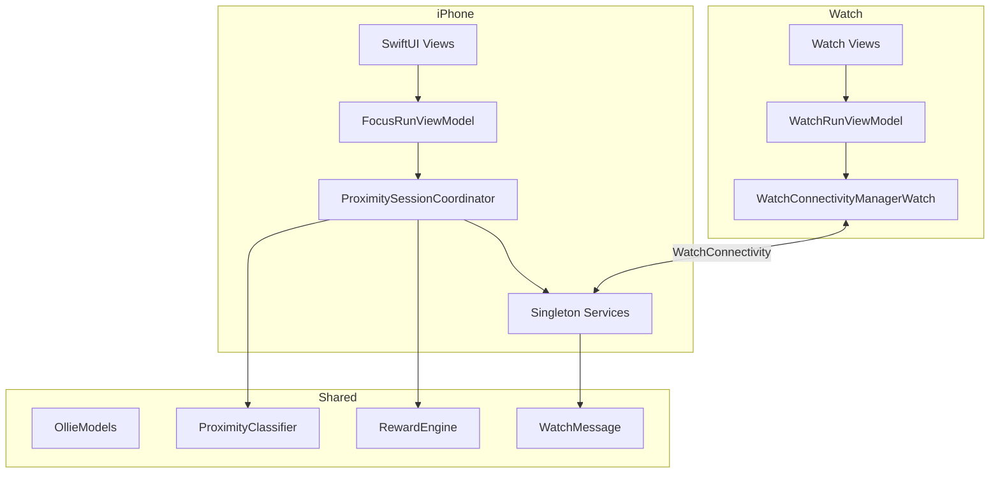
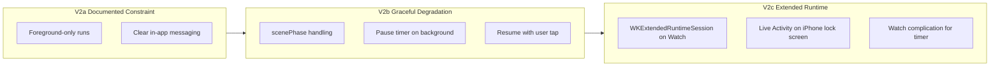

# Project Audit — Phone in the Other Room / Counting Sheep

**Date:** July 5, 2026  
**Auditor role:** Senior iOS Staff Engineer (read-only)  
**Repository:** Local-first iOS 17+ / watchOS 10+ focus game prototype

---

## Executive Summary

**Phone in the Other Room** (in-app brand: **Counting Sheep**) is a hackathon-quality but architecturally sound iOS + watchOS prototype. The core Focus Run loop — leave iPhone behind, use Apple Watch as companion, validate proximity via sampled UWB, earn rewards — is implemented with a clear MVVM + Coordinator pattern and a well-factored `Shared/` domain layer.

**Strengths:** Privacy-preserving local-first design, battery-aware sampled Nearby Interaction, kind failure model (warnings before early end), typed WatchConnectivity protocol, and a growing pixel-style UI revamp.

**Top risks:**

| Risk | Severity | Count |
|------|----------|-------|
| Signing/entitlements block real-device validation | Critical | 5 issues |
| Core run untested on device; coordinator untested in CI | Critical | 2 issues |
| 1 Hz WatchConnectivity sync drains battery on long runs | High | 3 issues |
| Screen Time / Health integrations scaffolded but non-functional | Critical/High | 2 features |
| Accessibility largely absent on primary flows | High | 5 screens |
| Dual UI systems and mock-heavy MVP shell | High | maintenance debt |

**Scale:** ~68 tracked issues → 8 Critical, 18 High, 24 Medium, 18 Low. See [`IMPLEMENTATION_PLAN.md`](IMPLEMENTATION_PLAN.md) for prioritized backlog and effort estimates.

**Related docs:** [`docs/PRD.md`](docs/PRD.md), [`docs/CHARLIE_AUDIT_ROADMAP.md`](docs/CHARLIE_AUDIT_ROADMAP.md), [`docs/IMPLEMENTATION_NOTES.md`](docs/IMPLEMENTATION_NOTES.md), [`README.md`](README.md)

---

## Risk Matrix

| Risk | Likelihood | Impact | Mitigation |
|------|------------|--------|------------|
| Family Controls entitlement approval delay | High | Critical | Apply early; stub stats UI until approved |
| NI unreliable on some hardware combos | Medium | High | Demo mode + unsupported states (already exist) |
| App backgrounding kills active run | High | High | MVP: document in UI; V2: `scenePhase` pause |
| WC battery drain on 25+ min runs | Medium | High | Throttle sync to state-change + heartbeat |
| Dual UI confuses demo reviewers | Medium | Medium | Consolidate active-run screens to pixel theme |
| Mock data shipped as product surface | Medium | Medium | Wire Farm/Friends or gate behind DEBUG |
| Export leaks exact dates in relative mode | Low | Medium | Fix JSON redaction before sharing feature ships |

---

## 1. Current Architecture

### Product model

Local-first, foreground-only focus game. iPhone hosts run orchestration; Apple Watch is the glanceable companion. No backend, no cloud persistence, no third-party analytics.

### Targets (XcodeGen — [`project.yml`](project.yml))

| Target | Platform | Role |
|--------|----------|------|
| `PhoneInTheOtherRoom` | iOS 17+ | Main app; embeds Watch app |
| `PhoneInTheOtherRoomWatchApp` | watchOS 10+ | Companion UI |
| `PhoneInTheOtherRoomScreenTimeReport` | iOS extension | DeviceActivity report scenes |
| `PhoneInTheOtherRoomTests` | iOS unit tests | Shared + Tests |

### Layered architecture



### Authority model

- **iPhone** is source of truth for run state, rewards, and persistence.
- **Watch** receives `startFocusRun`, displays live state, can ping, request distance checks, and end early — but cannot start runs independently.

### Core run loop

1. `PixelHomeDashboard` / `FocusRunSetupView` → `FocusRunViewModel.requestStartRun()`
2. Focus Mode alert in `HomeView` (user must opt in; app never toggles Focus silently)
3. `ProximitySessionCoordinator.start()` — state machine, sampled UWB, 1 Hz timer
4. `NearbyInteractionDistanceProvider` + token exchange over WC → `ProximityClassifier` → warnings / early end / completion
5. `RewardEngine` + `PersistenceService` (UserDefaults) on finish

### Proximity pipeline

```
NearbyInteractionDistanceProvider (iPhone NISession)
  ↔ token exchange via WatchConnectivity
  ↔ WatchNearbyInteractionSession (Watch NISession)
  → ProximityReading stream
  → ProximityClassifier.classify()
  → ProximityState bucket
  → state transitions + warnings + early end
```

Rules live in [`Shared/FocusRunRules.swift`](Shared/FocusRunRules.swift): close-phone fail threshold 2.0m, up to 3 warnings, 20s startup grace, 10s scheduled check windows.

### Parallel surfaces (not run-critical)

`FocusStatsView` (Today/Trends/Sleep), Screen Time extension, HealthKit sleep, analytics export — largely independent of the run loop.

### Entry points

| Platform | File | Root view |
|----------|------|-----------|
| iPhone | [`PhoneInTheOtherRoomApp.swift`](PhoneInTheOtherRoomApp/App/PhoneInTheOtherRoomApp.swift) | `HomeView` |
| Watch | [`PhoneInTheOtherRoomWatchApp.swift`](PhoneInTheOtherRoomWatchApp/App/PhoneInTheOtherRoomWatchApp.swift) | `WatchSetupView` |
| Shortcuts | [`FocusRunShortcuts.swift`](PhoneInTheOtherRoomApp/App/FocusRunShortcuts.swift) | `PrepareFocusRunIntent` |

### Key services (iPhone)

| Service | Role |
|---------|------|
| `PersistenceService` | UserDefaults: progress, rewards, thresholds, analytics |
| `WatchConnectivityManager` | iPhone-side `WCSession` |
| `ScreenTimeAuthorizationService` | Family Controls auth |
| `ScreenTimeSelectionService` | Persists `FamilyActivitySelection` per scope |
| `HealthSleepService` | HealthKit `sleepAnalysis` read |
| `PhoneNotificationService` | Local reminders |
| `AnalyticsExportService` | JSON/CSV export |

---

## 2. Folder Structure

```
PhoneInTheOtherRoomApp/
  App/           — @main, Shortcuts, shortcut store
  ViewModels/    — FocusRunViewModel, RewardShelfViewModel
  Views/         — Home, run screens, stats, pixel dashboard
    MVP/         — AssetReadyScreens (~1,400 lines, mostly mock)
    Components/  — GameComponents, AssetPlaceholderComponents
  Proximity/     — ProximitySessionCoordinator, NI providers
  Services/      — persistence, WC, health, screen time, notifications
  Design/        — Theme.swift, PixelComponents.swift
  MockData/      — MVPMockData.swift

PhoneInTheOtherRoomWatchApp/
  App/, ViewModels/, Views/, Services/

PhoneInTheOtherRoomScreenTimeReport/
  ScreenTimeReportExtension.swift, Info.plist, entitlements

Shared/          — models, engines, protocols (all 4 targets)

Tests/           — ProximityClassifierTests.swift only

Assets.xcassets/   — farm, sheep, home, missions, stats, ui, dog
docs/            — PRD, asset guides, roadmaps
```

### Structural issues

- **Dual UI systems:** legacy dark pasture (`GameComponents`, `ActiveRunView`) vs pixel revamp (`Theme`, `PixelHomeDashboard`, `AssetReadyScreens`)
- **`MVP/` folder:** large design-preview layer not fully wired to real data
- **Screen Time extension** not embedded in main app via `project.yml`
- **Doc drift:** [`docs/IMPLEMENTATION_NOTES.md`](docs/IMPLEMENTATION_NOTES.md) lists tab order Home/Farm/Missions/Friends/Stats; [`HomeView.swift`](PhoneInTheOtherRoomApp/Views/HomeView.swift) uses Home/Farm/Friends/Stats/Shop (Missions removed from tab bar)

---

## 3. Design Patterns

| Pattern | Where | Assessment |
|---------|-------|------------|
| **MVVM** | `FocusRunViewModel`, `WatchRunViewModel`, SwiftUI views | Standard; ViewModel is thin wrapper around coordinator |
| **Coordinator** | `ProximitySessionCoordinator` (~560 lines) | Good separation of run orchestration from UI |
| **Singleton services** | `PersistenceService.shared`, `WatchConnectivityManager.shared` | Convenient but hard to test/mock |
| **Strategy / Protocol** | `DistanceProvider`, `ProximityClassifier` | Clean abstraction for NI vs demo vs fallback |
| **State machine** | `FocusRunState`, `ProximityBucket` in `OllieModels` | Well-modeled domain |
| **Message bus** | `WatchMessage` + codec over WC | Typed protocol; good sync contract |
| **Engine pattern** | `RewardEngine`, `FocusAnalyticsEngine` | Pure logic in Shared — testable |
| **Compile-time feature flags** | `#if SCREEN_TIME_REPORTS`, `#if canImport(FamilyControls)` | Fragile: flag only on extension target |
| **Placeholder / Asset slot** | `AssetSlot` in Theme, `AssetPlaceholderComponents` | Intentional swap-in for final art |

---

## 4. Technical Debt

### Critical (blocks real-device validation)

- `CODE_SIGNING_ALLOWED: NO` on all targets in [`project.yml`](project.yml)
- Empty entitlement plists; `CODE_SIGN_ENTITLEMENTS` not wired in pbxproj
- Placeholder bundle IDs (`com.example.*`)
- Screen Time extension not embedded in main iOS target
- `SCREEN_TIME_REPORTS` compile flag only on extension, not main app

### High

- ~1,400-line [`AssetReadyScreens.swift`](PhoneInTheOtherRoomApp/Views/MVP/AssetReadyScreens.swift) mixing mock UI, navigation, and layout
- Farm/Friends/Shop tabs run on [`MVPMockData`](PhoneInTheOtherRoomApp/MockData/MVPMockData.swift), not `UserProgress`
- Asset naming drift: mock references `sheep_common_white`; catalog has `sheep/sheep_common`
- Dual visual systems increase maintenance
- No `scenePhase` / background lifecycle handling

### Medium

- `FocusRunViewModel` is a god-object for run + Screen Time + Health + analytics + export
- `shouldWarnPhoneTooClose` in `ProximityClassifier` is dead code (only tested, never called in production)
- [`README.md`](README.md) claims entitlements are configured; files are empty
- Doc drift across PRD, IMPLEMENTATION_NOTES, CHARLIE_AUDIT_ROADMAP

### Low

- `AsyncStream` in `NearbyInteractionDistanceProvider` never finished on `stop()`
- Watch scheme removed from shared scheme (per git status)

---

## 5. Code Smells

1. **God coordinator** — `ProximitySessionCoordinator` handles timer, NI, WC, rewards, persistence, ping, token retry, distance-check windows, and demo mode
2. **God view model** — `FocusRunViewModel` bundles unrelated integrations
3. **Singleton coupling** — services accessed via `.shared` everywhere; no DI container
4. **Magic numbers on Watch** — hardcoded 1.5/5/8m thresholds bypass shared `ThresholdProfile`:

```201:211:PhoneInTheOtherRoomWatchApp/ViewModels/WatchRunViewModel.swift
        if let distance {
            switch distance {
            case ..<1.5:
                bucket = .withYou
            case ..<5.0:
                bucket = .sameRoom
            case ..<8.0:
                bucket = .doorway
            default:
                bucket = .probablyOtherRoom
            }
```

5. **Misleading test file name** — `ProximityClassifierTests.swift` tests 6+ modules
6. **Forced light mode** — blocks system dark mode:

```11:16:PhoneInTheOtherRoomApp/App/PhoneInTheOtherRoomApp.swift
    var body: some Scene {
        WindowGroup {
            HomeView()
                .environmentObject(runViewModel)
                .preferredColorScheme(.light)
        }
```

7. **Silent error swallowing** — `PingService` uses `try?` on audio session setup
8. **HealthKit auth optimism** — `requestSleepAccess()` treats no-throw as authorized without checking `authorizationStatus`
9. **Large view files** — `FocusStatsView.swift`, `AssetReadyScreens.swift`, `PixelComponents.swift` are monolithic
10. **DEBUG mock leakage** — `FocusStatsView` has `#if DEBUG` mock fallbacks that can mask integration gaps

---

## 6. Duplicate Logic

| Area | Phone | Watch | Risk |
|------|-------|-------|------|
| WatchConnectivity managers | `WatchConnectivityManager.swift` | `WatchConnectivityManagerWatch.swift` | ~80% copy-paste |
| Notification auth boilerplate | `PhoneNotificationService` | `WatchNotificationService` | Identical auth flow |
| NI token retry (2s × 6) | `ProximitySessionCoordinator` | `WatchRunViewModel` | Same retry logic |
| NI session wrapper | `NearbyInteractionDistanceProvider` | `WatchNearbyInteractionSession` in VM | Parallel implementations |
| Proximity bucketing | `ProximityClassifier` | inline switch in `WatchRunViewModel` | Threshold drift if calibrated |
| `remainingSeconds` | coordinator | watch VM | Trivial duplication |
| Warnings-left display | `ActiveRunView` | `WatchWarningView` | Same `FocusRunRules` math |
| Completion/early-end UI | `CompletionView` / `EarlyEndView` | `WatchCompletionView` / `WatchEarlyEndView` | Copy not shared |

**Recommendation:** Extract `Shared/WatchConnectivityCore`, `Shared/NearbyTokenExchange`, route Watch bucketing through `ProximityClassifier`.

---

## 7. Performance Issues

1. **1 Hz WC sync** — every `tick()` sends full `FocusRun` via up to 3 WC paths:

```19:32:PhoneInTheOtherRoomApp/Services/WatchConnectivityManager.swift
    func send(_ message: WatchMessage) {
        guard WCSession.isSupported() else { return }
        if message.run != nil || message.proximity != nil || message.reward != nil {
            latestStateMessage = message
        }
        let dictionary = WatchMessageCodec.dictionary(from: message)
        try? WCSession.default.updateApplicationContext(dictionary)
        if WCSession.default.isReachable {
            WCSession.default.sendMessage(dictionary, replyHandler: nil) { _ in
                WCSession.default.transferUserInfo(dictionary)
            }
        } else if shouldQueueWhenUnreachable(message.type) {
            WCSession.default.transferUserInfo(dictionary)
        }
    }
```

2. **Unthrottled watch distance readings** — `watchDistanceReading` on every NISession update during check windows
3. **Redundant Watch UI timers** — `Timer.publish(every: 1)` in `WatchRunView` and `WatchWarningView`
4. **Large JSON payloads** — full run object encoded every second; no delta protocol
5. **Monolithic SwiftUI bodies** — large `body` builders may cause excess diffing (minor)
6. **No payload compression** — acceptable at MVP scale

---

## 8. Battery Issues

### High drain

- 1 Hz timer + WC for entire run duration ([`ProximitySessionCoordinator.startTimer()`](PhoneInTheOtherRoomApp/Proximity/ProximitySessionCoordinator.swift))
- `isIdleTimerDisabled = true` for full run (display stays on if user doesn't lock phone)
- Unthrottled UWB reading forwarding from Watch during check windows

### Well-designed (battery-aware)

- Sampled UWB: 45–120s random schedule, 10s windows, explicit `nearby.stop()` between checks
- No GPS / CoreLocation
- No always-on NI

### Medium

- Token retry loops (6 × 2s) on both devices
- `PingService` activates `AVAudioSession` per ping
- Watch 1 Hz UI timers while views visible

### Foreground constraint

No `WKExtendedRuntimeSession`, `BGTaskScheduler`, or background modes. Run depends on both apps staying foreground — intentional for MVP but not communicated in UI.

---

## 9. Accessibility Issues

**Coverage:** Only ~7 accessibility usages across entire SwiftUI codebase (mostly new pixel components).

### Critical gaps

| Screen | Issue |
|--------|-------|
| `ActiveRunView` | Timer, proximity meter (color-only 4-bar), warnings, buttons — no labels/hints |
| `FocusRunSetupView` | Duration/purpose pickers, primary CTA |
| `FocusStatsView` | Charts, export, manual entry fields |
| `WatchRunView` | Exposes raw `"NINearbyObject.distance"` as visible UI |
| `WatchWarningView` | Warning count/timer unlabeled |

### Systemic

- No `@ScaledMetric` / Dynamic Type on hero text (64pt fixed timer)
- No `accessibilityReduceMotion` guards on spring animations
- Forced light mode harms low-vision users
- Color-only proximity meter fails WCAG without text alternatives

---

## 10. Missing Tests

### Existing

Single file [`Tests/ProximityClassifierTests.swift`](Tests/ProximityClassifierTests.swift) — 19 methods covering classifier, reward progress, focus rules, sleep math, analytics. No watch test target.

### Highest-priority gaps

| Module | Why |
|--------|-----|
| `ProximitySessionCoordinator` | Core state machine: warnings, early end, completion, WC handling |
| `RewardEngine.generateReward` | Rarity, streak legendary, consolation — untested |
| `WatchMessageCodec` | No round-trip encode/decode tests |
| `WatchRunViewModel` | Message handling, local early-end, threshold divergence |
| `PersistenceService` | Migration, threshold storage, analytics entries |
| `FocusAnalyticsEngine` export | JSON privacy mode redaction bug untested |
| Integration | WC reachability loss, NI unsupported, warning recovery (PRD requires these) |

### Suggested test pyramid

- **Unit:** engines + classifier + codec (Shared/)
- **Unit:** coordinator with injected mock `DistanceProvider` + mock WC
- **Snapshot:** key SwiftUI screens (optional, post-MVP)
- **Manual/device:** NI hardware matrix (documented test plan, not CI)

---

## 11. Security / Privacy Concerns

### Strengths (aligned with PRD)

- No cloud, no third-party analytics SDK, no GPS
- Screen Time processed in sandboxed extension
- HealthKit read-only (`toShare: []`)
- Local-first UserDefaults

### Gaps

| Issue | Severity | Detail |
|-------|----------|--------|
| Empty entitlements | Critical | Family Controls, HealthKit not in checked-in plists |
| Screen Time selections in plain UserDefaults | Medium | Sensitive app-usage config |
| Analytics in plain UserDefaults | Medium | Sleep/screen-time manual entries |
| JSON export privacy bug | Medium | `relativeDays` mode doesn't redact ISO dates in JSON body |
| Export to temp directory | Low | Files persist until OS cleanup |
| Default export privacy = exact dates | Low | Should default to relative |
| Placeholder rows in export | Low | `includeAnalyticsPlaceholders` can export demo data |
| No App Group | Medium | Extension can't share selections with main app |

---

## 12. Features That Look Incomplete

| Feature | Status | Evidence |
|---------|--------|----------|
| **Core Focus Run** | Functional (sim/demo) | Needs real-device NI validation |
| **Pixel Home/Farm shell** | Partial | Real progress on home; Farm uses mock data |
| **Friends tab** | Mock only | `MVPMockData.friendFeed` |
| **Shop tab** | Placeholder | No economy wiring |
| **Missions** | Built but unwired | `MissionsOverviewScreen` not in tab bar |
| **Doghouse** | Orphaned | `DoghouseScreen` exists; home uses inline scene |
| **Screen Time stats** | Scaffolded | Extension not embedded; main app lacks `SCREEN_TIME_REPORTS` |
| **Health sleep** | Scaffolded | Sleep tab shows "Not connected" |
| **Bedtime phone-away** | Not implemented | Stats UI placeholder |
| **Reward shelf cosmetics** | Collect only | No equip/arrange |
| **Social** | None | Mock preview only |
| **Onboarding** | Preview only | Settings link only |
| **Watch complications/widgets** | None | |
| **Live Activities** | None | |
| **Background/multitask** | None | Not communicated in UI |

### Orphaned MVP screens (built, not in navigation)

- `MissionsOverviewScreen`, `StatsOverviewScreen`, `DoghouseScreen` — reachable only via nested/debug links

---

## 13. Suggested Roadmap — MVP

**Goal:** Reliable 3-minute demo loop on real iPhone + Watch. Per [`docs/PRD.md`](docs/PRD.md) demo acceptance.

### Phase A — Infrastructure

- Enable signing; real bundle IDs; populate entitlements (NI, HealthKit, Family Controls)
- Embed Screen Time extension; add `SCREEN_TIME_REPORTS` to main iOS target
- Document foreground requirement in setup/active-run UI
- Fix doc drift (IMPLEMENTATION_NOTES tab order)

### Phase B — Core loop hardening

- Real-device NI validation matrix (UWB supported / unsupported / demo mode)
- Throttle WC: state-change + 15–30s heartbeat; slim payloads
- Debounce `watchDistanceReading` (max 1 Hz)
- Unify Watch bucketing through `ProximityClassifier`
- Test `ProximitySessionCoordinator` state machine

### Phase C — UX polish

- Wire home dashboard to real data
- Consolidate to pixel visual system for demo screens
- Accessibility pass on active-run flow
- Gate orphaned MVP screens behind `#if DEBUG`

### Phase D — Stats (minimal)

- HealthKit: verify `authorizationStatus`; show last-night sleep
- Screen Time: wire `FamilyActivityPicker` + `DeviceActivityReport` on device
- Fix JSON export privacy redaction

**MVP exit criteria:** PRD demo acceptance + coordinator + reward + codec tests.

---

## 14. Suggested Roadmap — V2

### Reliability & Multitasking Strategy

iOS/watchOS multitasking is the biggest product risk. Three tiers:



- **V2a:** `scenePhase` observers; pause run / "return to app" banner when backgrounded
- **V2b:** `WKExtendedRuntimeSession` for Watch during active runs
- **V2c:** Live Activity; Watch complications; local notifications on warning

### Product features (post-MVP)

1. Daily missions wired to real `UserProgress`
2. Farm tab connected to sheep/coin economy
3. Reward shelf: rarity filters, equip slots
4. Share card for completed runs (local generation)
5. Local-only friend comparison preview
6. Calendar heatmap + monthly challenges
7. Sheep selling / coin pricing for cosmetics
8. Onboarding flow
9. Dark mode support
10. Watch test target + shared WC/NI abstractions

### Engineering (V2)

- Extract `WatchConnectivityCore` + `NearbyTokenExchange` to Shared
- Protocol-based DI for testable coordinators
- App Group for extension data sharing
- CI: XcodeGen + unit tests on PR

### Parallel development tracks

| Track | Focus | Starts after |
|-------|-------|--------------|
| **Run core** | Coordinator, NI, WC, Watch | Phase A signing |
| **Pixel UI** | Home, active run, completion | Phase A |
| **Stats/integrations** | Screen Time, HealthKit, export | Entitlements |
| **Watch companion** | Watch UI, extended runtime | Phase A |
| **QA/device** | NI matrix, battery profiling | Continuous |

---

## Cross-Reference: Doc Drift

| Document | Says | Code reality |
|----------|------|--------------|
| `IMPLEMENTATION_NOTES.md` | Tabs: Home/Farm/Missions/Friends/Stats | `HomeView`: Home/Farm/Friends/Stats/Shop |
| `IMPLEMENTATION_NOTES.md` | Watch target omitted from project.yml | Watch target present and embedded |
| `README.md` | HealthKit + Family Controls entitlements covered | Entitlement plists are empty |
| `CHARLIE_AUDIT_ROADMAP.md` | Screen Time not present | Scaffolded but non-functional |
| PRD product name | Phone in the Other Room | Display name: Counting Sheep |

---

## Appendix: Charlie-Inspired Gap Analysis

Per [`docs/CHARLIE_AUDIT_ROADMAP.md`](docs/CHARLIE_AUDIT_ROADMAP.md), several Charlie-inspired features were added in a recent pass (daily stars, pixel shell, stats tabs). Remaining gaps vs Charlie:

- Farm/Friends still mock-driven (Charlie's social/economy loop)
- No purchasable currency (intentionally deferred — good for focus product)
- Missions UI exists but unwired to real progress
- Reward personalization (equip/arrange) not started

---

*This audit is read-only. Actionable backlog with effort estimates: [`IMPLEMENTATION_PLAN.md`](IMPLEMENTATION_PLAN.md).*
