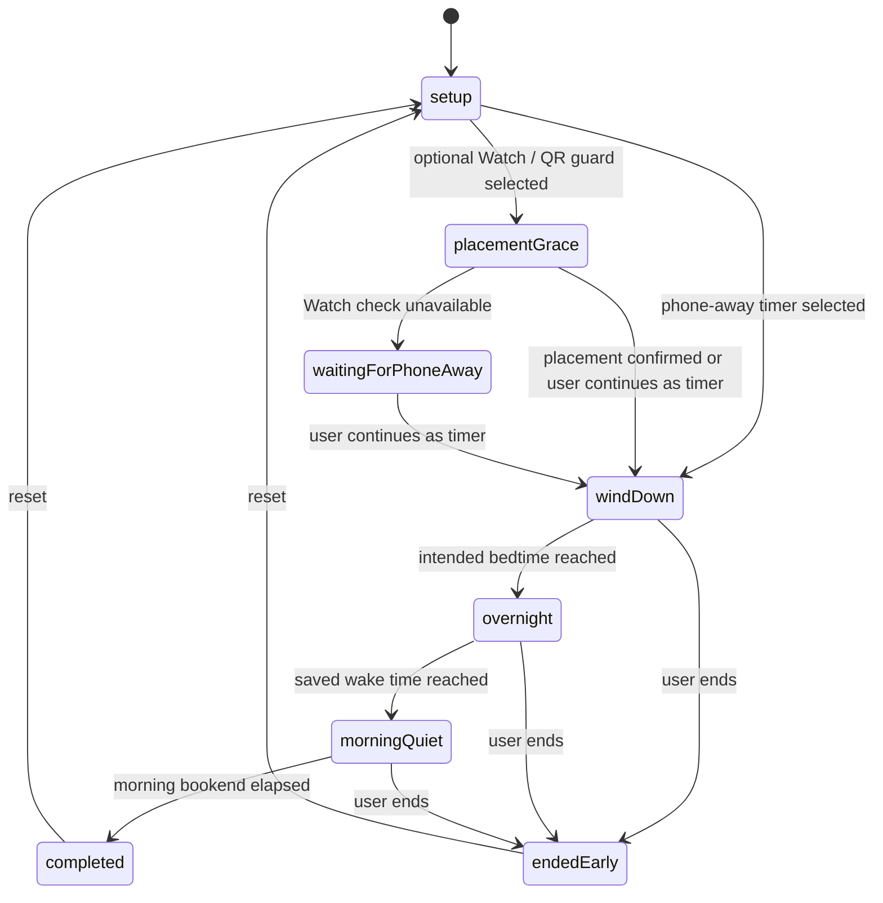

# Architecture Map — Counting Sheep

Practical architecture reference for humans and agents. Canonical rules live in
[`AGENTS.md`](../AGENTS.md); this file goes deeper on structure, data flow, and risk.

Last verified against code: July 2026.

## 1. Stack and build system

- Swift 5.9, SwiftUI, iOS 17.0+, watchOS 10.0+
- **XcodeGen**: `project.yml` is the source of truth; `PhoneInTheOtherRoom.xcodeproj` is
  generated. Run `xcodegen generate` after adding/moving files or editing `project.yml`.
  Never hand-edit `project.pbxproj`.
- One approved SPM dependency: official `supabase-swift`, limited to the optional
  ADR-0005 ActivityKit delivery path. No CocoaPods dependencies. No CI (local build + test is the gate).
- Five application/test targets plus shared domain code; use `rg --files` when exact counts matter.

## 2. Targets

| Target | Type | Sources | Notes |
|---|---|---|---|
| `PhoneInTheOtherRoom` | iOS app | `Shared/` + `PhoneInTheOtherRoomApp/` + assets | Display name "Counting Sheep". Embeds the Watch app. iPhone-only (`TARGETED_DEVICE_FAMILY: 1`). |
| `PhoneInTheOtherRoomWatchApp` | watchOS app | `Shared/` + `PhoneInTheOtherRoomWatchApp/` | Optional companion: mirrors run state and can make one brief Nearby Interaction placement check. |
| `PhoneInTheOtherRoomLiveActivity` | iOS Widget extension | `Shared/` + `PhoneInTheOtherRoomLiveActivity/` + assets | Embedded Live Activity for Lock Screen, Dynamic Island, and paired-Watch Smart Stack status. |
| `PhoneInTheOtherRoomScreenTimeReport` | iOS app extension | `Shared/` + `PhoneInTheOtherRoomScreenTimeReport/` | Embedded DeviceActivity report extension. Main app and extension compile the `SCREEN_TIME_REPORTS` paths and share scoped selections through the App Group. |
| `PhoneInTheOtherRoomTests` | unit tests | `Shared/` + `Tests/` | Shared-domain coverage, including Night Watch schedule and legacy decoding. |

Schemes: `PhoneInTheOtherRoom` (builds iOS + Watch, runs tests) and
`PhoneInTheOtherRoomScreenTimeReport` (extension only).

## 3. Module map

```
Shared/                        Pure domain logic (no UI, unit-testable)
├─ Models/OllieModels.swift      FocusRun, FocusRunState, UserProgress, stars,
│                                daily records, sheep/coin economy
├─ RewardModels.swift            keepsake types, families, and bookend context
├─ ProximityClassifier.swift     legacy/shared distance buckets (placement only)
├─ FocusRunRules.swift           timing and completion eligibility
├─ SessionGuard.swift            honor timer / Watch placement / QR / NFC guard metadata
├─ NightWatch.swift              saved sleep-bookend plan, phases, activities, quiet credit
├─ OfflinePurpose.swift          private offline intention + notification privacy choice
├─ RewardEngine.swift            rotating keepsakes, cumulative milestones, progress updates
├─ FocusAnalytics.swift          day records, correlations, CSV/JSON export
├─ WatchMessage.swift            typed phone↔watch message envelope + codec
├─ ScreenTimeIntegration.swift   Screen Time scopes + report context IDs (phone-other.*)
├─ SleepIntervalMath.swift       merge sleep intervals → SleepSummary
├─ MorningCheckIn.swift          private, optional morning reflections (no score/reward)
├─ DistanceProvider.swift        protocol: async stream of distance readings
└─ Formatting.swift              OllieFormat timer/minute formatting

PhoneInTheOtherRoomApp/        iOS app
├─ App/                          @main entry, App Intents / Shortcuts
├─ Design/                       Theme.swift + PixelComponents.swift — design system
├─ Proximity/
│  ├─ FocusSessionCoordinator.swift            ← THE phone-authoritative run coordinator
│  └─ NearbyInteractionDistanceProvider.swift  iPhone NI session for optional placement
├─ Services/                     singletons for side effects
│  ├─ PersistenceService.swift                 JSON-in-UserDefaults store
│  ├─ WatchConnectivityManager.swift           WCSession (phone side)
│  ├─ PhoneNotificationService.swift           local notifications
│  ├─ PingService.swift                        haptic/sound "whistle" at phone
│  ├─ FocusModeSuggestionService.swift         Focus Mode guidance strings
│  ├─ HealthSleepService.swift                 optional, read-only HealthKit sleep reads
│  ├─ ScreenTimeAuthorizationService.swift     FamilyControls auth (flag-gated)
│  ├─ ScreenTimeSelectionService.swift         FamilyActivitySelection per scope
│  ├─ AnalyticsExportService.swift             JSON/CSV export to temp files
│  ├─ SupabaseClientProvider.swift             configured official Swift client
│  ├─ SupabaseAuthenticationService.swift      anonymous-session restore/create
│  └─ SupabaseLiveActivityRemoteSink.swift     disabled-by-default push registration sink
├─ ViewModels/FocusRunViewModel.swift          root view model, owns the coordinator
├─ Views/
│  ├─ HomeView.swift                           navigation shell + run-state routing
│  ├─ PixelHomeDashboard.swift                 home tab
│  ├─ FocusRunSetupView.swift                  bedtime/wake, bookends, purpose + guard
│  ├─ ActiveRunView.swift                      in-run UI
│  ├─ CompletionView.swift / EarlyEndView.swift
│  ├─ FocusStatsView.swift                     dated Nights history + health/bookend reports
│  ├─ RewardShelfView.swift
│  ├─ Components/QRCodeScannerView.swift       QR phone-bed scanner + manual fallback
│  ├─ Components/NightWatchReceiptCard.swift   elapsed/bookend/sleep/data-status receipt
│  ├─ Components/MorningCheckInCard.swift       collapsed, optional morning reflection
│  ├─ Components/GameComponents.swift          legacy UI retained outside run flow
│  ├─ Components/AssetPlaceholderComponents.swift  placeholder/sprite fallbacks
│  └─ MVP/AssetReadyScreens.swift              GATED: Farm/Friends/Shop mock screens
└─ MockData/MVPMockData.swift                  GATED: feeds MVP screens only

PhoneInTheOtherRoomWatchApp/   watchOS companion
├─ App/                          @main
├─ Services/                     WatchConnectivityManagerWatch, WatchNotificationService
├─ ViewModels/WatchRunViewModel.swift          watch-side run state
└─ Views/                        WatchSetupView, WatchRunView, WatchWarningView,
                                 WatchCompletionView, WatchEarlyEndView, WatchOllieIconView

PhoneInTheOtherRoomLiveActivity/ iOS WidgetKit extension
├─ FocusRunLiveActivityWidget.swift              Lock Screen + Dynamic Island layouts
└─ Info.plist                                    Widget extension declaration

PhoneInTheOtherRoomScreenTimeReport/
└─ ScreenTimeReportExtension.swift   3 DeviceActivity report scenes:
                                     today / weekly / late-night (phone-other.*)

Config/                         local Supabase xcconfig values; secrets remain untracked
supabase/                       versioned ADR-0005 migrations and Edge Functions
```

## 4. Data flow

### Quiet Time lifecycle (implemented by the internal Night Watch model)



Sequence per Night Watch (persisted internally as `FocusRun` for data compatibility):

1. `PixelHomeDashboard` → `FocusRunSetupView` saves `NightWatchPreferences`: bedtime,
   wake time, quiet-window lengths, two optional offline cues, and the placement guard.
   Outside the start window, the app saves the plan and schedules a wind-down reminder.
2. `FocusRunViewModel.requestStartNightWatch()` anchors a `NightWatchPlan` to tonight and
   starts `FocusSessionCoordinator`. One persisted run spans wind-down, overnight, and
   morning quiet; there is no second morning timer or competing state machine.
3. The iPhone coordinator creates the run and schedules one foreground timer for the next
   semantic boundary (bedtime, wake time, or `plan.protectedUntil`), never a repeating
   countdown timer. SwiftUI renders visible countdowns from absolute dates. The view model
   schedules silent sleep-time and phone-free-morning transitions plus the audible completion
   the user requested. The coordinator persists and mirrors the run only at meaningful state
   and lifecycle events; when the optional ActivityKit delivery path is deployed, the backend
   sends phase updates at the same two boundaries so the Live Activity can advance while the
   app is suspended.
4. The default `.honorTimer` completes without either device being foregrounded. The
   optional `.watchPlacement` guard uses Nearby Interaction for at most 30 seconds to
   confirm the initial walk-away; it then stops. `.qrCode` records one phone-bed scan.
5. If optional placement is unavailable, the run automatically continues as a simple
   phone-away timer. No later distance reading can warn or end a run.
6. On finish, `RewardEngine` credits only elapsed wind-down and morning-quiet minutes.
   Overnight hours never inflate progress or the reward economy. One keepsake records the
   two credited bookends and offline cues; its family rotates independently of minutes,
   warnings, and streaks. Lifetime protected-night milestones cannot be lost. Progress is
   attributed to the intended-bedtime date, then `PersistenceService` saves and the Watch
   gets the completion or early-end message. See `docs/REWARDS.md`.
7. `HomeView` routes to `CompletionView` / `EarlyEndView` based on `activeRun.state`.
   Both outcomes show the same factual receipt: elapsed phone-away time, credited quiet
   bookends, optional Apple Health sleep context, and an explicit Screen Time availability
   state. The separate Nights tab stays finite and reports only history, the current plan,
   and consented selected-app use in independently configurable evening and morning report
   windows. The chosen report windows do not alter Quiet Time. Missing data is never estimated.

### Backgrounding during a run

Elapsed time is wall-clock based, so it continues while the iPhone app is in the
background. On background, the coordinator cancels its next-boundary timer and any in-progress
optional placement check, then saves the run snapshot. On foreground it reconciles against
the wall clock, schedules only the next boundary, and shows a warm return status. It does not
require a fresh Watch reading, so a person can use or put down either device after starting
the run.

The Live Activity uses the system timer for the current phase so it remains glanceable on the
Lock Screen and Dynamic Island while the app is backgrounded. ActivityKit does not execute a
WidgetKit timeline for phase changes, so the optional backend sends bedtime and morning-quiet
updates in addition to the final end event. It is requested with `pushType: .token`, and
`FocusRunLiveActivityService` observes every token rotation, associates it with the run and
ActivityKit activity IDs, and emits only a short SHA-256 fingerprint to diagnostics. The
remote sink is intentionally disabled unless ADR-0005's Supabase configuration and
deployment checks explicitly enable it. Without it, iOS can mark the activity stale at
the planned end but cannot
dismiss it until the app next finishes or restores the run; the local completion
notification and app-reopen reconciliation remain the completion fallbacks. See
`ACTIVITYKIT_PUSH_BACKEND.md` for the server lifecycle contract.

Energy-specific implementation notes and the physical-device profiling matrix live in
[`ENERGY_AUDIT.md`](ENERGY_AUDIT.md).

**Authority:** the iPhone coordinator is authoritative for run state. The Watch displays,
measures, and can request early end or "whistle" (`pingPhone`).

### WatchConnectivity strategy (both sides)

1. Always `updateApplicationContext` with latest state (survives launches).
2. If reachable, `sendMessage`; on error fall back to `transferUserInfo`.
3. If unreachable, queue critical messages (`startFocusRun`, pings, early end) via
   `transferUserInfo`.
4. Watch can rehydrate via `pingWatch` → phone's `currentStateProvider` snapshot.

## 5. View / component organisation

- `HomeView` is the single navigation shell: tab UI when idle, run-state views during a run.
- One root `@StateObject` per platform (`FocusRunViewModel` / `WatchRunViewModel`),
  distributed via `.environmentObject`. Views are thin; intents go to the view model.
- `OllieRitualView` maps the existing setup, placement, Night Watch phase, completion, and
  early-end presentation states to still-image poses. It does not own or duplicate run state.
- `AppMotion` in `Theme.swift` is the iOS motion vocabulary. Shipping motion respects
  Reduce Motion by removing spatial/repeating effects while retaining brief fades where useful.
- Two design layers exist (known debt): the canonical pixel Theme
  (`Design/Theme.swift` + `PixelComponents.swift`) and the legacy dark
  `GameComponents.swift` used by active-run screens. Build new UI on the pixel Theme.

## 6. Persistence assumptions

- `UserDefaults.standard` + `JSONEncoder`/`JSONDecoder`, via `PersistenceService.shared`:

| Key | Type | Purpose |
|---|---|---|
| `ollie.progress` | `UserProgress` | protected nights, quiet bookend minutes, daily records, sheep/coins, Ollie level |
| `ollie.rewards` | `[RewardItem]` | earned keepsakes with optional bookend context |
| `ollie.thresholds` | `ThresholdProfile` | proximity calibration |
| `ollie.lastRun` | `FocusRun?` | last run snapshot |
| `ollie.analytics.manualEntries` | `[ManualAnalyticsEntry]` | manual stat entries |
| `ollie.nightWatch.preferences` | `NightWatchPreferences` | bedtime, wake time, bookends, offline cues, placement guard |
| `ollie.offlinePurpose` | `OfflinePurposeProfile` | optional in-app intention and explicit custom-notification opt-in |
| `ollie.screenTime.reportPreferences` | `ScreenTimeReportPreferences` | independent evening and morning Screen Time report windows |
| `ollie.morningCheckIns` | `MorningCheckInHistory` | up to 45 days of private optional morning reflections |

- No CoreData / SwiftData. Core state stays in standard defaults. Screen Time selections
  alone use `group.com.ngawangchime.countingsheep`; legacy standard-default keys migrate
  forward without overwriting an existing shared selection.
- Codable models are the schema. Changing them requires backwards-compatible decoding;
  a legacy-decode test exists in `Tests/` and must keep passing.
- Watch and phone do not share persistence; the Watch is rehydrated over WatchConnectivity.

### Optional hosted backend

The main iOS target alone links the official `supabase-swift` package. A stable configured
client restores or refreshes an anonymous Supabase session and creates an anonymous user
only when no stored session exists. Live Activity registration/cancellation is injected
through `FocusRunLiveActivityRemoteSink` and remains disabled by default through
`SUPABASE_LIVE_ACTIVITY_PUSH_ENABLED`. Configuration or network failure never changes the
local coordinator's authority, local notification, rewards, or reopen reconciliation.

The versioned `supabase/` backend contains the ActivityKit delivery schema and Edge
Functions. Client-visible tables use RLS with `auth.uid()`; raw tokens, worker queues, and
delivery administration have no direct client grants. ADR-0005 and
`ACTIVITYKIT_PUSH_BACKEND.md` define the lifecycle and deployment gates.

## 7. Known architectural risks

1. **Placement evidence is intentionally light.** The default timer is an honest ritual,
   not tamper-proof verification. Watch and QR provide an optional start signal only.
2. **Night Watch intentionally crosses midnight.** Date boundaries, daylight-saving
   changes, timezone changes, termination, and background restoration need physical-device
   QA in addition to the pure scheduling tests. Only quiet bookends count as progress.
3. **Screen Time needs physical-device QA.** The report extension is embedded and signed
   in the project, but authorization, picker persistence, report rendering, empty states,
   and distribution profiles must be exercised on a physical iPhone.
4. **Mock layer remains in Debug navigation.** Farm/Friends/Shop still render
   `MVPMockData`; keep that entire layer gated from Release until ADR-0003's milestones.
5. **Oversized files.** `AssetReadyScreens.swift` and `PixelComponents.swift` resist safe
   editing by agents with limited context.
6. **Singleton coupling.** Services are reached via `.shared` from the coordinator, which
   makes unit-testing the coordinator itself hard (currently untested; only `Shared/` is).
7. **UserDefaults as the only store.** Fine at this scale; becomes a liability if run
   history grows or the extension needs shared reads (App Group migration is the fix).
8. **ActivityKit remote delivery is disabled by default.** Token observation, lifecycle
   contracts, and the approved Supabase implementation exist, but deployment, secrets, and
   APNs delivery still require validation. Local completion behavior remains authoritative.

## 8. Recommended architecture direction

- Keep MVVM + coordinator; it fits. Do not introduce new architecture patterns (TCA,
  Redux, etc.) — the codebase is small and the pattern works.
- Keep wind-down, overnight, and morning quiet as phases of the same persisted run. New
  morning features must extend `NightWatchPlan`, not introduce a parallel session model.
- The session-guard seam now lives in `SessionGuardKind` (`.honorTimer`,
  `.watchPlacement`, `.qrCode`, `.nfcTag`). Keep completion phone-authoritative; future
  NFC and Screen Time shielding must remain optional and preserve an emergency exit.
- When Family Controls ships, apply the same consented selection across the two quiet
  bookends. Do not shield the entire overnight interval merely because Night Watch is active.
- Keep the App Group limited to scoped Screen Time selections; do not migrate unrelated
  local progress or rewards into it.
- Converge run-screen UI onto the pixel Theme; retire `GameComponents` gradually.
- Inject services into `FocusSessionCoordinator` (init parameters defaulting to
  `.shared`) to make it testable — mechanical, low-risk refactor.
- Keep the approved ADR-0005 Supabase increment limited to ActivityKit scheduling and
  additive to local persistence until a later product decision expands its scope.

## 9. Clean up before TestFlight (build 1)

1. Gate Farm/Friends/Shop tabs + Screen Time UI out of release builds; quarantine `MVPMockData`.
2. Fix hardcoded dashboard values (Watch "Connected", "1 / 3" sheep progress).
3. Signing pass in `project.yml`: real bundle IDs, team, versions, entitlement wiring.
4. `HealthSleepService` uses requested/no-data/error states because HealthKit does not
   disclose whether read access was denied. Do not regress to an “authorized” read state.
5. Manually validate backgrounding, restore, local completion notification, QR fallback,
   and the one-time Watch placement assist on physical hardware.
6. Accessibility pass on the core run flow (timer, proximity state, Watch views).
7. Align stale docs (see AGENTS.md §16).

## 10. Explicitly postponed

- Splitting the oversized files (do opportunistically, not as a pre-TestFlight project)
- Removing `GameComponents` / design-system convergence
- Screen Time shielding (separate from the embedded read-only report; ADR-0004 gates apply)
- NFC and Family Controls blocking integration (QR currently only confirms phone-bed placement)
- Coordinator dependency injection refactor
- Any new persistence layer
