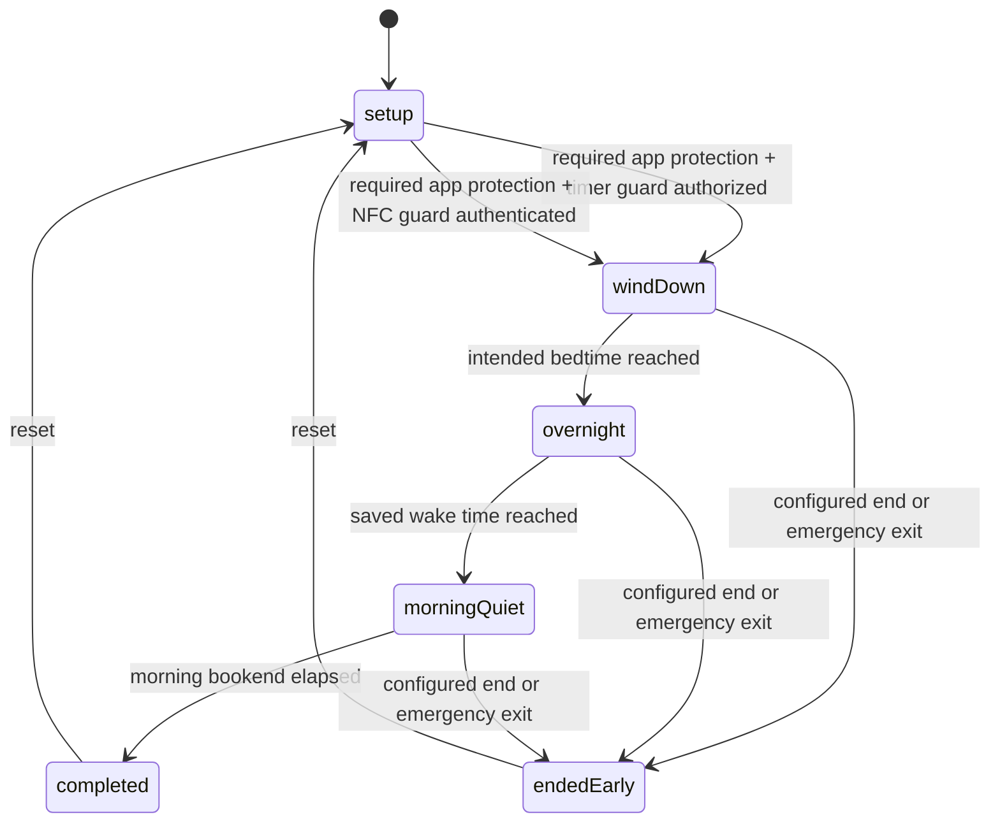

# Architecture Map — Counting Sheep

Practical architecture reference for humans and agents. Canonical rules live in
[`AGENTS.md`](../AGENTS.md); this file goes deeper on structure, data flow, and risk.

Last verified against code: 25 August 2026.

## 1. Stack and build system

- Swift 5.9, SwiftUI, iOS 17.0+, watchOS 10.0+
- **XcodeGen**: `project.yml` is the source of truth; `PhoneInTheOtherRoom.xcodeproj` is
  generated. Run `xcodegen generate` after adding/moving files or editing `project.yml`.
  Never hand-edit `project.pbxproj`.
- One approved SPM dependency: official `supabase-swift`, limited to optional ActivityKit,
  consented impact-data, gated feedback, and ADR-0016 Slumber Party paths. No CocoaPods
  dependencies. No CI
  (local build + test is the gate).
- Eight application/extension/test targets plus shared domain code.

## 2. Targets

| Target | Type | Sources | Notes |
|---|---|---|---|
| `PhoneInTheOtherRoom` | iOS app | `Shared/` + `PhoneInTheOtherRoomApp/` + assets | Display name "Counting Sheep". Embeds the Watch app. iPhone-only (`TARGETED_DEVICE_FAMILY: 1`). |
| `PhoneInTheOtherRoomWatchApp` | watchOS app | `Shared/` + `PhoneInTheOtherRoomWatchApp/` | Optional companion: mirrors the phone-authoritative timer for timer/NFC protection flows. UWB placement is deferred. |
| `PhoneInTheOtherRoomLiveActivity` | iOS Widget extension | `Shared/` + `PhoneInTheOtherRoomLiveActivity/` + assets | Embedded Live Activity for Lock Screen, Dynamic Island, and paired-Watch Smart Stack status. |
| `PhoneInTheOtherRoomScreenTimeReport` | iOS app extension | `Shared/` + `PhoneInTheOtherRoomScreenTimeReport/` | Embedded DeviceActivity report extension. Main app and extension compile the `SCREEN_TIME_REPORTS` paths and share scoped selections through the App Group. |
| `PhoneInTheOtherRoomDeviceActivityMonitor` | iOS app extension | `Shared/` + `PhoneInTheOtherRoomDeviceActivityMonitor/` | Applies and clears scheduled wind-down/morning shields while the app is suspended. |
| `PhoneInTheOtherRoomShieldConfiguration` | iOS app extension | `PhoneInTheOtherRoomShieldConfiguration/` + shared shield-presentation contract + local asset catalog | Role-aware ManagedSettings shield with finite first-party cues, the real protected-session end time, and a full-colour Ollie/sheep companion. |
| `PhoneInTheOtherRoomShieldAction` | iOS app extension | `PhoneInTheOtherRoomShieldAction/` | Handles role-aware Return to Quiet Time / Return to Wind Down actions on iOS 26.5+; safely closes the shielded app on older OS versions. |
| `PhoneInTheOtherRoomTests` | unit tests | `Shared/` + `Tests/` | Shared-domain coverage, including Night Watch schedule and legacy decoding. |

Schemes: `PhoneInTheOtherRoom` (builds iOS + Watch, runs tests) and
`PhoneInTheOtherRoomScreenTimeReport` (extension only).

## 3. Module map

```
Shared/                        Pure domain logic (no UI, unit-testable)
├─ Models/OllieModels.swift      FocusRun, FocusRunState, UserProgress, flock count,
│                                daily records, legacy economy fields
├─ RewardModels.swift            legacy keepsake compatibility types and context
├─ ProximityClassifier.swift     legacy/shared distance buckets (placement only)
├─ FocusRunRules.swift           timing and completion eligibility
├─ SessionGuard.swift            shielding-timer/NFC guard metadata; Watch/QR legacy decode values
├─ NightWatch.swift              saved sleep-bookend plan, phases, activities, factual bookend timing
├─ WindDownScheduling.swift      versioned schedule state, recurrence, one-time periods, overlap rules, aggregation
├─ NightsHistorySummary.swift    wake-day/start-day presentation summaries for week, month, and day history
├─ NightJourneyProgress.swift    run/phase-aware wall-clock journey reducer
├─ NightJourneyTerrain.swift     periodic terrain height and slope profiles
├─ OfflinePurpose.swift          private offline intention + notification privacy choice
├─ RewardEngine.swift            protected-night progress + legacy reward updates
├─ FocusAnalytics.swift          day records, correlations, CSV/JSON export
├─ ImpactMeasurement.swift       local outcome comparison + minimised sharing record
├─ NightFlockModels.swift        seven-day rules and backward-compatible social domain
├─ NightFlockCommitment.swift    legacy v2 shared-goal/status/setup compatibility
├─ NightFlockV2API.swift         legacy schema-two commitment compatibility
├─ NightFlockV3API.swift         legacy schema-three metrics/grant compatibility
├─ NightFlockV4Models.swift      named parties, seven-night rounds, members, status, and cheer rules
├─ NightFlockV4API.swift         strict schema-four state/command and profile-sync contracts
├─ NightFlockV4Outbox.swift      durable source activity/status retry and merge rules
├─ NightFlockV4Rewards.swift     server-authoritative per-party grant adaptation
├─ CountingSheepUserProfile.swift  canonical Shepherd name, rolling rename limit, curated Farm look
├─ NightFlockSharing.swift       legacy sharing defaults and projections
├─ NightFlockRewards.swift       bounded Slumber Party Farm grant rules and local ledger
├─ NightFlockOrientation.swift   legacy Slumber Party guide and contextual tips
├─ NightFlockPresentation.swift  aggregate and privacy presentation derivations
├─ NightFlockAPI.swift           versioned commands/state + monotonic outbox contracts
├─ NightWatchHistory.swift       90-day aggregate records + idempotent ritual events
├─ PhoneBedTag.swift             named primary/backup NDEF tag library and purpose rules
├─ PastureScene.swift             versioned local pasture layout, settling, and deterministic ambient plans
├─ PastureInteraction.swift       catalogue personalities plus bounded, presentation-only play landing rules
├─ QuietTimeShieldSchedule.swift schedule/status/evidence App Group contract
├─ WatchMessage.swift            typed phone↔watch message envelope + codec
├─ SlumberPartyFeedback.swift    bounded silent Live Activity/Watch cheer presentation
├─ ScreenTimeIntegration.swift   Screen Time scopes + report context IDs (phone-other.*)
├─ SleepIntervalMath.swift       merge sleep intervals → SleepSummary
├─ MorningCheckIn.swift          private, optional morning reflections (no score/reward)
├─ Onboarding.swift              first-run draft, per-question resume, independent gift route, reminder/readiness state
├─ OnboardingJourney.swift       stable raw steps, chapter progress, explicit presentation mode, and legacy normalization
├─ WindDownProfile.swift          optional categorical answers, deterministic explicit-evidence patterns, legacy decode
├─ WindDownProfilePresentation.swift  questionnaire and recommendation copy
├─ FirstRunJourney.swift          resumable Home/practice/Farm/Settings/Nights guide steps
├─ WelcomeReward.swift            starter sheep, immediately claimed chosen wearable, legacy pending migration, practice ledger
├─ SheepSearchWelcome.swift       starter and onboarding-practice search calculations
├─ SheepSearchPresentation.swift  user-facing welcome-gift and homecoming copy
├─ WindDownGuidance.swift         finite, source-linked screen-time and sleep-habit ideas
├─ SheepSearch.swift               deterministic search outcomes, posters, rarity, habitats
├─ SheepSearchState.swift          versioned outcomes, trail-map credit, and persisted state
├─ FarmModels.swift                versioned owned flock, discovery, balances, equipment, history
├─ FarmEconomyRules.swift          capacity, shearing, regrowth, sale, and balance invariants
├─ FarmMigration.swift             deterministic outcome/legacy-flock reconciliation
├─ FarmShop.swift                  fixed local catalogue, purchase, upgrade, and equipment rules
├─ Orientation.swift                versioned first-run guide (schema 6) + contextual-tip migration
├─ AppFeedback.swift             validated feedback draft/attachment/receipt protocol
├─ DistanceProvider.swift        protocol: async stream of distance readings
└─ Formatting.swift              OllieFormat timer/minute formatting

PhoneInTheOtherRoomApp/        iOS app
├─ App/                          @main entry, App Intents / Shortcuts
├─ Design/                       Theme.swift + PixelComponents.swift — design system
├─ Proximity/
│  ├─ FocusSessionCoordinator.swift            ← THE phone-authoritative run coordinator
│  └─ NearbyInteractionDistanceProvider.swift  iPhone NI session for optional placement
├─ Services/                     singletons for side effects
│  ├─ PersistenceService.swift                 JSON-in-UserDefaults store
│  ├─ WatchConnectivityManager.swift           WCSession (phone side)
│  ├─ PhoneNotificationService.swift           local notifications + tap routing
│  ├─ NightWatchUsageMonitoringService.swift   phase-scoped DeviceActivity thresholds
│  ├─ PingService.swift                        haptic/sound "whistle" at phone
│  ├─ FocusModeSuggestionService.swift         Focus Mode guidance strings
│  ├─ HealthSleepService.swift                 optional, read-only HealthKit sleep reads
│  ├─ PhoneBedNFCService.swift                 Core NFC provision/scan lifecycle
│  ├─ QuietTimeShieldingService.swift          schedule/apply/clear ManagedSettings
│  ├─ ImpactDataSyncService.swift              optional minimised Supabase upsert/delete
│  ├─ FeedbackService.swift                    gated private upload + Edge Function client
│  ├─ ScreenTimeAuthorizationService.swift     FamilyControls auth (flag-gated)
│  ├─ ScreenTimeSelectionService.swift         FamilyActivitySelection per scope
│  ├─ AnalyticsExportService.swift             JSON/CSV export to temp files
│  ├─ SupabaseClientProvider.swift             configured official Swift client
│  ├─ SupabaseAuthenticationService.swift      anonymous-session restore/create
│  ├─ SupabaseLiveActivityRemoteSink.swift     disabled-by-default push registration sink
│  ├─ NightFlockAccountService.swift           anonymous-to-Apple identity linking
│  ├─ NightFlockService.swift                  typed Edge Function client
│  └─ NightFlockOutboxService.swift            durable legacy + v4 activity/status retry queues
├─ ViewModels/FocusRunViewModel.swift          root view model, owns coordinator + Slumber Party VM
├─ ViewModels/NightFlockViewModel.swift        feature-gated social presentation and intents
├─ ViewModels/NightFlockViewModel+V4.swift    party list/detail, membership, profiles, and fan-out
├─ Views/
│  ├─ HomeView.swift                           navigation shell + run-state routing
│  ├─ PixelHomeDashboard.swift                 home tab
│  ├─ Components/OrientationTourOverlay.swift  shared spotlight guide for Home and contextual tips
│  ├─ FocusRunSetupView.swift                  bedtime/wake, bookends, purpose + guard
│  ├─ ActiveRunView.swift                      in-run UI + non-scrolling journey state
│  ├─ CompletionView.swift / EarlyEndView.swift
│  ├─ FocusStatsView.swift                     latest-primary Nights overview + grouped context
│  ├─ NightsWeekSection.swift                  seven-day board + all-nights navigation
│  ├─ MonthlyNightsView.swift                  shared-summary month calendar
│  ├─ NightsDayDetailView.swift                grouped day occurrences + factual record detail
│  ├─ FarmView.swift                           production Farm dashboard and destination routing
│  ├─ NightFlock/                              production v4 party list/detail/member cards; legacy views stay gated
│  ├─ FarmPastureView.swift                    paged, grounded living flock scene with local character placement
│  ├─ BarnView.swift                           owned flock, capacity, lifecycle, and pending arrivals
│  ├─ TrailBoardView.swift                     internal view name for Ollie's Search
│  ├─ TrailNotesArchiveView.swift              internal view name for Search Journal
│  ├─ FarmShopView.swift                       local purchases, upgrades, and equipment
│  ├─ ShepherdCustomizationView.swift          local player-avatar editor
│  ├─ ShepherdNameCard.swift                  accessible canonical Shepherd-name editor
│  ├─ MoreView.swift                           Compact Settings root: Your Wind Down, Connections, Privacy & data, Help & app guide
│  ├─ WindDownTimingView.swift                  compact saved schedule editor
│  ├─ WindDownScheduleView.swift                 finite Once / Repeats / Usual Wind Down editor
│  ├─ FeedbackFormView.swift                   validated form + email fallback
│  ├─ RewardShelfView.swift                    Debug internal preview only
│  ├─ Components/QRCodeScannerView.swift       retained legacy compatibility component (not release-facing)
│  ├─ Components/NightWatchReceiptCard.swift   elapsed/bookend/sleep/data-status receipt
│  ├─ Components/MorningCheckInCard.swift       collapsed, optional morning reflection
│  ├─ Components/GameComponents.swift          legacy UI retained outside run flow
│  ├─ Components/AssetPlaceholderComponents.swift  placeholder/sprite fallbacks
│  └─ MVP/AssetReadyScreens.swift              GATED: legacy Farm/Friends/Shop mock screens
└─ MockData/MVPMockData.swift                  GATED: feeds MVP screens only

PhoneInTheOtherRoomWatchApp/   watchOS companion
├─ App/                          @main
├─ Services/                     WatchConnectivityManagerWatch, WatchNotificationService
├─ ViewModels/WatchRunViewModel.swift          watch-side run state
└─ Views/                        WatchSetupView, WatchRunView, WatchWarningView,
                                 WatchCompletionView, WatchEarlyEndView, WatchOllieIconView

PhoneInTheOtherRoomLiveActivity/ iOS WidgetKit extension
├─ FocusRunLiveActivityWidget.swift              Lock Screen + Dynamic Island layouts
├─ QuietNoteWidget.swift                          configurable Lock Screen cue below the clock
└─ Info.plist                                    Widget extension declaration

PhoneInTheOtherRoomScreenTimeReport/
└─ ScreenTimeReportExtension.swift   3 DeviceActivity report scenes:
                                     today / weekly / late-night (phone-other.*)

PhoneInTheOtherRoomDeviceActivityMonitor/  background bookend shield callbacks
PhoneInTheOtherRoomShieldConfiguration/    shield appearance
PhoneInTheOtherRoomShieldAction/           shield-button response

Config/                         local Supabase xcconfig values; secrets remain untracked
supabase/                       versioned ADR-0005 migrations and Edge Functions
```

## 4. Data flow

### Wind Down lifecycle (implemented by the internal Night Watch model)



Sequence per Night Watch (persisted internally as `FocusRun` for data compatibility):

1. `PixelHomeDashboard` → `FocusRunSetupView` saves `NightWatchPreferences`: bedtime,
   wake time, quiet-window lengths, an ordered private sequence of up to three evening and two
   morning suggestions (putting the phone away is fixed first in the evening), and the placement
   guard. Suggestions have no checkmarks, verification, reward, score, streak, or completion claim.
   Outside the start window, the app saves the plan and schedules a wind-down reminder only
   when the person has enabled and authorized reminders.
   The user-facing actions are **Put phone away**, **Start now**, and **Plan**. Guidance sits beside
   routine choices, on Home, and in phase-appropriate moments. Home selects at most one compact
   routine-linked idea below the primary Wind Down action; active primary Wind Down selects at
   most one item for the current evening or morning phase after essential controls, and suppresses
   guidance overnight. Phone Away has no guidance placement. The full source library is local
   and reached from the secondary **About these ideas and sources** link; “finite guide” is not
   user-facing copy.
2. `FocusRunViewModel.requestStartNightWatch()` anchors a `NightWatchPlan` to tonight and
   starts `FocusSessionCoordinator`. One phone-authoritative coordinator owns Wind Down and a
   linked, independently settled Screen-Free Morning occurrence; there is no competing app-root
   state machine.
3. The iPhone coordinator creates the run and schedules one foreground timer for the next
   semantic boundary (bedtime, wake time, or `plan.protectedUntil`), never a repeating
   countdown timer. SwiftUI renders visible countdowns from absolute dates. The view model
   schedules silent sleep-time and phone-free-morning transitions plus the audible completion
   the user requested. The coordinator persists and mirrors the run only at meaningful state
   and lifecycle events; when the optional ActivityKit delivery path is deployed, the backend
   sends phase updates at the same two boundaries so the Live Activity can advance while the
   app is suspended.
4. The honor-timer path completes without either device being foregrounded. Current release
   setup offers App Shielding (`.honorTimer`) or NFC + App Shielding (`.nfcTag`). Legacy
   `.watchPlacement` and `.qrCode` values remain decodable and normalize to the timer for new
   release flows; their older implementation is not user-selectable. `.nfcTag` reads a
   provisioned NDEF record and compares its local token digest against a versioned library.
   The library supports one named primary and one optional named backup; either can be assigned
   to Wind Down, Phone Away, or both. A failed scan can explicitly pair a replacement writable
   tag without restarting the current run. The old slot remains authoritative until a successful
   write, duplicate credentials are rejected, and only a tag assigned to the active mode can
   authenticate it. Replaced credentials are retained as local digests so a retired physical tag
   is rejected with a reset-and-pair-from-Settings message instead of receiving success feedback or
   being silently overwritten. Settings recovery also recognizes the established one-record
   Counting Sheep external type with any valid UUID, even when the current installation has no
   local pairing history; it offers explicit reset confirmation, re-reads the same old credential,
   and commits the selected slot only after Core NFC confirms the fresh write. Blank tags still use
   normal pairing, while unrelated, malformed, multi-record, unreadable, read-only, and undersized
   tags are rejected. No NFC locking or password-protection commands are used. Names and purposes
   remain local and are never written to NFC. When automatic
   Wind Down is enabled, the saved plan
   schedules the selected local notification cadence and future DeviceActivity shielding
   while the app is closed; optional usage-aware monitoring is installed independently for
   wind-down, overnight, and morning quiet, with one generic three-minute cue per phase.
   The next app activation reconstructs the local run.
   Notification copy is resolved by the shared `NotificationCopyResolver` from a stable
   template ID, the current plan context, and local overrides. Settings previews call the
   same resolver before pending `UNNotificationRequest` values are rebuilt. Supported
   placeholders are optional (`{activity}`, `{purpose}`, `{time}`, and `{minutes}`); fixed
   protection notices bypass overrides.
5. The Watch mirrors the authoritative run and never starts one from schedule defaults.
   An explicit no-run state from the iPhone clears any stale Watch application context.
6. Required app protection derives a protected-session DeviceActivity schedule from this same
   `NightWatchPlan`. Every new Wind Down, Screen-Free Morning, and Phone Away start requires
   Family Controls authorization plus a non-empty opaque app/category selection. Runtime apply
   failure fails open and routes to repair; it is not a timer-only alternative. Readiness is a
   separate Screen Time state; changing the future preference cannot lift an active run's
   requested barrier. NFC authenticates start/end only and does not decide whether shielding is
   requested. After an eligible start (or the registered NFC tag confirmation),
   ManagedSettings applies through wind-down, overnight, and morning quiet, then clears
   on terminal/reset/replacement. A bounded App Group status history distinguishes observed
   shield time from a requested schedule; legacy two-bookend snapshots remain decodable.
   The app/category-only Brief Access action stores a versioned pending/scheduled grant
   record with run ID, schedule revision, nonce, clamped expiry, and one-shot restore
   activity name. Its bounded per-run ledger survives extension-only cleanup until the
   main app imports the factual count into the active run/history record. Restore callbacks
   accept a grant only for the same run/revision; a pending or stale callback instead
   reconciles the current schedule and reapplies its existing shield when that phase is
   still eligible. Web domains never advertise or receive Brief Access.
   The App Group snapshot carries a backwards-compatible `QuietTimeShieldRole` (legacy
   snapshots resolve to primary Wind Down). Shield Configuration selects a deterministic
   first-party cue for Phone Away, Wind Down, overnight, or morning
   quiet and uses the protected-session interval—not a bookend—as the displayed end time.
   Its Ollie/sheep icon is decorative; the companion sheep is not a search result, reward,
   or owned flock item.
7. At 420 eligible minutes, the coordinator privately resolves one immutable Wind Down outcome in
   the standard-defaults settlement journal. On authorized terminal delivery, `RewardEngine`
   retains compatibility updates while crediting only the factual Wind Down bookend; Screen-Free
   Morning settles independently into Sunrise Trail from actual eligible minutes. The journal
   then projects the resolved result and one individual `FlockSheep` arrival into `FarmState`.
   Available arrivals enter the active flock; capacity overflow remains pending. The completed
   protected-night count also advances wool regrowth. Progress is attributed to the intended-
   bedtime date, then `PersistenceService` saves and the Watch gets the terminal message. See
   `docs/REWARDS.md` and ADR-0015.
8. `HomeView` routes to `CompletionView` / `EarlyEndView` based on `activeRun.state`.
   Both outcomes show the same factual receipt: elapsed phone-away time, the Wind Down
   bookend, and a separate Screen-Free Morning factual row where applicable, plus optional
   Apple Health sleep context and an explicit Screen Time availability
   state. The separate Nights tab stays finite and observational: seven-day results, monthly
   drill-down, reflection, Health context, and consented selected-app results. Farm owns the
   active flock, lifecycle, catalogue, Shop, and customization presentation; Settings owns plan
   and report configuration. Chosen report windows do not
   alter Wind Down or Phone Away. Missing data is never estimated.
   When ADR-0016's flag is enabled, the v4 surface leads from Home and Farm to
   Your Slumber Parties, with create and join always visible; v1–v3's shared-goal card is legacy
   only. Routines, schedules, absence explanations, Health data, and private details remain
   unshared. Eligible activity can earn separately per party through server-authoritative fan-out.
9. During an active Night Watch, Home is replaced by the live journey while Nights, Farm,
   and Settings remain mounted in the same four-tab shell. A persistent return strip resets
   nested navigation and returns to Home. Run start, app activation, and active-run notification
   routing make Home the default. ActiveRunPresentation supplies role-aware copy,
   accessibility, guidance, exit, and shielding-status affordances; Phone Away uses
   its actual plan end date and never borrows primary Wind Down phase language. Terminal
   receipts temporarily replace the shell. Completed Phone Away receipts read the persisted
   per-run settlement record, distinguishing practice, below-minimum time, credited banking,
   a full locked meter, and a resolved Phone Away bonus search in Search Journal; they never
   infer progress from the current meter.
10. `NightJourneyProgress` resolves overall, phase, and segment progress from the active
    `FocusRun`; `NightJourneyTerrainProfile` supplies a periodic height and derivative used by
    both the Canvas foreground and Ollie's foot alignment. Backdrops pan/zoom only within safe
    crop bounds, and deterministic clues at 20/55/82 percent never affect search resolution.
11. Successful Phone Away runs settle through pure Shared logic. The settlement applies at least
   15 credited minutes and the centrally configured 100-minute per-run cap to the versioned
   `SheepTrailMapState` nested in `SheepSearchState`; it banks one full locked meter before
   three protected Wind Downs, then keeps one carried remainder after unlock. A per-run
   `PhoneAwaySearchSettlementRecord` stores eligibility, applied delta, meter before/after, and
   any stable outcome ID. The coordinator persists that search snapshot before projecting Farm,
   and `PersistenceService.farmState` replays persisted found outcomes on launch through the
   existing idempotent Farm arrival path. Practice and early endings settle as ineligible, and
   no Phone Away settlement changes protected-night progress, Wind Down drought/starter state,
   rewards, wool, or Slumber Party state. The deterministic 20/30/40/50/100 ladder and Phone
   Away clue counter never alter Wind Down odds.
   Home and the Phone Away schedule offer a separate **Start now** action. It creates a
   temporary bounded occurrence for the single start transaction; Not now rolls it back, while
   starting consumes it. Scheduled rows keep their exact occurrence identity through
   confirmation, and the future-period editor does not participate in this path. Starting one
   never changes progress by itself. An eligible completion can fill the Phone Away meter and
   open its separate bonus search, but never changes protected-night progress or Wind Down odds.
12. After first-run setup, the `HomeView` shell presents a versioned, resumable first-run
    guide persisted as `ollie.orientation.state` (schema 6). Initial setup has two distinct
    narrative pages followed by one skippable six-question behavioral chapter, a separate
    non-clinical starting-pattern result, a universal Shepherd/welcome-gift stage, explicit
    schedule and optional explained reminder permission, ordered optional evening/morning
    routines, required Screen Time protection, and a factual next-Wind-Down summary. Question
    progress stays within its chapter instead of turning six answers into six setup chapters.
    Missing behavioral fields remain absent; old default answers never become claims. Skipping
    the check-in omits only the result and still reaches the gift stage. Automatic start remains
    off; a schedule and an authorized reminder do not begin the run. Custom evening/morning
    routine text remains separate from the independently persisted offline purpose and does not
    inherit its notification consent.
    The in-app
    guide offers a four-tip Home Basics chapter, pauses for exploration, and offers a four-tip
    Around the Farm chapter only after a user-initiated Farm visit. Practice, Slumber Party,
    Settings, and Nights are contextual destinations. Chapter presentation and resume routing are
    persisted while legacy journey JSON migrates to the nearest valid destination. A chapter-specific
    Resume card appears only for a genuinely paused chapter and can be dismissed. Completing the
    independently selected welcome wearable is claimed exactly once at its explicit **Wear now**
    or **Keep for later** action. Wearing uses `FarmState.equip(itemID:)` so hats and coats retain
    their correct slots; keeping preserves the current Shepherd appearance. A legacy pending
    wearable is reconciled in place, and generic guide navigation never claims or equips it.
    Resume returns
    to the current surface, including the practice sheet, and a coach still appears if a spotlight
    target is missing. Skipping a lesson does not grant rewards.
    Practice grants the second starter sheep only after a successful five-minute completion.
    Contextual tips stay suppressed during an active Wind Down. Settings can resume or replay the
    guide. Older three-step tour JSON remains decodable.

### Slumber Party run boundary

`FocusRunViewModel` owns and forwards one `NightFlockViewModel`; there is no second app-root or
session coordinator. The locally implemented v4 contract adds one people-first
**Your Slumber Parties** list, long-lived named parties, fixed seven-night rounds, an active
invite, late factual backfill, and up to five concurrent memberships. It removes the v1–v3 goal,
readiness, orientation, pasture-identity, per-party alias, and sharing-matrix flows from new
presentation. Create and join stay visible on the list; the detail shows current members,
factual records, revisioned expiring statuses, curated snapshots, and fixed cheers.

For v4, the coordinator persists a factual account activity record first. A transactional,
idempotent party-fan-out path then evaluates each eligible current party and creates a
per-party record/reward. A late joiner can idempotently self-report all factual current-round
Wind Down and Phone Away records. The local iPhone never waits for this transport. An early end
creates only a factual partly-completed record. Network work remains asynchronous and foreground reconciliation
drains durable queues.

### Slumber Party v4 data and delivery contract

V4 is additive behind a strict schema fence: v1–v3 decoders/outboxes remain labeled legacy
compatibility paths, but an ambiguous old client never receives an arbitrary v4 party. A server
transaction enforces the five-party account cap and all per-party idempotency. Every current member
can retrieve/share the active invite through an active round; the host alone can create, replace,
or revoke it, and replacement is explicit compare-and-swap. The invite's recoverable ciphertext is
encrypted service-only data and never appears in RLS projections, Realtime payloads, logs, or
support evidence. An ordinary member may leave; a host cannot leave and must delete for everyone
until a future transfer flow is approved.

Party projections include only canonical display name, allowlisted/revisioned curated Farm look,
factual round records rounded to five-minute buckets, statuses (`revision`, `observed_at`,
`expires_at`), and fixed historical/live cheers. They
exclude complete Farm state, inventory, wool, exact schedules, private text, app tokens, Screen
Time/Health data, NFC, notifications, and impact data. The canonical name serves Farm and all
parties, with initial/migration selection free and two successful changes per rolling 14 days.
The curated profile contains only Shepherd look, Ollie ornament, featured sheep definition, and
pasture theme, all server-validated catalogue identifiers.

Realtime status and silent cheers are best-effort. A sanitized member-only party revision signal
prompts a canonical state refresh after membership, invitation, round, profile, or activity
changes; it contains no profile, invite, source, or private Farm payload. A fixed cheer can target
an actively winding-down member before a completed activity exists. Immediate silent feedback may
reach Live Activity or Watch system surfaces, but no social UI appears during active Wind Down and
clients reconcile accumulated completion cheers through a durable ledger. Party delete tombstones,
revokes, and deactivates while earned grants survive in the account inbox and minimal moderation
audit follows its retention rule. Ordinary members may leave; v4 hosts cannot leave and instead
delete for everyone, until a later transfer flow is separately approved. Existing fixed-reason
reporting, blocking across shared groups, and authenticated in-app account deletion remain
available through fenced v4 commands.

### Farm Shop economy

`FarmShopCatalog` is the single fixed source for the 31 production items: four sequential Barn
capacity upgrades and 27 permanent discretionary purchases. Wool remains the only currency.
Tiered items stay visible, but both presentation and `FarmState.purchase` evaluate the same
`FarmShopUnlockRequirement`: tier 1 at 3 qualifying Wind Downs or 4 discoveries, tier 2 at 10 or
8, and tier 3 at 25 or all 12. `FarmState.unlockedShopTier` makes an achieved tier permanent.

Equipment is separate from ownership. Ollie and Shepherd slots replace only the matching worn
item. Decorations occupy named pasture zones, with one visible item per zone; replacement stores
the prior prop without removing ownership. Keepsakes use four deterministic display slots, and
overflow remains safely owned. Schema-v3 decoding maps legacy arrays into those zones and slots
in stable order. The user-initiated analytics export includes only aggregate wool earned/spent by
transaction kind, current balance, owned count, and flock/capacity counts—no Farm names or
transaction timestamps.

### Pasture play

`FarmPastureView` may enter an explicit, local Play mode that keeps the ordinary accessible
double-tap routes to The Barn and Ollie's Shop available. `PastureSceneController` composes its
touch and VoiceOver actions with the existing long-press placement gesture, so a cancelled or
page-interrupted gesture always restores a settled character. Sheep temperaments are deterministic
derivations of their existing catalogue identities, while Ollie can observe, greet, and briefly
fetch a ball. Petting, presses, toss landings, reciprocal reactions, effects, haptics, and ball
choreography are finite cancellable presentation state; none persist or mutate Farm inventory,
wool, Search odds, Wind Down progress, or care obligations. Only final settled character
placement is written to `ollie.farm.pastureScene`.

Active Wind Down gates Play mode and cancels its effects, ball, and autonomous pasture scheduler;
Reduce Motion keeps feedback discreet and removes spatial fetch/toss choreography. The pasture
remains browsable during a run, including its destination routes and placement recovery. The
presentation layer supplies quiet visual feedback and accessible action labels without making
the Farm a source of active-run progression.

The member projection never contains Family Controls tokens, selected-app lists, raw Screen Time
reports, exact schedules, exact shield timestamps, raw HealthKit samples, full Farm state,
inventory, or wool. Impact/research sharing remains a separate local/cloud contract. The
`ollie.nightFlock.orientation`, commitment outbox, metrics outbox, and sharing-preference data are
v1–v3 compatibility state only; v4 replaces those flows with its single party contract and durable
activity/fan-out/cheer ledgers. Active Wind Down removes Slumber Party navigation while permitted
background reconciliation stays asynchronous.

Home and Farm remove Slumber Party navigation when a run becomes active. `ActiveRunView` has no
Slumber Party state, panel, badge, reaction, or social navigation. A bounded best-effort party
subscription may only forward a fixed silent cheer to the existing Live Activity and Watch system
surfaces; it never renders social UI inside the active ritual or participates in local run state.

### Backgrounding during a run

Elapsed time is wall-clock based, so it continues while the iPhone app is in the
background. On background, the coordinator cancels its next-boundary timer and any in-progress
optional placement check, then saves the run snapshot. On foreground it reconciles against
the wall clock, schedules only the next boundary, and shows a warm return status. It does not
require a fresh Watch reading, so a person can use or put down either device after starting
the run.

The Live Activity uses the system timer for the current phase when explicitly enabled, so it remains glanceable on the
Lock Screen and Dynamic Island while the app is backgrounded. Its Lock Screen layout gives
the status/timer and message separate vertical regions: the person's selected offline
activity is primary, followed by one stable phase-appropriate cue. It does not shrink or
truncate a combined paragraph to create artificial compactness. ActivityKit does not execute a
WidgetKit timeline for phase changes, so the optional backend sends bedtime and morning-quiet
updates in addition to the final end event. It is requested with `pushType: .token`, and
`FocusRunLiveActivityService` observes every token rotation, associates it with the run and
ActivityKit activity IDs, and emits only a short SHA-256 fingerprint to diagnostics. The
local Live Activity is enabled by default for new installs and can be turned off in Settings;
DEBUG can force either state with `-ollie.debug.enableLiveActivity YES` or
`-ollie.debug.disableLiveActivity YES`. The remote sink is also disabled in the local
configurations. Without it, iOS can mark the activity stale at
the planned end but cannot deliver an exact phase or terminal transition, end it, or dismiss
it until the app next finishes or restores the run; `staleDate` alone is not an update
mechanism. Exact background transitions require the existing optional `pushType: .token`
ActivityKit path, including the remote sink, deployed functions, APNs credentials, and
scheduler. The local completion notification and app-reopen reconciliation remain the
completion fallbacks. See
`ACTIVITYKIT_PUSH_BACKEND.md` for the server lifecycle contract.

The same WidgetKit extension also exposes a static `QuietNoteWidget` in the
`accessoryRectangular` family. Its text comes from the person's explicit Quiet Note
editor value in the existing App Group, with the App Intent widget configuration retained
as the first-install fallback. It is normalized to a short Unicode-safe value and is not
copied from the private `OfflinePurposeProfile`. The widget uses a `.never` timeline and
reloads after an in-app save; active phase and countdown state remain exclusive to the
Live Activity. Tapping it opens `countingsheep://quiet-note` in the app.

Energy-specific implementation notes and the physical-device profiling matrix live in
[`ENERGY_AUDIT.md`](ENERGY_AUDIT.md).

**Authority:** the iPhone coordinator is authoritative for run state. The Watch displays,
measures, and can request early end or "whistle" (`pingPhone`). An early-end request from
Watch is rejected while the active guard is NFC, because the registered tag must be read
by the iPhone.

### WatchConnectivity strategy (both sides)

1. Always `updateApplicationContext` with latest state (survives launches).
2. If reachable, `sendMessage`; on error fall back to `transferUserInfo`.
3. If unreachable, queue critical messages (`startFocusRun`, pings, early end) via
   `transferUserInfo`.
4. Watch can rehydrate via `pingWatch` → phone's `currentStateProvider` snapshot.

## 5. View / component organisation

- `HomeView` is the single navigation shell: its four tabs remain available during an active
  Night Watch, Home becomes the live journey, and terminal receipts temporarily override it.
- One root `@StateObject` per platform (`FocusRunViewModel` / `WatchRunViewModel`),
  distributed via `.environmentObject`. Views are thin; intents go to the view model.
- `OllieRitualView` maps the existing setup, placement, Night Watch phase, completion, and
  early-end presentation states to still-image poses. It does not own or duplicate run state.
- `HomeOllieIdleView` uses a registered six-frame Ollie loop for a brief blink, ear twitch,
  head tilt, and settle on the configured Home dashboard; Reduce Motion holds frame one.
- `NightJourneyView` animates the approved six-frame Ollie cycle with a smaller current-batch
  Bramble sheep running ahead as decorative scenery. The companion is not a search result,
  reward, or owned flock item.
- `AppMotion` in `Theme.swift` is the iOS motion vocabulary. Shipping motion respects
  Reduce Motion by removing spatial/repeating effects while retaining brief fades where useful.
- Two design layers exist (known debt): the canonical pixel Theme
  (`Design/Theme.swift` + `PixelComponents.swift`) and the legacy dark
  `GameComponents.swift` used by active-run screens. Build new UI on the pixel Theme.

## 6. Persistence assumptions

- `UserDefaults.standard` + `JSONEncoder`/`JSONDecoder`, via `PersistenceService.shared`:

| Key | Type | Purpose |
|---|---|---|
| `ollie.progress` | `UserProgress` | protected-night flock count, quiet bookend minutes, daily records, legacy economy fields |
| `ollie.rewards` | `[RewardItem]` | legacy keepsakes retained for compatible decoding/internal preview |
| `ollie.thresholds` | `ThresholdProfile` | proximity calibration |
| `ollie.lastRun` | `FocusRun?` | last run snapshot |
| `ollie.analytics.manualEntries` | `[ManualAnalyticsEntry]` | manual stat entries |
| `ollie.nightWatch.preferences` | `NightWatchPreferences` | bedtime, wake time, bookends, offline cues, placement guard |
| `ollie.nightWatch.schedule` | `WindDownScheduleState` | versioned dated one-time periods and recurring routines; migrated from the two legacy schedule keys |
| `ollie.nightWatch.routines` | `[WindDownRoutine]` | migrated primary routine plus optional additional bounded periods |
| `ollie.nightWatch.nextOverride` | `NextWindDownOverride?` | legacy compatibility mirror; migrated into the versioned schedule and consumed once |
| `ollie.offlinePurpose` | `OfflinePurposeProfile` | optional in-app intention and explicit custom-notification opt-in |
| `ollie.screenTime.reportPreferences` | `ScreenTimeReportPreferences` | independent evening and morning Screen Time report windows |
| `ollie.screenTime.briefAccessState` (App Group) | `QuietTimeBriefAccessState` | active temporary grant plus bounded per-run completed-use ledger |
| `ollie.morningCheckIns` | `MorningCheckInHistory` | up to 45 days of private optional morning reflections |
| `ollie.onboarding.version` | `Int` | completed first-run onboarding version |
| `ollie.onboarding.draft` | `OnboardingDraft` | resumable first-run setup choices |
| `ollie.windDown.profile` | `WindDownProfileRecord` | local Wind Down starting-point answers and deterministic recommendations |
| `ollie.welcome.rewards` | `WelcomeRewardLedger` | idempotent starter, immediately claimed chosen wearable, legacy pending-wearable migration, and practice-sheep grants |
| `ollie.orientation.state` | `CountingSheepOrientationState` | schema-6 chapter-scoped guide status, presentation state, contextual tips, Farm tutorial actions, practice identity, and resume routing |
| `ollie.notifications.preferences` | `NotificationPreferences` | cadence, authorization choices, sounds, optional channels, and versioned local message overrides |
| `ollie.notifications.remindersEnabled` | `Bool` | backwards-compatible mirror of the notification master switch |
| `ollie.sheepSearch.state` | `SheepSearchState` | found sheep, outcomes including starter/practice/Wind Down/Phone Away origins, trail-map minutes/run IDs, separate guarantee counters, trail distance, no-find protection, odds preference |
| `ollie.farm.state` | `FarmState` | versioned individual flock, pending arrivals, discovery history, capacity, wool, Shop ownership/equipment, avatar, and transaction history including starter and welcome-gift records; schema v3 retains the v2 cash-to-wool migration and adds permanent Shop unlock tiers plus named decoration zones and four bounded keepsake slots |
| `ollie.farm.pastureScene` | `PastureSceneSnapshot` | versioned local-only normalized placement for active sheep and each pasture's Ollie and Shepherd; autonomous behavior stays ephemeral and stale entities are pruned |
| `ollie.nightWatch.history` | `NightWatchHistory` | up to 90 days of aggregate records and idempotent observed/inferred/self-reported/system events |
| `ollie.phoneBedNFCTags.library` | `PhoneBedTagLibrary` | only SHA-256 digests (including local retired-credential history) plus local name, purpose, and timestamps persist in defaults; the generated UUID bearer credential is written only to the physical NDEF tag; names and purposes are never written to NFC; the credential, name, and purpose are never transmitted |
| `ollie.impactSharing.preferences` | `ImpactSharingPreferences` | explicit optional-sharing state and consent date |
| `ollie.impactSharing.records` | `[ImpactUploadRecord]` | date-free retry cache for consented impact rows |
| `ollie.nightFlock.outbox` | `[NightFlockOutboxRecord]` | bounded local retry queue containing only positive state contracts |
| `ollie.nightFlock.runContexts` | `[NightFlockRunShareContext]` | up to 32 local consent/idempotency contexts; never uploaded as run IDs |
| `ollie.nightFlock.stagedDestructiveEffect` | `NightFlockDestructiveLocalEffect` | local-only no-replay recovery journal for an accepted destructive command awaiting authoritative state; the outbox actor clears it last, after all v1/v2/v3/context lanes, so relaunch reconciles before any flush |
| `ollie.nightFlock.pendingDestructiveIntent` | `NightFlockPendingDestructiveIntent` | local-only preflight journal for a leave, block, sharing-off, or Slumber Party-data deletion command; restart loads authoritative state to determine whether it applied, never replays the command, and keeps all outbox lanes paused until resolved |
| `ollie.nightFlock.pendingAccountDeletionIntent` | `Bool` | durable preflight journal for a full online-account deletion; it closes all Slumber Party transport and local producers before the request, and an ambiguous response remains local fail-closed with no account inspection, recovery, flush, or remote deletion replay |
| `ollie.nightFlock.acceptedAccountDeletion` | `Bool` | durable local tombstone written after an accepted full account-deletion response; relaunch finalizes local lane clearing and local sign-out before removing it, never replaying the remote deletion |
| `ollie.nightFlock.expectedLinkedUserID` | valid UUID string | local-only expected Supabase account binding used solely to reject wrong-account recovery; an invalid persisted value fails closed rather than being treated as absent; it is never uploaded as a new social field and local reset/confirmed online-account deletion clear it |
| `ollie.appearance.preference` | `AppAppearancePreference` | Automatic, Light, or Dark app appearance choice |

For destructive Slumber Party changes, a pending ordinary intent resolves from authoritative state before
any flush. Full account deletion is stricter: a pending preflight closes all Slumber Party activity and
never replays remotely; only an accepted tombstone continues through local lane clearing, verified sign-out,
and final tombstone removal.

The older `ollie.phoneBedNFCTag` and `ollie.phoneBedNFCTag.registration` keys are migration-only.
On first library access, either legacy value becomes one primary tag named “Wind Down tag,”
assigned to Wind Down and Phone Away, and both legacy keys are removed. Local reset clears all
three keys.

- No CoreData / SwiftData. Core state stays in standard defaults. The App Group is limited
  to Screen Time selections plus shield schedule/status contracts needed by extensions;
  legacy standard-default selection keys migrate forward without overwriting shared data.
- Codable models are the schema. Changing them requires backwards-compatible decoding;
  a legacy-decode test exists in `Tests/` and must keep passing.
- Watch and phone do not share persistence; the Watch is rehydrated over WatchConnectivity.

`FocusRunViewModel.eraseLocalDataAndStartOver()` is the scoped local reset boundary. It clears
the explicit standard-default key list in `Shared/CountingSheepStorage.swift`, asks the owning
notification, HealthKit, NFC, usage-monitoring, shielding, and Live Activity services to clear
their runtime state, and clears the explicit Screen Time/Brief Access App Group keys. It resets
the coordinator and root route in memory, then opens a fresh Welcome draft in the same process.
The installation transport identifier is intentionally retained so previously uploaded optional
Live Activity delivery records are not re-identified by a local reset; remote impact records are
also never deleted by this operation. iOS notification, Family Controls, and HealthKit grants
cannot be revoked programmatically here.

### Optional hosted backend

The main iOS target alone links the official `supabase-swift` package. A stable configured
client restores or refreshes an anonymous Supabase session and creates an anonymous user
only when no stored session exists. Live Activity registration/cancellation is injected
through `FocusRunLiveActivityRemoteSink` and remains disabled by default through
`SUPABASE_LIVE_ACTIVITY_PUSH_ENABLED`. Configuration or network failure never changes the
local coordinator's authority, local notification, flock, or reopen reconciliation.

The versioned `supabase/` backend contains the ActivityKit delivery schema, the optional
`impact_nights` table, gated feedback delivery, and the independently gated Slumber Party schema.
Impact rows use relative nights and exclude exact dates/times, source
names, app tokens, NFC identity, raw Health samples, and free text. The user can stop future
sharing or call a scoped deletion RPC without deleting local history. The backend and Edge
Functions remain separately deployed. Client-visible tables use RLS with `auth.uid()`; raw tokens, worker queues, and
delivery administration have no direct client grants.

Feedback uses anonymous auth, direct uploads to the private `feedback-attachments` bucket,
and an authenticated idempotent `submit-feedback` function. `app_feedback` has no client
read/write grants. A service-only database RPC serializes each user's rolling five-per-day
limit. Resend notification failures remain pending; a secret-protected scheduled function
retries every ten minutes up to five attempts and purges rows/private objects after 180 days.
`SUPABASE_FEEDBACK_ENABLED` remains off until the independent production gate passes; the
iOS form then uses Mail instead. ADR-0005/0007 and `ACTIVITYKIT_PUSH_BACKEND.md` define the
cloud boundaries.

Slumber Party is independently controlled by `SUPABASE_NIGHT_FLOCK_ENABLED` (ordinary Debug `NO`;
TestFlight/Release `YES`). With the flag off, its app surfaces are absent and it does not create a
Supabase session or make a request. Entry creates or restores an anonymous session only when needed, then Sign in with Apple
links that identity in place and verifies the Auth UUID did not change. A successful link and a
validated linked session bind the Supabase UUID locally. Recovery never creates an anonymous
session: a 401 requires Apple ID-token reauthentication to that same UUID, while
`linked_account_required` may only link the current valid anonymous session in place. Missing,
changed, or unprovable identities fail closed, preserve the snapshot, run contexts, and all three
outboxes, then reconcile rather than replay a direct mutation. Slumber Party server RPCs
also require Apple in Auth app metadata, so another non-anonymous provider is insufficient.

`night-flock-command` and `night-flock-state` derive the caller from the JWT and alone call
service-role RPCs. Production deployed the reviewed v1–v4 migrations and both authenticated
functions on 2026-08-25; exact v1–v3 payload validation remains legacy behavior. The v4 functions
require an explicit schema fence, transactionally enforce the five-party account cap and party
fan-out, and never return an arbitrary party to an older ambiguous client. Protected tables
retain member-only RLS and no authenticated client write grants. V4 projections omit Auth owner
IDs, source event IDs, raw start/end intervals, private state, invite ciphertext, invite digests,
and idempotency keys. Coarse ordering and expiring-status timestamps remain transport fields, not
an exposed exact schedule or continuously updating remote timer.

Slumber Party tables do not reference `focus_runs`, `impact_nights`, HealthKit, Screen Time, NFC,
notifications, or a full Farm/economy store. The v4 service may use allowlisted curated-catalogue
identifiers and an account grant inbox only. Versioned hosted invitation-encryption secrets are
configured in production. Retention scheduling, minimum moderation operations, privacy
publication, updated app distribution, and physical QA remain separate unverified release gates.

## 7. Known architectural risks

1. **Protection evidence is intentionally bounded.** Current release starts require a selected-app
   barrier, using either the timer guard or NFC + app shielding. Honor timer, Watch-placement, and
   QR values remain persisted-data compatibility only; they are not release-facing fallbacks or
   start signals. NFC authenticates the normal end action with the same registered tag; a multi-step emergency
   bypass remains available and is recorded locally. For an active NFC-tag run, the iPhone
   coordinator owns an ephemeral, run-bound two-step reason reflection before it accepts
   that bypass: the user names what they need the phone for, then retypes that reason with
   forgiving local normalization. The reason is stored only on the iPhone under an `ollie.*` key;
   it is never persisted in the shared run payload, logged, uploaded, or available to the Watch.
   Successful authentication consumes the challenge before notification, usage-monitor, shield,
   Live Activity, and automatic-schedule cleanup begins. A timer-guard run can use the ordinary
   authorized end path; it does not represent an unshielded alternative.
2. **Night Watch intentionally crosses midnight.** Date boundaries, daylight-saving
   changes, timezone changes, termination, and background restoration need physical-device
   QA in addition to the pure scheduling tests. The continuous app barrier is not progression;
   Wind Down progression uses its factual wind-down bookend, while Screen-Free Morning settles
   independently through Sunrise Trail (ADR-0019).
3. **Screen Time needs physical-device QA.** The report/monitor/configuration/action
   extensions are embedded locally, but the three new shield bundle IDs still need Family
   Controls distribution assignment and continuous barrier transitions need physical proof.
   App/category shields use the iOS 26.4+ system submenu for Brief Access, with role-specific
   protected-time-purpose choices serving as the five-minute confirmation; system Cancel is the
   only no-op. The run-scoped pause/allotted-minute tracker appears on both the shield and active-
   run UI. Older OS versions use the direct five-minute button, and web domains never advertise
   Brief Access. Continue Wind Down opens Counting Sheep on iOS 26.5+ and keeps the close fallback
   on older systems.
   Authorization, picker persistence, report rendering, empty states, and distribution
   profiles must still be exercised on a physical iPhone.
4. **Legacy mock layer remains compiled in Debug.** Friends and the old Farm/Shop/reward shelf
   still render `MVPMockData`; they appear only inside More with
   `-ollie.debug.enableMockScreens YES`. The production Farm and Farm Shop are separate real-data
   surfaces backed by `FarmState`.
5. **Oversized files.** `AssetReadyScreens.swift` and `PixelComponents.swift` resist safe
   editing by agents with limited context.
6. **Singleton coupling.** Services are reached via `.shared` from the coordinator, which
   makes unit-testing the coordinator itself hard (currently untested; only `Shared/` is).
7. **UserDefaults as the detailed-history store.** The 90-day bound is appropriate now;
   schema growth or richer user inspection may justify a local database later.
8. **ActivityKit remote delivery is disabled by default.** Token observation, lifecycle
   contracts, and the approved Supabase implementation exist, but deployment, secrets, and
   APNs delivery still require validation. Local completion behavior remains authoritative.
9. **Feedback delivery is disabled by default.** Resend secrets/domain, scheduled retry,
   hosted migration, private-object behavior, mailbox retention, and a physical-device
   upload must all pass before enabling it. Email fallback is the release-safe path.
10. **Slumber Party is compiled on for TestFlight/Release and off for ordinary Debug.** Its
    production migrations, versioned invitation secrets, and authenticated functions were
    deployed on 2026-08-25. Apple-link recovery, moderation operations, retention scheduling,
    updated app distribution, and physical two-account QA remain operational evidence for a
    working party, not a compile-flag gate.

## 8. Recommended architecture direction

- Keep MVVM + coordinator; it fits. Do not introduce new architecture patterns (TCA,
  Redux, etc.) — the codebase is small and the pattern works.
- Keep wind-down, overnight, and morning quiet as phases of the same persisted run. New
  morning features must extend `NightWatchPlan`, not introduce a parallel session model.
- The session-guard seam retains `SessionGuardKind` (`.honorTimer`, `.watchPlacement`,
  `.qrCode`, `.nfcTag`) for persisted-data compatibility. Current release UI exposes only the
  shielding timer (`.honorTimer` raw compatibility) and NFC + app shielding; Watch-placement and
  QR never reappear as release-facing starts. Keep completion phone-authoritative and preserve an emergency exit.
- Keep the App Group limited to Screen Time/Shield extension contracts; do not migrate
  unrelated progress, rewards, HealthKit history, or reflections into it.
- Converge run-screen UI onto the pixel Theme; retire `GameComponents` gradually.
- Inject services into `FocusSessionCoordinator` (init parameters defaulting to
  `.shared`) to make it testable — mechanical, low-risk refactor.
- Keep cloud work additive and permission-separated: ActivityKit delivery, explicitly consented
  minimised impact rows, and ADR-0016's narrow Slumber Party tables never become shared data sources.

## 9. Clean up before App Store 1.0

1. Keep general Friends, the legacy Farm/Shop/shelf, and `MVPMockData` behind the explicit Debug
   flag. Slumber Party is the separate ADR-0016 production slice and stays release-hidden until its
   explicit feature flag and external gates are approved.
2. Register/approve/sign the three new shield extension IDs.
3. Increment the build number and produce a distribution archive.
4. `HealthSleepService` uses requested/no-data/error states because HealthKit does not
   disclose whether read access was denied. Do not regress to an “authorized” read state.
5. Manually validate NFC tag lifecycle, background/terminated shielding, HealthKit stages,
   optional impact deletion, run restore, and Watch timer mirroring on physical hardware; QR and
   Watch-placement remain legacy decode/migration coverage rather than release flows.
6. Accessibility pass on the core run flow (timer, proximity state, Watch views).
7. Keep backend feedback disabled unless every ADR-0007/TestFlight gate is proven.

## 10. Explicitly postponed

- Splitting the oversized files (do opportunistically, not as a pre-TestFlight project)
- Removing `GameComponents` / design-system convergence
- Screen Time shielding (separate from the embedded read-only report; ADR-0004 gates apply)
- Physical-device proof for NFC-authenticated ending and terminated-app shielding
- Coordinator dependency injection refactor
- Any new persistence layer
