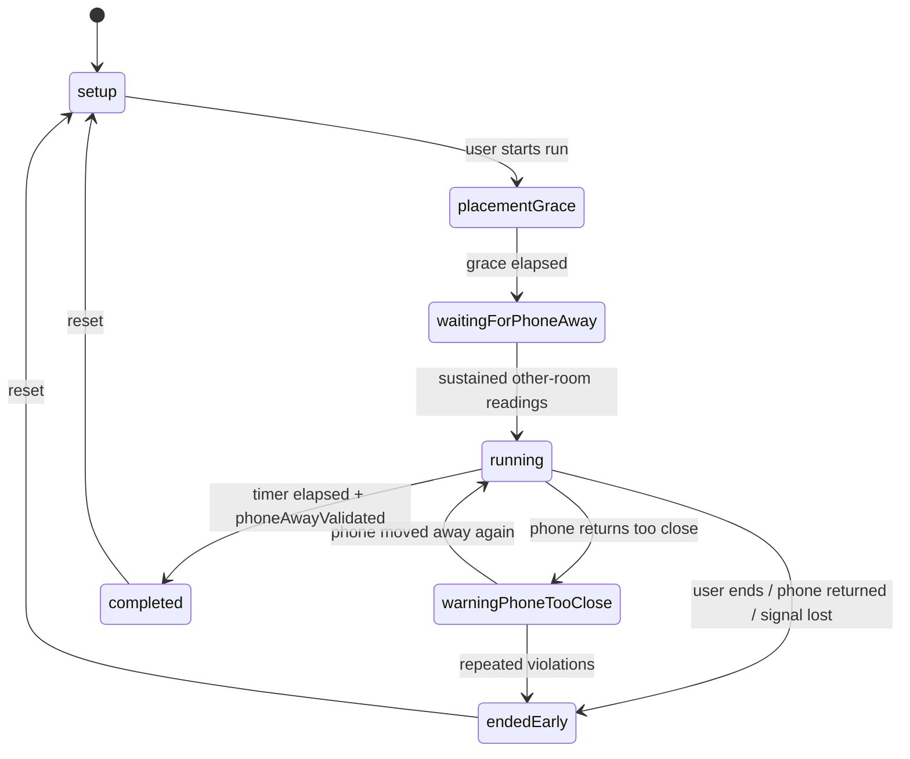

# Architecture Map — Counting Sheep

Practical architecture reference for humans and agents. Canonical rules live in
[`AGENTS.md`](../AGENTS.md); this file goes deeper on structure, data flow, and risk.

Last verified against code: July 2026.

## 1. Stack and build system

- Swift 5.9, SwiftUI, iOS 17.0+, watchOS 10.0+
- **XcodeGen**: `project.yml` is the source of truth; `PhoneInTheOtherRoom.xcodeproj` is
  generated. Run `xcodegen generate` after adding/moving files or editing `project.yml`.
  Never hand-edit `project.pbxproj`.
- No SPM / CocoaPods dependencies. No CI (local build + test is the gate).
- ~54 Swift files, ~9,800 lines.

## 2. Targets

| Target | Type | Sources | Notes |
|---|---|---|---|
| `PhoneInTheOtherRoom` | iOS app | `Shared/` + `PhoneInTheOtherRoomApp/` + assets | Display name "Counting Sheep". Embeds the Watch app. iPhone-only (`TARGETED_DEVICE_FAMILY: 1`). |
| `PhoneInTheOtherRoomWatchApp` | watchOS app | `Shared/` + `PhoneInTheOtherRoomWatchApp/` | Companion app; runs Nearby Interaction, mirrors run state. |
| `PhoneInTheOtherRoomScreenTimeReport` | iOS app extension | `Shared/` + `PhoneInTheOtherRoomScreenTimeReport/` | DeviceActivity report extension. **Not embedded in the main app.** Only target with the `SCREEN_TIME_REPORTS` compile flag. |
| `PhoneInTheOtherRoomTests` | unit tests | `Shared/` + `Tests/` | 19 tests, `Tests/ProximityClassifierTests.swift`. |

Schemes: `PhoneInTheOtherRoom` (builds iOS + Watch, runs tests) and
`PhoneInTheOtherRoomScreenTimeReport` (extension only).

## 3. Module map

```
Shared/                        Pure domain logic (no UI, unit-testable)
├─ Models/OllieModels.swift      FocusRun, FocusRunState, UserProgress, rewards,
│                                stars, daily records, sheep/coin economy (387 lines)
├─ ProximityClassifier.swift     distance readings → proximity buckets + validation
├─ FocusRunRules.swift           timing thresholds, fail rules, completion eligibility
├─ RewardEngine.swift            reward generation, streaks, economy updates
├─ FocusAnalytics.swift          day records, correlations, CSV/JSON export
├─ WatchMessage.swift            typed phone↔watch message envelope + codec
├─ ScreenTimeIntegration.swift   Screen Time scopes + report context IDs (phone-other.*)
├─ SleepIntervalMath.swift       merge sleep intervals → SleepSummary
├─ DistanceProvider.swift        protocol: async stream of distance readings
└─ Formatting.swift              OllieFormat timer/minute formatting

PhoneInTheOtherRoomApp/        iOS app
├─ App/                          @main entry, App Intents / Shortcuts
├─ Design/                       Theme.swift + PixelComponents.swift (902) — design system
├─ Proximity/
│  ├─ ProximitySessionCoordinator.swift (563)  ← THE run orchestrator/state machine
│  ├─ NearbyInteractionDistanceProvider.swift  iPhone NI session
│  ├─ DemoDistanceProvider.swift               simulated distances (half-wired, see risks)
│  └─ NoDistanceFallbackProvider.swift         nil-distance fallback (no-UWB path)
├─ Services/                     singletons for side effects
│  ├─ PersistenceService.swift                 JSON-in-UserDefaults store
│  ├─ WatchConnectivityManager.swift           WCSession (phone side)
│  ├─ PhoneNotificationService.swift           local notifications
│  ├─ PingService.swift                        haptic/sound "whistle" at phone
│  ├─ FocusModeSuggestionService.swift         Focus Mode guidance strings
│  ├─ HealthSleepService.swift                 HealthKit sleep reads (entitlement pending)
│  ├─ ScreenTimeAuthorizationService.swift     FamilyControls auth (flag-gated)
│  ├─ ScreenTimeSelectionService.swift         FamilyActivitySelection per scope
│  └─ AnalyticsExportService.swift             JSON/CSV export to temp files
├─ ViewModels/FocusRunViewModel.swift (368)    root view model, owns the coordinator
├─ Views/
│  ├─ HomeView.swift                           navigation shell + run-state routing
│  ├─ PixelHomeDashboard.swift (444)           home tab
│  ├─ FocusRunSetupView.swift (357)            duration/purpose picker
│  ├─ ActiveRunView.swift                      in-run UI
│  ├─ CompletionView.swift / EarlyEndView.swift
│  ├─ FocusStatsView.swift (1,232)             stats tab (needs splitting)
│  ├─ RewardShelfView.swift
│  ├─ Components/GameComponents.swift (467)    legacy dark game-panel UI
│  ├─ Components/AssetPlaceholderComponents.swift  placeholder/sprite fallbacks
│  └─ MVP/AssetReadyScreens.swift (1,413)      GATED: Farm/Friends/Shop mock screens
└─ MockData/MVPMockData.swift                  GATED: feeds MVP screens only

PhoneInTheOtherRoomWatchApp/   watchOS companion
├─ App/                          @main
├─ Services/                     WatchConnectivityManagerWatch, WatchNotificationService
├─ ViewModels/WatchRunViewModel.swift          watch-side run state
└─ Views/                        WatchSetupView, WatchRunView, WatchWarningView,
                                 WatchCompletionView, WatchEarlyEndView, WatchOllieIconView

PhoneInTheOtherRoomScreenTimeReport/
└─ ScreenTimeReportExtension.swift   3 DeviceActivity report scenes:
                                     today / weekly / late-night (phone-other.*)
```

## 4. Data flow

### Focus Run lifecycle (the core loop)



Sequence per run:

1. `PixelHomeDashboard` → `FocusRunSetupView` → `FocusRunViewModel.requestStartRun()`
   (Focus Mode prompt) → `ProximitySessionCoordinator.start(...)`.
2. Coordinator creates the `FocusRun`, starts its timer, sends `WatchMessage.startFocusRun`.
3. Watch (`WatchRunViewModel`) starts a Nearby Interaction session; discovery tokens are
   exchanged via `nearbyDiscoveryToken` messages; Watch streams `watchDistanceReading` back.
4. `ProximityClassifier` buckets readings; the coordinator drives state transitions and
   mirrors them to the Watch (`focusRunStateUpdate`, `proximityStateUpdate`).
5. On finish, `RewardEngine` produces the reward + updated `UserProgress`;
   `PersistenceService` saves; the Watch gets `rewardEarned` / `endFocusRunEarly`.
6. `HomeView` routes to `CompletionView` / `EarlyEndView` based on `activeRun.state`.

**Authority:** the iPhone coordinator is authoritative for run state. The Watch displays,
measures, and can request early end or "whistle" (`pingPhone`).

### WatchConnectivity strategy (both sides)

1. Always `updateApplicationContext` with latest state (survives launches).
2. If reachable, `sendMessage`; on error fall back to `transferUserInfo`.
3. If unreachable, queue critical messages (`startFocusRun`, pings, early end) via
   `transferUserInfo`.
4. Watch can rehydrate via `pingWatch` → phone's `currentStateProvider` snapshot.

## 5. View / component organisation

- `HomeView` is the single navigation shell: tab UI when idle, run-state views during a run.
- One root `@StateObject` per platform (`FocusRunViewModel` / `WatchRunViewModel`),
  distributed via `.environmentObject`. Views are thin; intents go to the view model.
- Two design layers exist (known debt): the canonical pixel Theme
  (`Design/Theme.swift` + `PixelComponents.swift`) and the legacy dark
  `GameComponents.swift` used by active-run screens. Build new UI on the pixel Theme.

## 6. Persistence assumptions

- `UserDefaults.standard` + `JSONEncoder`/`JSONDecoder`, via `PersistenceService.shared`:

| Key | Type | Purpose |
|---|---|---|
| `ollie.progress` | `UserProgress` | streaks, focus minutes, daily records, sheep/coins, Ollie level |
| `ollie.rewards` | `[RewardItem]` | earned collectibles |
| `ollie.thresholds` | `ThresholdProfile` | proximity calibration |
| `ollie.lastRun` | `FocusRun?` | last run snapshot |
| `ollie.analytics.manualEntries` | `[ManualAnalyticsEntry]` | manual stat entries |

- No CoreData / SwiftData. No App Groups — each process has its own UserDefaults, which
  means the Screen Time extension **cannot** read the app's selections today.
- Codable models are the schema. Changing them requires backwards-compatible decoding;
  a legacy-decode test exists in `Tests/` and must keep passing.
- Watch and phone do not share persistence; the Watch is rehydrated over WatchConnectivity.

## 7. Known architectural risks

1. **Foreground-only runs.** No `scenePhase` handling; backgrounding the app mid-run
   degrades the experience with no explanation to the user. (Pre-TestFlight hardening item.)
2. **UWB hardware dependency.** Nearby Interaction needs a U1/UWB iPhone *and* Watch.
   The `unsupported` path exists but narrows the audience badly — see ADR-0004 for the
   watch-independent direction.
3. **Screen Time integration is half-assembled.** Extension not embedded; compile flag not
   on the main app; entitlements empty; no App Group. It looks closer to done than it is.
4. **Mock layer wired into navigation.** Farm/Friends/Shop tabs render `MVPMockData`;
   `PixelHomeDashboard` hardcodes Watch "Connected" and "1 / 3" sheep progress. Must be
   gated before TestFlight (ADR-0003).
5. **Oversized files.** `AssetReadyScreens.swift` (1,413), `FocusStatsView.swift` (1,232),
   `PixelComponents.swift` (902) resist safe editing by agents with limited context.
6. **Dead/half-wired code.** `RewardShelfViewModel` unused; demo mode
   (`DemoDistanceProvider`, `updateDemoDistance`) not reachable from UI.
7. **Singleton coupling.** Services are reached via `.shared` from the coordinator, which
   makes unit-testing the coordinator itself hard (currently untested; only `Shared/` is).
8. **UserDefaults as the only store.** Fine at this scale; becomes a liability if run
   history grows or the extension needs shared reads (App Group migration is the fix).

## 8. Recommended architecture direction

- Keep MVVM + coordinator; it fits. Do not introduce new architecture patterns (TCA,
  Redux, etc.) — the codebase is small and the pattern works.
- Generalize the verification seam: `DistanceProvider` already abstracts "how do we know
  the phone is away". Evolve toward session-guard strategies
  (`.watchProximity`, `.nfcTag`, `.qrCode`, `.honorTimer`) per ADR-0004 — *after* build 1.
- Introduce an App Group when (and only when) the Screen Time extension ships.
- Converge run-screen UI onto the pixel Theme; retire `GameComponents` gradually.
- Inject services into `ProximitySessionCoordinator` (init parameters defaulting to
  `.shared`) to make it testable — mechanical, low-risk refactor.

## 9. Clean up before TestFlight (build 1)

1. Gate Farm/Friends/Shop tabs + Screen Time UI out of release builds; quarantine `MVPMockData`.
2. Fix hardcoded dashboard values (Watch "Connected", "1 / 3" sheep progress).
3. Signing pass in `project.yml`: real bundle IDs, team, versions, entitlement wiring.
4. `HealthSleepService` returns `.authorized` without checking actual status — fix before
   the HealthKit build (build 2), remove from build-1 surface anyway.
5. Backgrounding-mid-run UX: at minimum, honest copy when the app loses the session.
6. Accessibility pass on the core run flow (timer, proximity state, Watch views).
7. Align stale docs (see AGENTS.md §16).

## 10. Explicitly postponed

- Splitting the oversized files (do opportunistically, not as a pre-TestFlight project)
- Removing `GameComponents` / design-system convergence
- App Group + Screen Time extension embedding (post-build-1, with Family Controls approval)
- Demo mode finish-or-delete decision
- Coordinator dependency injection refactor
- Any new persistence layer
