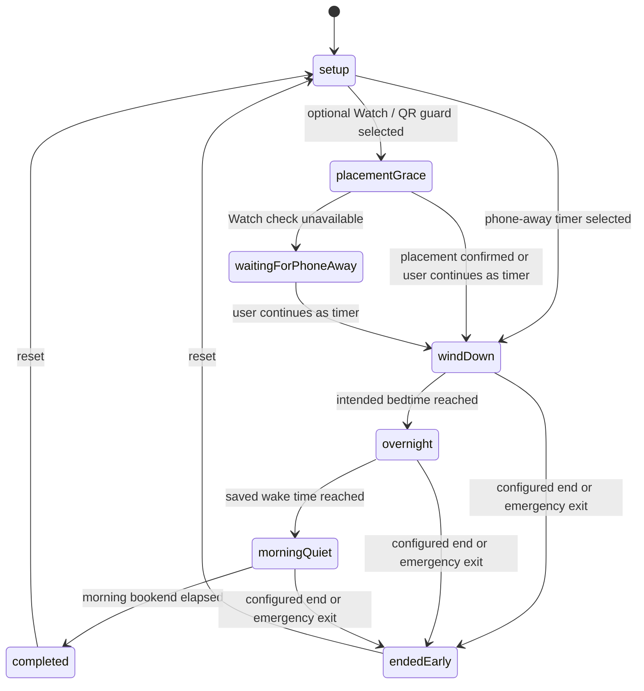

# Architecture Map — Counting Sheep

Practical architecture reference for humans and agents. Canonical rules live in
[`AGENTS.md`](../AGENTS.md); this file goes deeper on structure, data flow, and risk.

Last verified against code: 12 August 2026.

## 1. Stack and build system

- Swift 5.9, SwiftUI, iOS 17.0+, watchOS 10.0+
- **XcodeGen**: `project.yml` is the source of truth; `PhoneInTheOtherRoom.xcodeproj` is
  generated. Run `xcodegen generate` after adding/moving files or editing `project.yml`.
  Never hand-edit `project.pbxproj`.
- One approved SPM dependency: official `supabase-swift`, limited to optional ActivityKit,
  consented impact-data, gated feedback, and ADR-0016 Slumber Party paths. No CocoaPods
  dependencies. No CI
  (local build + test is the gate).
- Eight application/extension/test targets plus shared domain code.

## 2. Targets

| Target | Type | Sources | Notes |
|---|---|---|---|
| `PhoneInTheOtherRoom` | iOS app | `Shared/` + `PhoneInTheOtherRoomApp/` + assets | Display name "Counting Sheep". Embeds the Watch app. iPhone-only (`TARGETED_DEVICE_FAMILY: 1`). |
| `PhoneInTheOtherRoomWatchApp` | watchOS app | `Shared/` + `PhoneInTheOtherRoomWatchApp/` | Optional companion: mirrors the phone-authoritative timer for timer/NFC protection flows. UWB placement is deferred. |
| `PhoneInTheOtherRoomLiveActivity` | iOS Widget extension | `Shared/` + `PhoneInTheOtherRoomLiveActivity/` + assets | Embedded Live Activity for Lock Screen, Dynamic Island, and paired-Watch Smart Stack status. |
| `PhoneInTheOtherRoomScreenTimeReport` | iOS app extension | `Shared/` + `PhoneInTheOtherRoomScreenTimeReport/` | Embedded DeviceActivity report extension. Main app and extension compile the `SCREEN_TIME_REPORTS` paths and share scoped selections through the App Group. |
| `PhoneInTheOtherRoomDeviceActivityMonitor` | iOS app extension | `Shared/` + `PhoneInTheOtherRoomDeviceActivityMonitor/` | Applies and clears scheduled wind-down/morning shields while the app is suspended. |
| `PhoneInTheOtherRoomShieldConfiguration` | iOS app extension | `PhoneInTheOtherRoomShieldConfiguration/` + shared shield-presentation contract + local asset catalog | Role-aware ManagedSettings shield with finite first-party cues, the real protected-session end time, and a full-colour Ollie/sheep companion. |
| `PhoneInTheOtherRoomShieldAction` | iOS app extension | `PhoneInTheOtherRoomShieldAction/` | Handles role-aware Return to Quiet Time / Return to Wind Down actions on iOS 26.5+; safely closes the shielded app on older OS versions. |
| `PhoneInTheOtherRoomTests` | unit tests | `Shared/` + `Tests/` | Shared-domain coverage, including Night Watch schedule and legacy decoding. |

Schemes: `PhoneInTheOtherRoom` (builds iOS + Watch, runs tests) and
`PhoneInTheOtherRoomScreenTimeReport` (extension only).

## 3. Module map

```
Shared/                        Pure domain logic (no UI, unit-testable)
├─ Models/OllieModels.swift      FocusRun, FocusRunState, UserProgress, flock count,
│                                daily records, legacy economy fields
├─ RewardModels.swift            legacy keepsake compatibility types and context
├─ ProximityClassifier.swift     legacy/shared distance buckets (placement only)
├─ FocusRunRules.swift           timing and completion eligibility
├─ SessionGuard.swift            honor timer / Watch placement / QR / NFC guard metadata
├─ NightWatch.swift              saved sleep-bookend plan, phases, activities, quiet credit
├─ WindDownScheduling.swift      versioned schedule state, recurrence, one-time periods, overlap rules, aggregation
├─ NightsHistorySummary.swift    wake-day/start-day presentation summaries for week, month, and day history
├─ NightJourneyProgress.swift    run/phase-aware wall-clock journey reducer
├─ NightJourneyTerrain.swift     periodic terrain height and slope profiles
├─ OfflinePurpose.swift          private offline intention + notification privacy choice
├─ RewardEngine.swift            protected-night progress + legacy reward updates
├─ FocusAnalytics.swift          day records, correlations, CSV/JSON export
├─ ImpactMeasurement.swift       local outcome comparison + minimised sharing record
├─ NightFlockModels.swift        seven-day rules and positive-only social domain
├─ NightFlockPresentation.swift  aggregate and privacy presentation derivations
├─ NightFlockAPI.swift           versioned commands/state + monotonic outbox contracts
├─ NightWatchHistory.swift       90-day aggregate records + idempotent ritual events
├─ PhoneBedTag.swift             local NDEF registration digest
├─ QuietTimeShieldSchedule.swift schedule/status/evidence App Group contract
├─ WatchMessage.swift            typed phone↔watch message envelope + codec
├─ ScreenTimeIntegration.swift   Screen Time scopes + report context IDs (phone-other.*)
├─ SleepIntervalMath.swift       merge sleep intervals → SleepSummary
├─ MorningCheckIn.swift          private, optional morning reflections (no score/reward)
├─ Onboarding.swift              first-run Wind Down setup draft and protection choices
├─ WindDownGuidance.swift         finite, source-linked screen-time and sleep-habit ideas
├─ SheepSearch.swift               deterministic search outcomes, posters, rarity, habitats
├─ SheepSearchState.swift          versioned outcomes, trail-map credit, and persisted state
├─ FarmModels.swift                versioned owned flock, discovery, balances, equipment, history
├─ FarmEconomyRules.swift          capacity, shearing, regrowth, sale, and balance invariants
├─ FarmMigration.swift             deterministic outcome/legacy-flock reconciliation
├─ FarmShop.swift                  fixed local catalogue, purchase, upgrade, and equipment rules
├─ Orientation.swift                versioned three-step Home tour + contextual-tip migration
├─ AppFeedback.swift             validated feedback draft/attachment/receipt protocol
├─ DistanceProvider.swift        protocol: async stream of distance readings
└─ Formatting.swift              OllieFormat timer/minute formatting

PhoneInTheOtherRoomApp/        iOS app
├─ App/                          @main entry, App Intents / Shortcuts
├─ Design/                       Theme.swift + PixelComponents.swift — design system
├─ Proximity/
│  ├─ FocusSessionCoordinator.swift            ← THE phone-authoritative run coordinator
│  └─ NearbyInteractionDistanceProvider.swift  iPhone NI session for optional placement
├─ Services/                     singletons for side effects
│  ├─ PersistenceService.swift                 JSON-in-UserDefaults store
│  ├─ WatchConnectivityManager.swift           WCSession (phone side)
│  ├─ PhoneNotificationService.swift           local notifications + tap routing
│  ├─ NightWatchUsageMonitoringService.swift   phase-scoped DeviceActivity thresholds
│  ├─ PingService.swift                        haptic/sound "whistle" at phone
│  ├─ FocusModeSuggestionService.swift         Focus Mode guidance strings
│  ├─ HealthSleepService.swift                 optional, read-only HealthKit sleep reads
│  ├─ PhoneBedNFCService.swift                 Core NFC provision/scan lifecycle
│  ├─ QuietTimeShieldingService.swift          schedule/apply/clear ManagedSettings
│  ├─ ImpactDataSyncService.swift              optional minimised Supabase upsert/delete
│  ├─ FeedbackService.swift                    gated private upload + Edge Function client
│  ├─ ScreenTimeAuthorizationService.swift     FamilyControls auth (flag-gated)
│  ├─ ScreenTimeSelectionService.swift         FamilyActivitySelection per scope
│  ├─ AnalyticsExportService.swift             JSON/CSV export to temp files
│  ├─ SupabaseClientProvider.swift             configured official Swift client
│  ├─ SupabaseAuthenticationService.swift      anonymous-session restore/create
│  ├─ SupabaseLiveActivityRemoteSink.swift     disabled-by-default push registration sink
│  ├─ NightFlockAccountService.swift           anonymous-to-Apple identity linking
│  ├─ NightFlockService.swift                  typed Edge Function client
│  └─ NightFlockOutboxService.swift            local monotonic positive-state retry queue
├─ ViewModels/FocusRunViewModel.swift          root view model, owns coordinator + Slumber Party VM
├─ ViewModels/NightFlockViewModel.swift        feature-gated social presentation and intents
├─ Views/
│  ├─ HomeView.swift                           navigation shell + run-state routing
│  ├─ PixelHomeDashboard.swift                 home tab
│  ├─ Components/OrientationTourOverlay.swift  shared spotlight guide for Home and contextual tips
│  ├─ FocusRunSetupView.swift                  bedtime/wake, bookends, purpose + guard
│  ├─ ActiveRunView.swift                      in-run UI + non-scrolling journey state
│  ├─ CompletionView.swift / EarlyEndView.swift
│  ├─ FocusStatsView.swift                     latest-primary Nights overview + grouped context
│  ├─ NightsWeekSection.swift                  seven-day board + all-nights navigation
│  ├─ MonthlyNightsView.swift                  shared-summary month calendar
│  ├─ NightsDayDetailView.swift                grouped day occurrences + factual record detail
│  ├─ FarmView.swift                           production Farm dashboard and destination routing
│  ├─ NightFlock/                              invite, hub, trail, pasture, safety, result views
│  ├─ FarmPastureView.swift                    paged, grounded, visit-shuffled living flock scene
│  ├─ BarnView.swift                           owned flock, capacity, lifecycle, and pending arrivals
│  ├─ TrailBoardView.swift                     missing/discovered catalogue and tracked lead
│  ├─ TrailNotesArchiveView.swift              persisted search-result history
│  ├─ FarmShopView.swift                       local purchases, upgrades, and equipment
│  ├─ ShepherdCustomizationView.swift          local player-avatar editor
│  ├─ MoreView.swift                           Settings root: configuration, connections, privacy, help
│  ├─ WindDownTimingView.swift                  compact saved schedule editor
│  ├─ WindDownScheduleView.swift                 finite Once / Repeats / Usual Wind Down editor
│  ├─ FeedbackFormView.swift                   validated form + email fallback
│  ├─ RewardShelfView.swift                    Debug internal preview only
│  ├─ Components/QRCodeScannerView.swift       Wind Down code scanner + manual fallback
│  ├─ Components/NightWatchReceiptCard.swift   elapsed/bookend/sleep/data-status receipt
│  ├─ Components/MorningCheckInCard.swift       collapsed, optional morning reflection
│  ├─ Components/GameComponents.swift          legacy UI retained outside run flow
│  ├─ Components/AssetPlaceholderComponents.swift  placeholder/sprite fallbacks
│  └─ MVP/AssetReadyScreens.swift              GATED: legacy Farm/Friends/Shop mock screens
└─ MockData/MVPMockData.swift                  GATED: feeds MVP screens only

PhoneInTheOtherRoomWatchApp/   watchOS companion
├─ App/                          @main
├─ Services/                     WatchConnectivityManagerWatch, WatchNotificationService
├─ ViewModels/WatchRunViewModel.swift          watch-side run state
└─ Views/                        WatchSetupView, WatchRunView, WatchWarningView,
                                 WatchCompletionView, WatchEarlyEndView, WatchOllieIconView

PhoneInTheOtherRoomLiveActivity/ iOS WidgetKit extension
├─ FocusRunLiveActivityWidget.swift              Lock Screen + Dynamic Island layouts
├─ QuietNoteWidget.swift                          configurable Lock Screen cue below the clock
└─ Info.plist                                    Widget extension declaration

PhoneInTheOtherRoomScreenTimeReport/
└─ ScreenTimeReportExtension.swift   3 DeviceActivity report scenes:
                                     today / weekly / late-night (phone-other.*)

PhoneInTheOtherRoomDeviceActivityMonitor/  background bookend shield callbacks
PhoneInTheOtherRoomShieldConfiguration/    shield appearance
PhoneInTheOtherRoomShieldAction/           shield-button response

Config/                         local Supabase xcconfig values; secrets remain untracked
supabase/                       versioned ADR-0005 migrations and Edge Functions
```

## 4. Data flow

### Wind Down lifecycle (implemented by the internal Night Watch model)



Sequence per Night Watch (persisted internally as `FocusRun` for data compatibility):

1. `PixelHomeDashboard` → `FocusRunSetupView` saves `NightWatchPreferences`: bedtime,
   wake time, quiet-window lengths, two optional offline cues, and the placement guard.
   Outside the start window, the app saves the plan and schedules a wind-down reminder.
2. `FocusRunViewModel.requestStartNightWatch()` anchors a `NightWatchPlan` to tonight and
   starts `FocusSessionCoordinator`. One persisted run spans wind-down, overnight, and
   morning quiet; there is no second morning timer or competing state machine.
3. The iPhone coordinator creates the run and schedules one foreground timer for the next
   semantic boundary (bedtime, wake time, or `plan.protectedUntil`), never a repeating
   countdown timer. SwiftUI renders visible countdowns from absolute dates. The view model
   schedules silent sleep-time and phone-free-morning transitions plus the audible completion
   the user requested. The coordinator persists and mirrors the run only at meaningful state
   and lifecycle events; when the optional ActivityKit delivery path is deployed, the backend
   sends phase updates at the same two boundaries so the Live Activity can advance while the
   app is suspended.
4. The honor-timer path completes without either device being foregrounded. Current release
   setup offers App Shielding (`.honorTimer`) or NFC + App Shielding (`.nfcTag`). Legacy
   `.watchPlacement` and `.qrCode` values remain decodable and normalize to the timer for new
   release flows; their older implementation is not user-selectable. `.nfcTag`
   reads a provisioned NDEF record and compares its local token digest. A failed
   tag scan can explicitly pair a replacement writable tag without restarting the
   current run; the new digest is committed only after a successful write, and supersedes
   the previous tag for normal ending. When automatic Wind Down is enabled, the saved plan
   schedules the selected local notification cadence and future DeviceActivity shielding
   while the app is closed; optional usage-aware monitoring is installed independently for
   wind-down, overnight, and morning quiet, with one generic three-minute cue per phase.
   The next app activation reconstructs the local run.
   Notification copy is resolved by the shared `NotificationCopyResolver` from a stable
   template ID, the current plan context, and local overrides. Settings previews call the
   same resolver before pending `UNNotificationRequest` values are rebuilt. Supported
   placeholders are optional (`{activity}`, `{purpose}`, `{time}`, and `{minutes}`); fixed
   protection notices bypass overrides.
5. The Watch mirrors the authoritative run and never starts one from schedule defaults.
   An explicit no-run state from the iPhone clears any stale Watch application context.
6. Optional shielding derives a protected-session DeviceActivity schedule from this same
   `NightWatchPlan`. The start confirmation carries a per-run shielding choice, so a person
   can continue one practice or quiet period without app limits while preserving their saved
   preference. After an eligible start (or the registered NFC tag confirmation),
   ManagedSettings applies through wind-down, overnight, and morning quiet, then clears
   on terminal/reset/replacement. A bounded App Group status history distinguishes observed
   shield time from a requested schedule; legacy two-bookend snapshots remain decodable.
   The app/category-only Brief Access action stores a versioned pending/scheduled grant
   record with run ID, schedule revision, nonce, clamped expiry, and one-shot restore
   activity name. Its bounded per-run ledger survives extension-only cleanup until the
   main app imports the factual count into the active run/history record. Restore callbacks
   accept a grant only for the same run/revision; a pending or stale callback instead
   reconciles the current schedule and reapplies its existing shield when that phase is
   still eligible. Web domains never advertise or receive Brief Access.
   The App Group snapshot carries a backwards-compatible `QuietTimeShieldRole` (legacy
   snapshots resolve to primary Wind Down). Shield Configuration selects a finite,
   deterministic first-party cue for Phone Break, Wind Down, overnight, or morning
   quiet and uses the protected-session interval—not a bookend—as the displayed end time.
   Its Ollie/sheep icon is decorative; the companion sheep is not a search result, reward,
   or owned flock item.
7. On finish, `RewardEngine` retains compatibility updates while crediting only elapsed
   wind-down and morning-quiet minutes. The coordinator resolves one deterministic search outcome
   per run, persists it, and reconciles one individual `FlockSheep` arrival into `FarmState`.
   Available arrivals enter the active flock; capacity overflow remains pending. The completed
   protected-night count also advances wool regrowth. Progress is attributed to the intended-
   bedtime date, then `PersistenceService` saves and the Watch gets the terminal message. See
   `docs/REWARDS.md` and ADR-0015.
8. `HomeView` routes to `CompletionView` / `EarlyEndView` based on `activeRun.state`.
   Both outcomes show the same factual receipt: elapsed phone-away time, credited quiet
   bookends, optional Apple Health sleep context, and an explicit Screen Time availability
   state. The separate Nights tab stays finite and observational: seven-day results, monthly
   drill-down, reflection, Health context, and consented selected-app results. Farm owns the
   active flock, lifecycle, catalogue, Shop, and customization presentation; Settings owns plan
   and report configuration. Chosen report windows do not
   alter Wind Down or Phone Break. Missing data is never estimated.
   When ADR-0016's flag is enabled, Home may show one compact positive Slumber Party aggregate
   and Farm owns the nested Slumber Party hub. A successful eligible completion may show one
   finite link to its anonymous shared-pasture result. None of these surfaces changes rewards.
9. During an active Night Watch, Home is replaced by the live journey while Nights, Farm,
   and Settings remain mounted in the same four-tab shell. A persistent return strip resets
   nested navigation and returns to Home. Run start, app activation, and active-run notification
   routing make Home the default. ActiveRunPresentation supplies role-aware copy,
   accessibility, guidance, exit, and shielding-status affordances; Phone Break uses
   its actual plan end date and never borrows primary Wind Down phase language. Terminal
   receipts temporarily replace the shell.
10. `NightJourneyProgress` resolves overall, phase, and segment progress from the active
    `FocusRun`; `NightJourneyTerrainProfile` supplies a periodic height and derivative used by
    both the Canvas foreground and Ollie's foot alignment. Backdrops pan/zoom only within safe
    crop bounds, and deterministic clues at 20/55/82 percent never affect search resolution.
11. Successful Phone Break runs atomically credit at least 15 and at most 75 of their actual
   quiet minutes to the versioned `SheepTrailMapState` nested in `SheepSearchState`. The state
   carries remainder minutes, retains bounded credited run IDs for idempotency, and resolves at
   most one separate bonus search per completed break after three protected Wind Downs. The
   deterministic 20/30/40/50/100 ladder and Phone Break clue counter never alter Wind Down odds.
   Home and the Phone Break schedule offer a separate ad-hoc Start now action. It creates a
   temporary bounded occurrence for the single start transaction; Not now rolls it back, while
   starting consumes it. Scheduled rows keep their exact occurrence identity through
   confirmation, and the future-period editor does not participate in this path. Starting one
   never changes progress by itself. An eligible completion can fill the Phone Break meter and
   open its separate bonus search, but never changes protected-night progress or Wind Down odds.
12. After first-run setup, the `HomeView` shell presents a finite three-step app tour persisted
    as `ollie.orientation.state`; one-time contextual spotlights cover Nights, Farm, Settings,
    Phone Break, the first Trail Note, and first Barn capacity. Each uses the same dimmed coach-mark
    language as Home and points to real interface beneath it; no guide step is styled as ordinary
    app content. A dimmed modal layer spotlights the real
    Tonight plan and bottom navigation without becoming part of Home's scroll. Finishing or dismissing the
    tour is independent of tab visits and real Wind Down actions. The optional five-minute
    practice is offered only after the tour and uses the normal additional-quiet path, so it
    is recorded without protected-night progress or sheep resolution. Settings can resume or
    replay the tour and start practice separately. Version-one milestone data remains decodable.

### Slumber Party run boundary

`FocusRunViewModel` owns and forwards one `NightFlockViewModel`; there is no second app-root or
session coordinator. A primary manual start creates its final run UUID before
`FocusSessionCoordinator.start`. If the challenge is active, membership sharing is enabled, and
the preflight was not private, the Slumber Party view model stores a local run-share context.

The coordinator calls `onPhoneAwayValidated` only after the selected NFC/honor guard has actually
made the run valid. That callback enqueues `phoneTucked`; successful primary completion enqueues
`morningQuietCompleted`. An early end removes the context without a command. Automatic and
additional-quiet runs have no context and therefore cannot publish. Stable
challenge/member/day/run-derived hashes make retries idempotent, and foreground activation drains
the monotonic UserDefaults outbox. Network work is asynchronous and never gates local run state.

Home and Farm remove Slumber Party navigation when a run becomes active. `ActiveRunView` has no
Slumber Party dependency, state, panel, badge, reaction, notification, or realtime subscription.

### Backgrounding during a run

Elapsed time is wall-clock based, so it continues while the iPhone app is in the
background. On background, the coordinator cancels its next-boundary timer and any in-progress
optional placement check, then saves the run snapshot. On foreground it reconciles against
the wall clock, schedules only the next boundary, and shows a warm return status. It does not
require a fresh Watch reading, so a person can use or put down either device after starting
the run.

The Live Activity uses the system timer for the current phase when explicitly enabled, so it remains glanceable on the
Lock Screen and Dynamic Island while the app is backgrounded. Its Lock Screen layout gives
the status/timer and message separate vertical regions: the person's selected offline
activity is primary, followed by one stable phase-appropriate cue. It does not shrink or
truncate a combined paragraph to create artificial compactness. ActivityKit does not execute a
WidgetKit timeline for phase changes, so the optional backend sends bedtime and morning-quiet
updates in addition to the final end event. It is requested with `pushType: .token`, and
`FocusRunLiveActivityService` observes every token rotation, associates it with the run and
ActivityKit activity IDs, and emits only a short SHA-256 fingerprint to diagnostics. The
local Live Activity is enabled by default for new installs and can be turned off in Settings;
DEBUG can force either state with `-ollie.debug.enableLiveActivity YES` or
`-ollie.debug.disableLiveActivity YES`. The remote sink is also disabled in the local
configurations. Without it, iOS can mark the activity stale at
the planned end but cannot deliver an exact phase or terminal transition, end it, or dismiss
it until the app next finishes or restores the run; `staleDate` alone is not an update
mechanism. Exact background transitions require the existing optional `pushType: .token`
ActivityKit path, including the remote sink, deployed functions, APNs credentials, and
scheduler. The local completion notification and app-reopen reconciliation remain the
completion fallbacks. See
`ACTIVITYKIT_PUSH_BACKEND.md` for the server lifecycle contract.

The same WidgetKit extension also exposes a static `QuietNoteWidget` in the
`accessoryRectangular` family. Its text comes from the person's explicit Quiet Note
editor value in the existing App Group, with the App Intent widget configuration retained
as the first-install fallback. It is normalized to a short Unicode-safe value and is not
copied from the private `OfflinePurposeProfile`. The widget uses a `.never` timeline and
reloads after an in-app save; active phase and countdown state remain exclusive to the
Live Activity. Tapping it opens `countingsheep://quiet-note` in the app.

Energy-specific implementation notes and the physical-device profiling matrix live in
[`ENERGY_AUDIT.md`](ENERGY_AUDIT.md).

**Authority:** the iPhone coordinator is authoritative for run state. The Watch displays,
measures, and can request early end or "whistle" (`pingPhone`). An early-end request from
Watch is rejected while the active guard is NFC, because the registered tag must be read
by the iPhone.

### WatchConnectivity strategy (both sides)

1. Always `updateApplicationContext` with latest state (survives launches).
2. If reachable, `sendMessage`; on error fall back to `transferUserInfo`.
3. If unreachable, queue critical messages (`startFocusRun`, pings, early end) via
   `transferUserInfo`.
4. Watch can rehydrate via `pingWatch` → phone's `currentStateProvider` snapshot.

## 5. View / component organisation

- `HomeView` is the single navigation shell: its four tabs remain available during an active
  Night Watch, Home becomes the live journey, and terminal receipts temporarily override it.
- One root `@StateObject` per platform (`FocusRunViewModel` / `WatchRunViewModel`),
  distributed via `.environmentObject`. Views are thin; intents go to the view model.
- `OllieRitualView` maps the existing setup, placement, Night Watch phase, completion, and
  early-end presentation states to still-image poses. It does not own or duplicate run state.
- `HomeOllieIdleView` uses a registered six-frame Ollie loop for a brief blink, ear twitch,
  head tilt, and settle on the configured Home dashboard; Reduce Motion holds frame one.
- `NightJourneyView` animates the approved six-frame Ollie cycle with a smaller current-batch
  Bramble sheep running ahead as decorative scenery. The companion is not a search result,
  reward, or owned flock item.
- `AppMotion` in `Theme.swift` is the iOS motion vocabulary. Shipping motion respects
  Reduce Motion by removing spatial/repeating effects while retaining brief fades where useful.
- Two design layers exist (known debt): the canonical pixel Theme
  (`Design/Theme.swift` + `PixelComponents.swift`) and the legacy dark
  `GameComponents.swift` used by active-run screens. Build new UI on the pixel Theme.

## 6. Persistence assumptions

- `UserDefaults.standard` + `JSONEncoder`/`JSONDecoder`, via `PersistenceService.shared`:

| Key | Type | Purpose |
|---|---|---|
| `ollie.progress` | `UserProgress` | protected-night flock count, quiet bookend minutes, daily records, legacy economy fields |
| `ollie.rewards` | `[RewardItem]` | legacy keepsakes retained for compatible decoding/internal preview |
| `ollie.thresholds` | `ThresholdProfile` | proximity calibration |
| `ollie.lastRun` | `FocusRun?` | last run snapshot |
| `ollie.analytics.manualEntries` | `[ManualAnalyticsEntry]` | manual stat entries |
| `ollie.nightWatch.preferences` | `NightWatchPreferences` | bedtime, wake time, bookends, offline cues, placement guard |
| `ollie.nightWatch.schedule` | `WindDownScheduleState` | versioned dated one-time periods and recurring routines; migrated from the two legacy schedule keys |
| `ollie.nightWatch.routines` | `[WindDownRoutine]` | migrated primary routine plus optional additional bounded periods |
| `ollie.nightWatch.nextOverride` | `NextWindDownOverride?` | legacy compatibility mirror; migrated into the versioned schedule and consumed once |
| `ollie.offlinePurpose` | `OfflinePurposeProfile` | optional in-app intention and explicit custom-notification opt-in |
| `ollie.screenTime.reportPreferences` | `ScreenTimeReportPreferences` | independent evening and morning Screen Time report windows |
| `ollie.screenTime.briefAccessState` (App Group) | `QuietTimeBriefAccessState` | active temporary grant plus bounded per-run completed-use ledger |
| `ollie.morningCheckIns` | `MorningCheckInHistory` | up to 45 days of private optional morning reflections |
| `ollie.onboarding.version` | `Int` | completed first-run onboarding version |
| `ollie.onboarding.draft` | `OnboardingDraft` | resumable first-run setup choices |
| `ollie.orientation.state` | `CountingSheepOrientationState` | versioned orientation status, real-action milestones, and practice run identity |
| `ollie.notifications.preferences` | `NotificationPreferences` | cadence, authorization choices, sounds, optional channels, and versioned local message overrides |
| `ollie.notifications.remindersEnabled` | `Bool` | backwards-compatible mirror of the notification master switch |
| `ollie.sheepSearch.state` | `SheepSearchState` | found sheep, outcomes including applied map bonus, trail-map minutes/run IDs, trail distance, no-find protection, odds preference |
| `ollie.farm.state` | `FarmState` | versioned individual flock, pending arrivals, discovery history, capacity, wool, Shop ownership/equipment, avatar, and transaction history; schema v2 folds legacy Farm cash into wool at 5:1, rounded up |
| `ollie.nightWatch.history` | `NightWatchHistory` | up to 90 days of aggregate records and idempotent observed/inferred/self-reported/system events |
| `ollie.phoneBedNFCTag.registration` | `PhoneBedTagRegistration` | local tag UUID + digest metadata; raw token is not retained |
| `ollie.impactSharing.preferences` | `ImpactSharingPreferences` | explicit optional-sharing state and consent date |
| `ollie.impactSharing.records` | `[ImpactUploadRecord]` | date-free retry cache for consented impact rows |
| `ollie.nightFlock.outbox` | `[NightFlockOutboxRecord]` | bounded local retry queue containing only positive state contracts |
| `ollie.nightFlock.runContexts` | `[NightFlockRunShareContext]` | up to 32 local consent/idempotency contexts; never uploaded as run IDs |
| `ollie.appearance.preference` | `AppAppearancePreference` | Automatic, Light, or Dark app appearance choice |

- No CoreData / SwiftData. Core state stays in standard defaults. The App Group is limited
  to Screen Time selections plus shield schedule/status contracts needed by extensions;
  legacy standard-default selection keys migrate forward without overwriting shared data.
- Codable models are the schema. Changing them requires backwards-compatible decoding;
  a legacy-decode test exists in `Tests/` and must keep passing.
- Watch and phone do not share persistence; the Watch is rehydrated over WatchConnectivity.

`FocusRunViewModel.eraseLocalDataAndStartOver()` is the scoped local reset boundary. It clears
the explicit standard-default key list in `Shared/CountingSheepStorage.swift`, asks the owning
notification, HealthKit, NFC, usage-monitoring, shielding, and Live Activity services to clear
their runtime state, and clears the explicit Screen Time/Brief Access App Group keys. It resets
the coordinator and root route in memory, then opens a fresh Welcome draft in the same process.
The installation transport identifier is intentionally retained so previously uploaded optional
Live Activity delivery records are not re-identified by a local reset; remote impact records are
also never deleted by this operation. iOS notification, Family Controls, and HealthKit grants
cannot be revoked programmatically here.

### Optional hosted backend

The main iOS target alone links the official `supabase-swift` package. A stable configured
client restores or refreshes an anonymous Supabase session and creates an anonymous user
only when no stored session exists. Live Activity registration/cancellation is injected
through `FocusRunLiveActivityRemoteSink` and remains disabled by default through
`SUPABASE_LIVE_ACTIVITY_PUSH_ENABLED`. Configuration or network failure never changes the
local coordinator's authority, local notification, flock, or reopen reconciliation.

The versioned `supabase/` backend contains the ActivityKit delivery schema, the optional
`impact_nights` table, gated feedback delivery, and the independently gated Slumber Party schema.
Impact rows use relative nights and exclude exact dates/times, source
names, app tokens, NFC identity, raw Health samples, and free text. The user can stop future
sharing or call a scoped deletion RPC without deleting local history. The backend and Edge
Functions remain separately deployed. Client-visible tables use RLS with `auth.uid()`; raw tokens, worker queues, and
delivery administration have no direct client grants.

Feedback uses anonymous auth, direct uploads to the private `feedback-attachments` bucket,
and an authenticated idempotent `submit-feedback` function. `app_feedback` has no client
read/write grants. A service-only database RPC serializes each user's rolling five-per-day
limit. Resend notification failures remain pending; a secret-protected scheduled function
retries every ten minutes up to five attempts and purges rows/private objects after 180 days.
`SUPABASE_FEEDBACK_ENABLED` remains off until the independent production gate passes; the
iOS form then uses Mail instead. ADR-0005/0007 and `ACTIVITYKIT_PUSH_BACKEND.md` define the
cloud boundaries.

Slumber Party is independently controlled by `SUPABASE_NIGHT_FLOCK_ENABLED` (default `NO`). With
the flag off, its app surfaces are absent and it does not create a Supabase session or make a
request. Entry creates or restores an anonymous session only when needed, then Sign in with Apple
links that identity in place and verifies the Auth UUID did not change. Slumber Party server RPCs
also require Apple in Auth app metadata, so another non-anonymous provider is insufficient.

`night-flock-command` and `night-flock-state` derive the caller from the JWT, validate exact
schema-version-one payloads, and alone call service-role RPCs. Protected tables have RLS enabled,
no authenticated client write grants, one active membership per user, one pending/active challenge
per flock, and an eight-member trigger protected by an advisory lock. State projections include
system aliases only in the roster and omit Auth owner IDs, run IDs, exact timestamps, and private
state. Plain invite codes are returned once and stored only as SHA-256 digests.

Slumber Party tables do not reference `focus_runs`, `impact_nights`, HealthKit, Screen Time, NFC,
notifications, or any Farm/economy table. Retention purges invites after 30 days, raw check-ins and
reactions after 90 days, and aggregate completed summaries after 12 months. The hosted scheduler,
migration/functions, Apple provider, and moderation operating process remain deployment gates.

## 7. Known architectural risks

1. **Placement evidence is intentionally light.** The honor timer is an honest fallback,
   not tamper-proof verification. Watch and QR provide optional start signals. NFC also
   authenticates the normal end action with the same registered tag; a multi-step emergency
   bypass remains available and is recorded locally.
2. **Night Watch intentionally crosses midnight.** Date boundaries, daylight-saving
   changes, timezone changes, termination, and background restoration need physical-device
   QA in addition to the pure scheduling tests. The continuous app barrier is not progression;
   only quiet bookends count as progress.
3. **Screen Time needs physical-device QA.** The report/monitor/configuration/action
   extensions are embedded locally, but the three new shield bundle IDs still need Family
   Controls distribution assignment and continuous barrier transitions need physical proof.
   App/category shields use the iOS 26.4+ system submenu for Brief Access; older OS versions
   use the direct five-minute button, and web domains never advertise Brief Access. Continue
   Wind Down opens Counting Sheep on iOS 26.5+ and keeps the close fallback on older systems.
   Authorization, picker persistence, report rendering, empty states, and distribution
   profiles must still be exercised on a physical iPhone.
4. **Legacy mock layer remains compiled in Debug.** Friends and the old Farm/Shop/reward shelf
   still render `MVPMockData`; they appear only inside More with
   `-ollie.debug.enableMockScreens YES`. The production Farm and Farm Shop are separate real-data
   surfaces backed by `FarmState`.
5. **Oversized files.** `AssetReadyScreens.swift` and `PixelComponents.swift` resist safe
   editing by agents with limited context.
6. **Singleton coupling.** Services are reached via `.shared` from the coordinator, which
   makes unit-testing the coordinator itself hard (currently untested; only `Shared/` is).
7. **UserDefaults as the detailed-history store.** The 90-day bound is appropriate now;
   schema growth or richer user inspection may justify a local database later.
8. **ActivityKit remote delivery is disabled by default.** Token observation, lifecycle
   contracts, and the approved Supabase implementation exist, but deployment, secrets, and
   APNs delivery still require validation. Local completion behavior remains authoritative.
9. **Feedback delivery is disabled by default.** Resend secrets/domain, scheduled retry,
   hosted migration, private-object behavior, mailbox retention, and a physical-device
   upload must all pass before enabling it. Email fallback is the release-safe path.
10. **Slumber Party is disabled by default.** The local contract, app surfaces, schema, RLS tests,
    and Edge Functions are versioned, but hosted deployment, Apple/Supabase configuration,
    moderation operations, retention scheduling, and physical two-account QA remain external.

## 8. Recommended architecture direction

- Keep MVVM + coordinator; it fits. Do not introduce new architecture patterns (TCA,
  Redux, etc.) — the codebase is small and the pattern works.
- Keep wind-down, overnight, and morning quiet as phases of the same persisted run. New
  morning features must extend `NightWatchPlan`, not introduce a parallel session model.
- The session-guard seam retains `SessionGuardKind` (`.honorTimer`, `.watchPlacement`,
  `.qrCode`, `.nfcTag`) for persisted-data compatibility. Current release UI exposes only
  `.honorTimer` and `.nfcTag`. Keep completion phone-authoritative and preserve an emergency exit.
- Keep the App Group limited to Screen Time/Shield extension contracts; do not migrate
  unrelated progress, rewards, HealthKit history, or reflections into it.
- Converge run-screen UI onto the pixel Theme; retire `GameComponents` gradually.
- Inject services into `FocusSessionCoordinator` (init parameters defaulting to
  `.shared`) to make it testable — mechanical, low-risk refactor.
- Keep cloud work additive and permission-separated: ActivityKit delivery, explicitly consented
  minimised impact rows, and ADR-0016's narrow Slumber Party tables never become shared data sources.

## 9. Clean up before App Store 1.0

1. Keep general Friends, the legacy Farm/Shop/shelf, and `MVPMockData` behind the explicit Debug
   flag. Slumber Party is the separate ADR-0016 production slice and stays release-hidden until its
   explicit feature flag and external gates are approved.
2. Register/approve/sign the three new shield extension IDs.
3. Increment the build number and produce a distribution archive.
4. `HealthSleepService` uses requested/no-data/error states because HealthKit does not
   disclose whether read access was denied. Do not regress to an “authorized” read state.
5. Manually validate NFC tag lifecycle, background/terminated shielding, HealthKit stages,
   optional impact deletion, run restore, and QR/Watch fallbacks on physical hardware.
6. Accessibility pass on the core run flow (timer, proximity state, Watch views).
7. Keep backend feedback disabled unless every ADR-0007/TestFlight gate is proven.

## 10. Explicitly postponed

- Splitting the oversized files (do opportunistically, not as a pre-TestFlight project)
- Removing `GameComponents` / design-system convergence
- Screen Time shielding (separate from the embedded read-only report; ADR-0004 gates apply)
- Physical-device proof for NFC-authenticated ending and terminated-app shielding
- Coordinator dependency injection refactor
- Any new persistence layer
