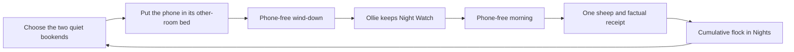

# One Night, One Sheep

Counting Sheep marks the phone-away ritual, not time asleep and not time spent in the app.
Ollie guards and guides. Each completed protected night settles exactly one equal sheep into
the flock, then the person can leave.

## The loop

Only completion determines whether one sheep arrives. The factual receipt keeps wind-down
and morning-quiet minutes separate. Duration, the overnight interval, Health data, Screen
Time data, placement method, warning count, streak, Watch ownership, and app opens never
change a sheep's value.

## Canonical presentation

The completion card says “A sheep settled in,” shows one common sheep illustration, displays
the cumulative flock count from `UserProgress.totalCompletedRuns`, and includes the factual
quiet-time receipt. Nights shows the same cumulative count without locked slots, rarity,
collection percentage, or future-reward teasing.

An early-ended Night Watch adds no sheep. It still receives warm copy and the factual receipt;
no sheep or previously completed night is lost.

## Persisted compatibility

`RewardItem`, `RewardContext`, rarity, coin and sheep balances, total earned fields, and
Ollie level remain encoded and decoded so existing users lose no data. The release UI does
not read those legacy economy values. The old keepsake shelf is available only through the
explicit Debug internal-preview flag until a later compatibility cleanup.

## Evidence boundary

Counting Sheep is **CBT-I-informed, not CBT-I treatment**. The 2021 American Academy of
Sleep Medicine guideline recommends clinician-delivered, multi-component CBT-I for chronic
insomnia and explicitly cautions that sleep hygiene alone is not an adequate treatment.
Stimulus control—one component—works to strengthen the bed as a cue for sleep and establish
a consistent wake time. The 2025 VA/DoD guidance likewise describes CBT-I as a structured,
multi-component intervention with clinical considerations.

The app stays on the non-clinical side of that boundary:

- the phone has a consistent resting place outside the bedroom;
- a saved wind-down and wake boundary make the ritual easier to repeat;
- offline cues suggest calmer alternatives without proof or checklists;
- the completion copy notices behavior and purpose, never sleep quality; and
- there is no sleep restriction prescription, sleep-efficiency score, diagnosis, or claim
  to treat insomnia.

Sources:

- [AASM behavioral and psychological treatments guideline (2021)](https://pmc.ncbi.nlm.nih.gov/articles/PMC7853203/)
- [VA/DoD chronic insomnia and OSA guideline pocket card (2025)](https://healthquality.va.gov/HEALTHQUALITY/guidelines/CD/insomnia/I-OSA-2025-Pocket-Card_final_20250205.pdf)

## Product-principle checks

- **Slow living:** the reveal repeats what the quiet made room for and the two offline cues;
  it adds no routine checklist.
- **Purpose over accumulation:** one protected night is one equal sheep. There are no locked
  slots, collection percentage, rarity classes, currencies, or next-reward countdowns.
- **Mindful screen-time management:** the rewarded behavior is physical separation during
  the selected bookends. Optional Screen Time reports can supply context elsewhere but
  never determine the sheep.
- **Kindness:** the flock cannot shrink; shorter attempts receive warmth rather than punishment.
- **Finite attention:** one arrival appears at completion and Nights remains a finite record.

## Evaluation

Judge this loop by protected behavior, not collection engagement:

- completed Night Watches in a tester's first 14 nights;
- credited wind-down and morning-quiet minutes, kept separate;
- whether users understand that every protected night adds one equal sheep;
- selected-app use around sleep when the person explicitly enables Screen Time reports; and
- qualitative reports that rewards feel calm, meaningful, and non-compulsive.

Do not optimize completion-screen opens, flock-page dwell time, notification taps, rarity
demand, or currency accumulation.
