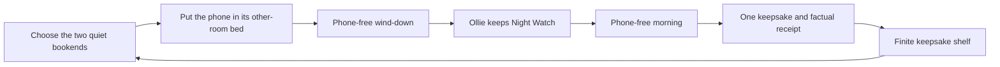

# Keepsakes and the Night Watch Reward Loop

Counting Sheep rewards the phone-away ritual, not time asleep and not time spent in the
app. The morning reveal should make a completed Night Watch feel warm enough to repeat,
then let the person leave.

## The loop

Only the two quiet bookends are credited. The overnight interval, Health data, Screen Time
data, placement method, warning count, and app opens never improve the reward.

## What a keepsake remembers

New `RewardItem` values carry an optional `RewardContext` snapshot:

- credited minutes before bed;
- credited minutes after waking;
- the chosen evening and morning offline cues; and
- the cumulative protected-night number.

This makes a keepsake a small receipt for the ritual that produced it. It does not claim
that the user completed an offline activity, slept better, or reduced selected-app use.
Legacy rewards decode without a context and remain on the shelf.

## Variety without a value ladder

Ordinary completions rotate through three families:

| Family | Examples | Meaning |
|---|---|---|
| Ollie's notes | mail, letter, postcard | A calm reflection from Night Watch |
| Pasture finds | tennis ball, stick, field map | A playful object from the other room |
| Night markers | ribbon, sheep badge | A marker for quiet gathered over time |

The families and their items use a balanced rotation. There are no odds, refresh rolls,
paid outcomes, limited windows, duplicate compensation, or “come back later” teasers.
Minutes, warnings, and current streak do not create a higher-value tier.

Cumulative milestones arrive at 1, 3, 7, 14, 30, 50, and 100 protected nights. They count
all protected nights rather than consecutive nights, so a gap never removes progress.
The persisted `RewardRarity` field remains for legacy compatibility and milestone artwork;
the shipping shelf presents a keepsake's family and receipt instead of a rarity hierarchy.

An early-ended Night Watch can still leave a muddy paw. It is a fresh-start keepsake, not
a failed reward, and it does not increment the protected-night count.

## Evidence boundary

Counting Sheep is **CBT-I-informed, not CBT-I treatment**. The 2021 American Academy of
Sleep Medicine guideline recommends clinician-delivered, multi-component CBT-I for chronic
insomnia and explicitly cautions that sleep hygiene alone is not an adequate treatment.
Stimulus control—one component—works to strengthen the bed as a cue for sleep and establish
a consistent wake time. The 2025 VA/DoD guidance likewise describes CBT-I as a structured,
multi-component intervention with clinical considerations.

The app stays on the non-clinical side of that boundary:

- the phone has a consistent resting place outside the bedroom;
- a saved wind-down and wake boundary make the ritual easier to repeat;
- offline cues suggest calmer alternatives without proof or checklists;
- the completion copy notices behavior and purpose, never sleep quality; and
- there is no sleep restriction prescription, sleep-efficiency score, diagnosis, or claim
  to treat insomnia.

Sources:

- [AASM behavioral and psychological treatments guideline (2021)](https://pmc.ncbi.nlm.nih.gov/articles/PMC7853203/)
- [VA/DoD chronic insomnia and OSA guideline pocket card (2025)](https://healthquality.va.gov/HEALTHQUALITY/guidelines/CD/insomnia/I-OSA-2025-Pocket-Card_final_20250205.pdf)

## Product-principle checks

- **Slow living:** the reveal repeats what the quiet made room for and the two offline cues;
  it adds no routine checklist.
- **Purpose over accumulation:** the shelf explains the ritual behind each item. It exposes
  no locked slots, collection percentage, or next-reward countdown.
- **Mindful screen-time management:** the rewarded behavior is physical separation during
  the selected bookends. Optional Screen Time reports can supply context elsewhere but
  never determine the keepsake.
- **Kindness:** lifetime milestones cannot be lost; shorter attempts receive warmth rather
  than punishment.
- **Finite attention:** one reveal occurs at completion and the shelf has a definite end.

## Evaluation

Judge this loop by protected behavior, not shelf engagement:

- completed Night Watches in a tester's first 14 nights;
- credited wind-down and morning-quiet minutes, kept separate;
- whether users understand why they received a keepsake;
- selected-app use around sleep when the person explicitly enables Screen Time reports; and
- qualitative reports that rewards feel calm, meaningful, and non-compulsive.

Do not optimize reward-screen opens, shelf dwell time, notification taps, rarity demand, or
the number of muddy paws collected.
