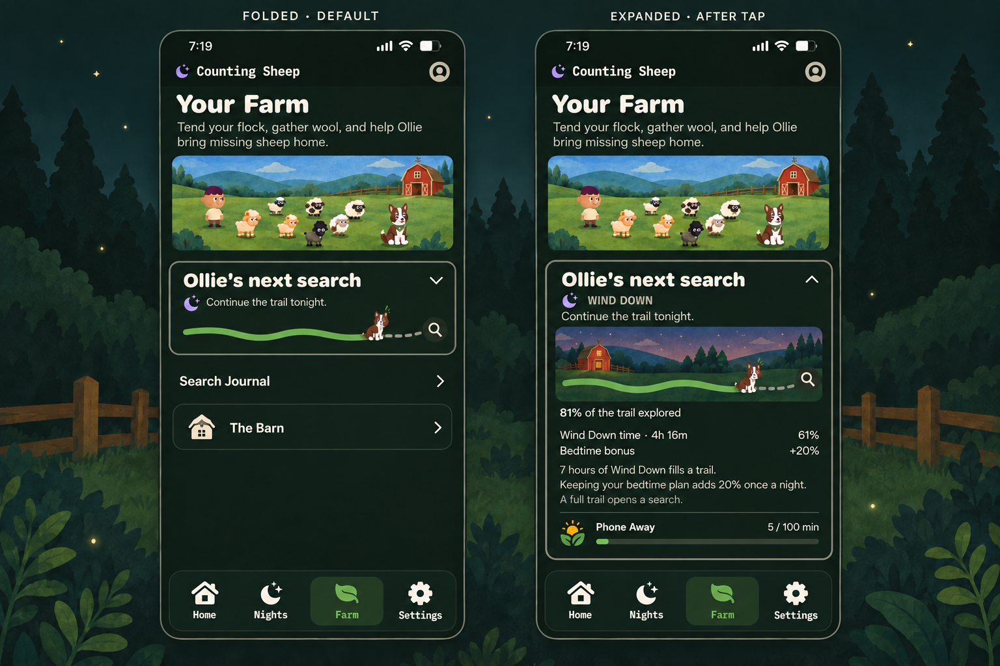

# Ollie's next search — scoped implementation plan

Date: 20 September 2026. Status: **implemented; TestFlight 1.0 (53) delivered to Internal QA**.
[Release evidence](../../output/design/search-progress-20260920/release-53/README.md); spoken VoiceOver and signed-device acceptance remain pending.

Implementation follows the scoped plan below. See [native captures and validation](../../output/design/search-progress-20260920/README.md).
The card is replaced in its two existing locations; no Farm redesign or new
production navigation was introduced. Bonus accounting, schema-3/4 compatibility,
legacy upload identity and account restoration use the existing settlement/store.

Founder-approved direction: a folded/expanded, story-first search card immediately
below the existing Farm pasture; combine accumulated Wind Down time with a bedtime
ritual bonus. Expanding reveals exact progress and rules. The 20-percentage-point
bonus and 15-minute start tolerance below were authorized by the implementation request.

## Scope and visual reference

Replace the contents of `CumulativeFarmProgressCard` in place. Preserve Farm's
existing title, pasture size, residents/play controls, character placement,
priority cards, guide targets, other sections, navigation, and four tabs. The
concept's smaller pasture and rearranged surrounding sections are **not** part of
implementation. Preserve the current visibility rule while a session is active.

The same component is used in `TrailBoardView`; update both callers together.
No new screen, sheet, dependency, target, entitlement, or background timer.

This ImageGen concept illustrates hierarchy, not final typography, pixel-perfect
geometry, or production art. Draw the actual trail with SwiftUI and reuse existing
Ollie art and design tokens. Do not ship a raster screenshot as the card. ImageGen
was used with the brief: compact default card, story-only folded content, one
illustrated trail and exact time/bonus breakdown after expansion, preserving the
existing dark green and cream paper-art identity.

## 1. Card behavior

**Folded by default**

- Heading: “Ollie's next search”, a disclosure chevron, and a moon/Wind Down cue.
- Story line: “Continue the trail tonight.”
- One small trail with Ollie at the saved progress position and a search marker at
  its endpoint. No percentage, minute fraction, countdown, or landscape panel.
- Aim for roughly 110–130 points at default text size; allow intrinsic growth for
  accessibility sizes rather than enforcing a fixed height.

**Expanded by tapping the header**

- The same header changes to an upward chevron; expand inline in the existing scroll view.
- Reveal a restrained illustrated trail, “Your Wind Downs add up across nights,”
  the current trail percentage, and separate remaining time/bonus contributions.
- Show Phone Away as an independent compact progress row. It does not advance the
  nighttime trail. Keep its existing policy in this slice and show its actual values.
- Show the rules directly here; do not require another tap to find the arithmetic.
- Do not add a second progress bar beneath the illustrated trail.

Use view-local `@State` and a native disclosure/button pattern with the existing
`PixelCard` styling. Preserve expansion during ordinary redraws; a newly created
card starts folded. No account-synced expansion preference. Avoid a recurring
mascot animation: animate only disclosure/progress changes and respect Reduce Motion.

The whole header has at least a 44-point target. VoiceOver announces expanded or
collapsed state and the progress meaning, with a separate accessible details
group; the drawing is decorative. Do not wrap the entire interactive card in the
old combined accessibility element. Allow wrapping and vertical rows at large text.

## 2. Combined reward policy

Keep the existing seven-hour time baseline and cumulative carry. Change the
presentation from a daily-looking `256 / 420 min` gauge to a persistent trail.
Introduce a separate bedtime bonus worth **20% of one complete trail**, at most
once per anchored night. This adds search progress, not additional recorded time.

Implemented eligibility, captured from the admitted run's frozen plan:

1. A new-policy, non-practice, primary Wind Down has a valid saved night anchor and
   a positive planned evening duration.
2. Planned Wind Down start is `intendedBedtime - windDownMinutes`.
3. Actual start is within 15 minutes either side of that planned start, and before
   intended bedtime. Do not reuse the legacy search-odds calculation that compares
   start against bedtime itself.
4. The recorded session reaches intended bedtime, bounded by its actual and planned
   end. Resolve this at normal terminal settlement/recovery, not from a UI timer.
5. No bonus has already been granted for this anchored night in this Farm.

An early ending after bedtime can qualify; ending before bedtime cannot. Neither
case erases eligible accumulated time. Brief Access remains excluded from timer
credit and wool growth; it is not a new automatic bonus-disqualification rule.
Missing timing/provenance or an interruption that makes eligibility indeterminate
produces an unknown/unawarded bonus, without a missed-habit penalty. Preserve
emergency exit and existing fail-open protection behavior.

The bonus recognizes the recorded start and bedtime milestone, not actual sleep,
physical placement, continuous shielding, or completion of optional routine ideas.
Routine suggestions gain no checkboxes, verification, or individual rewards.

The bonus never advances wool regrowth, factual minutes, completed-night counts,
Health, social metrics, Phone Away, or Screen-Free Morning. Retain current search
odds, independent starter guarantees, bad-luck protection, and found-versus-clue
outcomes. A full trail opens a search; it does not promise a sheep.

**Illustrative expanded state:** 4h 16m of unspent Wind Down time contributes
60.95%; a retained 20-point bonus makes 80.95%, displayed as 81%. Keep full internal
precision and consistent displayed rounding. At a threshold crossing, resolve the
search and carry the remainder into the next trail; do not reset at midnight.

Suggested rules copy, to finalize through product-copy review:

- “7 hours of Wind Down time fills a trail.”
- “Start within 15 minutes of your planned Wind Down and continue to bedtime for
  a 20% trail bonus, once a night.”
- “Time and bonuses carry into the next trail. Brief Access time is excluded.”
- “A full trail opens a search. Ollie may find a sheep or a clue.”

These rules are included in TestFlight 1.0 (53); signed-device acceptance remains separate.

## 3. Domain and persistence work

Extend the existing cumulative settlement instead of adding a parallel reward engine.

- Keep `windDownSeconds` as actual, unspent eligible timer seconds. Add a separate
  bonus remainder in equivalent search units and durable bonus grant identities.
  A 20% grant equals 5,040 search-equivalent seconds internally; never display that
  value as 84 minutes of recorded activity.
- Resolve thresholds against the sum of the time and bonus balances. Consume time
  first, then bonus, consistently on every replay. Expanded rows describe the
  **current unspent trail**, not lifetime earnings. Save original contributions in
  receipts so a completed trail does not lose its explanation.
- Extend immutable receipts with backward-compatible bonus amount, policy version,
  anchored-night identity, and eligibility/result fields. Store only minimal
  accounting data in the private payload; keep detailed schedule evidence local.
- Grant once per canonical saved night identity, not once per run UUID. Reuse the
  captured `NightWatchLocalDateAnchor` and existing occurrence attribution. Lock
  its deduplication behavior for restarts, edited schedules, midnight and travel
  in tests; never reconstruct an old night using the current timezone.
- Persist time, bonus, receipt, search outcomes, and arrivals together in the
  existing Farm transaction. Keep all grant identities needed to prevent replay;
  do not rely on the bounded 256-entry transaction list for deduplication.
- Use the existing `farmCreditVersion`/run-admission version boundary to distinguish
  new policy from old runs. Do not mutate an already running session's contract on
  upgrade. Maintain old Watch-message decoding if the shared run payload changes.

**Migration:** old saves decode with zero bonus and no grants. Preserve their
balances, receipts, outcomes, sheep and existing supported historical time backfill.
Never backfill the new bedtime bonus for past sessions, including legacy sessions
settled after upgrade. Save the policy transition atomically; retries must not
reinitialize it or grant a second introductory reward.

**Account compatibility:** the existing `FarmBackupPayload` embeds `FarmState`, so
new fields affect restore and sync even without a new endpoint. Update the owning
save contract and version handling; prove new clients can read old payloads and
older clients cannot silently strip new bonus/grant data and overwrite the Farm.
Use existing schema/economy compatibility gates. If they cannot enforce this,
identify the smallest required backend guard before enabling bonus writes; source
implementation is not authorization to deploy it. Round-trip the minimal ledger,
account ownership and recovery copies through the supported private payload.

## 4. Implementation sequence and likely files

| Step | Work | Main touch points |
|---|---|---|
| 1 | Add the pure progress presentation and folded/expanded card using current time data; bonus row absent when zero | `Shared/CumulativeFarmCredit.swift` or one focused presentation type; `Views/Components/CumulativeFarmProgressCard.swift`; `Views/FarmView.swift`; `Views/TrailBoardView.swift` |
| 2 | Add versioned bonus qualification, balances, grant identities, migration and meaningful tests | `Shared/CumulativeFarmCredit.swift`; `Shared/Models/OllieModels.swift`; `Shared/NightWatch.swift` only if existing attribution is insufficient; `Tests/CumulativeFarmCreditTests.swift` |
| 3 | Wire normal terminal settlement and recovery to the same transaction; expose saved bonus contribution in receipts | `Proximity/FocusSessionCoordinator.swift` or a focused existing-pattern extension; current completion reward presentation |
| 4 | Verify account save/restore and older-client protection; update contracts | `Shared/FarmBackupPayload.swift`; `Shared/FarmSaveDocument.swift`; owning persistence tests and `docs/plans/farm-save-contract.md` |
| 5 | Validate layout and economy, then record the final rule and evidence | `Tests/FarmEconomySimulationTests.swift`; product direction; ADR-0020 successor/amendment; this plan |

All app-relative paths above are under `PhoneInTheOtherRoomApp/`. Inspect actual
callers before implementation and keep the diff small; this is not a mandate to
edit every listed file. Split a growing shared file only when needed for clarity.
Regenerate the project only if file membership or project configuration changes.

The component can be reviewed with real current values before bonus activation.
Do not ship placeholder bonus numbers, demo progress, or pretend eligibility.
The current card is hidden during active sessions: retain that behavior so this
work does not add live provisional reward accounting or change the Home journey.

## 5. Acceptance and validation

**Presentation**

- Compare the same real Farm before/after. Pasture, controls, guides and section
  order remain intact; only the current progress-card region changes height/content.
- Verify tap-to-expand/collapse in Farm and Ollie's Search. Folded content contains
  no arithmetic; expanded content explains both sources and bonus eligibility.
- Preview zero/partial/near-threshold progress, carried bonus, no bonus, multiple
  resolved searches, legacy save, long copy, save-unavailable context, large text
  and Reduce Motion. Confirm accessible labels, header target and scroll behavior.
- Reuse existing art with a fallback. No generated design-board framing enters the app.

**Reward correctness**

- Exercise starts exactly on and just outside both 15-minute boundaries; starts at
  or after bedtime; zero-duration plans; early ends before/at/after bedtime.
- Cover access exclusions, uncertain timestamps, overlapping sessions, restarted
  runs in the same night, subsequent nights, midnight, DST, timezone/schedule edits.
- Check mixed time/bonus crossing, multiple crossings, fractional carry and exact
  unspent-source totals. Bonus must never grow wool or inflate factual counters.
- Retry settlement, crash/relaunch, migration, same-account restore and account
  switching. Verify no duplicate grant/outcome/arrival, no cross-account inheritance,
  no retroactive bonus, and no older-client destructive overwrite.
- Preserve Wind Down/Phone Away/Screen-Free Morning independence and legacy run rules.

**Balance and release evidence**

Run deterministic 30-day comparisons for bedtime-only, mixed-use, heavy Phone Away,
short/early-ended sessions, and irregular schedules. Compare search count, arrivals,
pending sheep and wool against the current economy. The bedtime bonus accelerates
acquisition; report that effect explicitly given the original hoarding concern.
Keep any later Phone Away cap as a separately versioned policy change.

Run the affected domain/persistence tests, then the repository's full app build and
unit-suite merge gate with an available iPhone Simulator. Record exact commands,
source revision and outcomes once. Physical checks cover small-screen use,
VoiceOver, overnight termination/recovery and account switching on a signed build;
Simulator arithmetic does not prove shielding or physical placement. Any backend
activation, archive/distribution and device acceptance remain separate release steps.

## Related follow-ups outside this implementation

- Phone Away's post-introduction daily search cap: earlier proposed economy work,
  not silently introduced by this card change.
- Grouped arrival explanations and per-sheep provenance: useful for the original
  unexplained-growth report; this slice adds only its own bonus receipt explanation.
- Recoverable wandering and flock-management changes: separate lifecycle policy,
  with no sheep loss or retroactive penalties in this implementation.

ADR-0020 now records the version-2 bonus extension. Existing version-0/1 runs keep
their earlier contracts. Internal TestFlight distribution is recorded above; it does not
establish physical-device acceptance or a public release sign-off.
