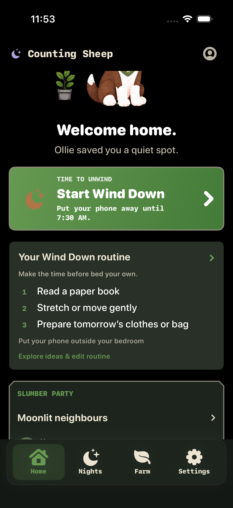
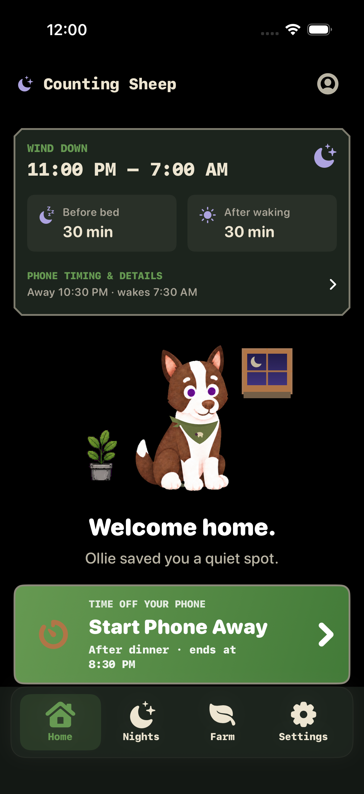
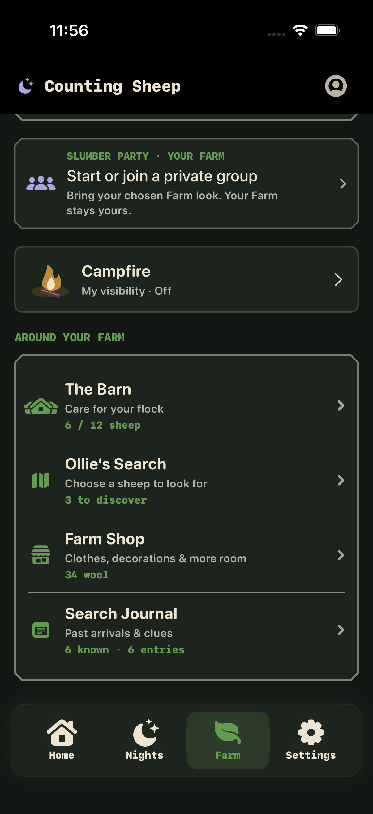
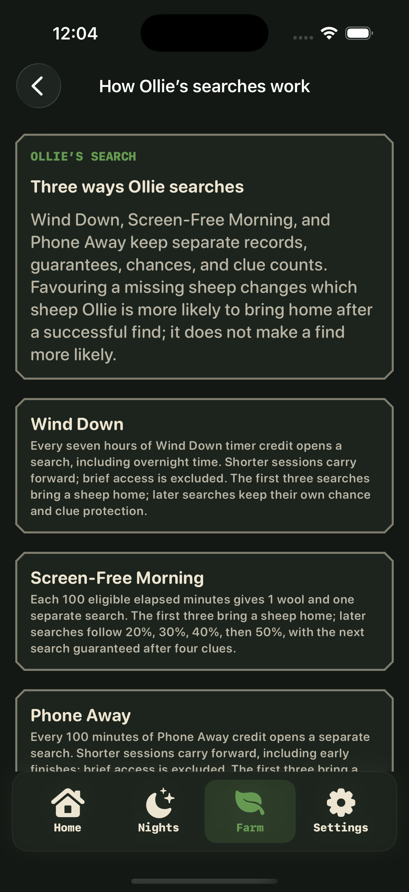

# Home and Farm clarity — local validation

Work began 21 September 2026; final checks continued after midnight on 22 September (Singapore).
[Implementation and Mobbin references](../../../docs/plans/home-farm-clarity-2026-09-21.md).

## Changes

- Your Wind Down routine shows the complete saved evening sequence, with full-card access to the existing save-only editor. Empty and smaller-version states remain supported. The smaller-version toggle stays independent.
- The primary action visibly names Start Wind Down or Start Phone Away. Wind Down shows planned phone-away end; saved Phone Away shows period title/end; quick Phone Away uses saved offline purpose/duration. Existing eligibility, source IDs and start handlers are unchanged.
- Farm destinations are grouped into one panel with counts next to their destinations. Repeated metric links and the permanent search-explanation card are removed. Recent events are collapsed by default. Existing tours/contextual tips explain searches, with a full guide accessible from the Search page header.

## Screens inspected

The three saved activities appear in order. Tapping blank space inside the routine card opens the editor with three evening ideas and Save plan; it does not start a session.

The same Home action changes to Start Phone Away with the saved “After dinner” period and end time.

All four destinations are full-width rows. A tap away from the title/chevron in the Ollie’s Search row opens the correct page. Counts are beside their destinations; the permanent search explainer card and duplicate metric links are absent.

The labeled question-mark control in the Search header opens the full explanation of all three search paths. Verified through its native accessibility button.

## Validation

- Full generic iOS Simulator app build passed, including the final Search help adjustment (`/tmp/home-farm-build-final.log`).
- Both full unit runs passed: 1,112 tests, zero failures each. Final source-matching run: `/tmp/home-farm-tests-final.log` and `/tmp/home-farm-tests-final.xcresult`.
- Commands: `xcodebuild build -project PhoneInTheOtherRoom.xcodeproj -scheme PhoneInTheOtherRoom -destination 'generic/platform=iOS Simulator' -derivedDataPath /tmp/slumber-repair-derived`; `xcodebuild test -project PhoneInTheOtherRoom.xcodeproj -scheme PhoneInTheOtherRoom -destination 'platform=iOS Simulator,id=71CF8F3E-9E9A-449D-93A8-B73F64869A5E' -derivedDataPath /tmp/slumber-repair-derived -resultBundlePath /tmp/home-farm-tests-final.xcresult`.
- `git diff --check` passed.
- Native dark-mode inspection on iPhone 16 Pro Simulator, iOS 26.5: full Home, whole saved routine, full-card edit, alternate Phone Away action, compact Farm panel and row navigation.

## Limits

No deployment, archive, TestFlight distribution, account data changes, or real session start was performed. Spoken VoiceOver and physical-device touch checks remain release acceptance work. The task-owned iPhone SE (3rd generation) simulator booted but stalled at Springboard/app launch; one restart and retry did not recover it. Narrow-device validation is blocked, not passed. The Mac had about 500 MB free during these failures; deleting only that disposable simulator recovered space. iPhone 17 at accessibility3 exposed the full three-activity routine and start-action labels correctly in its accessibility tree, with the top timing layout visibly wrapping. Further large-text scrolling/capture was blocked by native automation reporting `noWindowsAvailable`, so a full visual pass at that size remains pending. No new guidance persistence or automatic replay was introduced.
